# ARCHITECTURE.md — Sabr Studio

**Document type:** System Architecture Reference
**Derived from:** `PRD.md` (product source of truth), `TRD.md` (technical source of truth), `UI-UX.md` (interface/interaction source of truth)
**Audience:** Human developers (junior → senior), reviewers, and AI coding agents implementing or extending this system.

> Priority order when documents conflict: **PRD → TRD → UI-UX**. Every contradiction found during analysis is logged in **Section 5A (Contradictions & Resolutions)** and resolved according to this order — neither source document is silently altered.

---

## 1. Architecture Overview

### 1.1 Project Name
**Sabr Studio** — a full-stack interior design studio platform (MERN).

### 1.2 Purpose of This Document
This document translates the product requirements (`PRD.md`), the mandated technology stack and technical rules (`TRD.md`), and the interface/interaction system (`UI-UX.md`) into a single, implementable system architecture. It is the primary reference a developer or AI coding agent consults before writing code, and the reference against which any implementation is validated.

### 1.3 Architecture Scope
In scope: the public marketing/e-commerce website, the admin panel, the Express REST API, the MongoDB Atlas data layer, and the three external integrations (Cloudinary via Multer, Razorpay, EmailJS), as deployed as a single Node.js process on Hostinger.
Out of scope (per PRD §2 "Out of Scope", carried through unchanged): customer accounts/registration, booking/appointments, reviews/ratings, wishlists (the cart is the only "save" mechanism — see §5A-2), push/SMS notification, analytics dashboards, and any CMS beyond the admin panel described here.

### 1.4 System Overview

Sabr Studio has two client-facing surfaces sharing one backend and one database:

- **Public website** — unauthenticated, SEO-indexed, browses projects and retail products, submits enquiries, purchases retail products (and configured purchasable projects) via Razorpay.
- **Admin panel** — authenticated (single `admin` role), manages all dynamic content: projects, retail items, enquiries, orders.

Both are served by a **single Express/Node.js REST API**, which is the only component permitted to talk to MongoDB Atlas, Cloudinary, Razorpay, and EmailJS. In production, that same Express process also serves the built React frontend as static files (TRD §20). MongoDB Atlas is the sole system of record.

### 1.5 Architectural Goals
1. Ship a **production-correct**, not merely demo-correct, e-commerce + lead-generation site: server-authoritative pricing, verified payments, and validated content on every mutation.
2. Keep the codebase's **cognitive footprint small** — one language (JavaScript), one styling system (Tailwind), one HTTP client, one state mechanism (Context) — matching TRD §0's closed dependency list.
3. Make the system **safe by default**: nothing admin-only is reachable without server-side authentication and authorization, regardless of what the frontend does or doesn't render.
4. Make the system **cheap to run and cheap to reason about**: one server process, one database, no infrastructure (queues, caches, container orchestration) that the current requirements don't justify.
5. Make the system's structure **legible to an AI coding agent**: consistent file suffixes, consistent layering, one place for every kind of decision (see Section 20 — AI Coding Agent Rules).

### 1.6 Architectural Principles
- **Backend is the only source of truth for state that matters.** Price, availability, payment status, and publish status are never trusted from the client (PRD FR-G3, FR-G5; TRD SEC-13, SEC-14).
- **Frontend route protection is UX, not security** (TRD AUTH-06/AUTH-07). Every protected capability is re-checked server-side.
- **No speculative infrastructure.** Redis, message queues, microservices, GraphQL, and TypeScript are explicitly excluded (TRD §0, §2.1, §2.2) unless a named requirement later forces reconsideration.
- **Data-driven UI, not hardcoded UI.** Static content lives in `*.data.js` files; backend-driven content is always fetched (TRD DATA-01–04).
- **One component language for shared UI.** One `<Button />`, one card contract, one form pattern, reused everywhere (UI-UX §04, §23, §33).
- **Snapshot over reference for financial/historical data.** Orders embed a snapshot of what was purchased; they never live-populate from Project/Retail documents (PRD FR-H2, TRD §7 Orders).

### 1.7 Major System Components
| Component | Description |
|---|---|
| Public SPA | React app rendering the 9 public routes (Home, Projects, Project Detail, Retail, Retail Detail, Services, About, Contact, Cart) |
| Admin SPA | React app (code-split from the public bundle) rendering the 6 admin routes |
| Express API | Single REST API serving both SPAs' data needs, under `/api/*` |
| MongoDB Atlas | Single managed cluster, single database, five collections |
| Cloudinary | Image storage/delivery, reached only via the backend's Multer → Cloudinary pipeline |
| Razorpay | Payment gateway, order creation and signature verification done server-side only |
| EmailJS | Enquiry notification channel, decoupled from enquiry persistence |
| Hostinger Node.js host | Single process serving both the API and the built frontend |

### 1.8 Technology Boundaries
Everything listed in TRD §0/§2/§23 is available. Nothing else is introduced without a named PRD requirement forcing it (TRD TECH-14). This includes: no Redux/Zustand, no UI kit, no GraphQL, no Passport.js, no Redis, no Docker/Kubernetes, no TypeScript, no second animation library performing the same job as an existing one.

### 1.9 External Dependencies
Cloudinary, Razorpay, EmailJS, MongoDB Atlas, Hostinger (hosting), Google Fonts equivalents self-hosted per UI-UX §07 (Abhaya Libre, Inter — loaded as static assets, not a runtime dependency).

### 1.10 Internal Dependencies
Frontend → Backend (via `axios`, `/api/*`, same-origin in production). Backend → MongoDB Atlas (via Mongoose). Backend → Cloudinary/Razorpay/EmailJS (via their SDKs/HTTP APIs). No component skips a layer (frontend never reaches MongoDB or Cloudinary directly — PRD FR-P1).

### 1.11 Primary User Types / System Actors
| Actor | Description | PRD Reference |
|---|---|---|
| Potential Client (General Lead) | Browses homepage/portfolio, may enquire | §3 |
| Residential Client | Evaluates residential projects | §3 |
| Commercial Client | Evaluates commercial capability | §3 |
| Retail Visitor/Shopper | Browses and purchases retail products | §3 |
| Admin / Studio Management | Manages all dynamic content | §3 |
| Search Engine Crawler | Indexes public pages only | §10 SEO |

### 1.12 Public System / Admin System / Backend System / Database System / External Services / Deployment Environment
These are each given a full dedicated section below: Frontend Architecture (§7), Admin Architecture (§11), Backend Architecture (§13), Database Architecture (§18), Third-Party Integrations (§26), Deployment Architecture (§27).

---

## 2. Architectural Style

**Selected style: Layered Client-Server Architecture with a Modular Monolith backend and a Feature-Based Component Frontend, exposed as a single REST API, single-process deployment.**

### 2.1 Why This Was Selected
- The PRD defines a bounded, well-enumerated feature set (projects, retail, cart/checkout, enquiries, admin CRUD) — not an open-ended platform. A monolith keeps five related resources (Project, Retail, Enquiry, Order, Admin) transactionally and operationally simple, sharing one connection pool and one deploy.
- The TRD is explicit and non-negotiable about the deployment topology: **one Hostinger Node process serves both the API and the built frontend** (TRD §20). This is architecturally incompatible with a microservices or serverless split, and the TRD explicitly excludes microservices, Kubernetes, and serverless (TRD §5, restated in the source instructions).
- REST maps directly onto the PRD's five resources and their CRUD/read patterns; nothing in the PRD needs GraphQL's flexible querying, and TRD explicitly excludes it.
- Feature-based frontend organization (TRD §3.1) matches the PRD's page-oriented structure (each public route is close to one feature) and keeps an AI coding agent's blast radius small when adding a feature.

### 2.2 What It Solves
- Single deploy artifact, single environment-variable set, single point of authentication enforcement, no cross-service network calls to reason about or secure.
- Clear layering (routes → controllers → services → models) gives every kind of logic exactly one home, which is what TRD §5 (Backend Technical Requirements, "Layer separation (strict)") mandates.

### 2.3 What It Intentionally Avoids
- **Microservices** — no independent scaling requirement exists per-resource; the added network/deployment complexity has no corresponding benefit at this scope.
- **Event-driven architecture / message queues** — no asynchronous, decoupled workflow exists in the PRD (EmailJS and Razorpay calls are synchronous, awaited, try/caught service calls, not queued jobs).
- **GraphQL** — PRD defines fixed, resource-shaped reads; REST's simplicity is a better fit and is explicitly mandated (TRD §6, restated per-endpoint).
- **Server-side rendering / meta-frameworks (Next.js, Remix)** — TRD §0 mandates Vite + React SPA specifically, with SEO handled via a dynamic `<Seo>`/Helmet-equivalent component (TRD FE-26) rather than a rendering-framework change.

### 2.4 Limitations
- A single Node process means zero horizontal redundancy at this scope: a process crash or a deploy briefly takes the whole site down (TRD DEP-09, explicitly documented as expected/acceptable). See Section 24 (Reliability & Failure Modes).
- All five resources share one MongoDB Atlas cluster; a runaway query against one collection can degrade others sharing the connection pool. Indexing (Section 18) mitigates this at current scale.
- The admin panel and the public site share one JavaScript bundle pipeline, mitigated by route-level code-splitting (`React.lazy` on admin routes, TRD PERF-03) so public visitors never download admin code.

### 2.5 How It Can Evolve
See Section 23 (Current vs. Future Architecture) and Section 25 (Architecture Evolution) for concrete migration paths (e.g., splitting admin into its own lazy-loaded shell first, before ever considering a second deployed service).

---

## 3. High-Level System Architecture

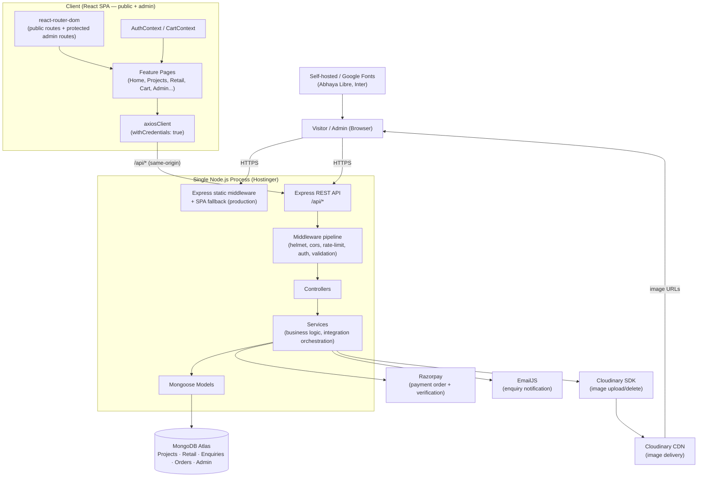

### 3.1 Component Explanations
- **Client (React SPA)** — renders both the public and admin surfaces from one codebase, code-split so admin JS is not downloaded by public visitors (TRD PERF-03). Talks to the backend exclusively through a single `axiosClient` (TRD FE-10).
- **Express static middleware + SPA fallback** — production-only; serves the built frontend and resolves deep-link/refresh requests to `index.html` so client-side routing works (TRD §20.3).
- **Middleware pipeline** — the ordered chain every request passes through before reaching a controller: security headers → CORS → body/cookie parsing → rate limiting (scoped routes) → authentication → authorization → validation (TRD BE-03).
- **Controllers / Services / Models** — strict three-layer backend (Section 13).
- **MongoDB Atlas** — single cluster, five collections, reached only through Mongoose from the service/model layer (PRD FR-P1, TRD BE-10).
- **Cloudinary** — image binaries live here; MongoDB stores only URLs (PRD §11).
- **Razorpay** — payment order creation and signature verification, entirely server-side (PRD FR-G4, TRD SEC-13/14).
- **EmailJS** — enquiry notification only, decoupled from enquiry persistence success (PRD FR-I4).

No other external services (analytics platforms, CDNs beyond Cloudinary, monitoring SaaS, queues) are included, per PRD §2 Out of Scope and TRD §21.

---

## 4. System Components (Inventory)

### 4.1 Frontend Components

| Component | Responsibility | Input | Output | Dependencies | Data Handled | Security Boundary | Failure Scenarios | Communication |
|---|---|---|---|---|---|---|---|---|
| Application shell (`App.jsx`) | Mounts router, Lenis smooth-scroll provider, global Context providers | — | Rendered app | react-router-dom, Lenis | none directly | none (public) | Fails to mount → white screen; guarded by top-level error boundary | — |
| Router (`AppRouter.jsx`) | Maps URL → page component, gates admin routes | URL | Rendered page or redirect | react-router-dom | route params (`:slug`) | Public vs. `ProtectedRoute`-wrapped admin | Unmatched route → 404 page | — |
| `AuthContext` | Holds admin session state client-side | `GET /api/auth/me` response | `{ admin, isAuthenticated, isLoading }` | `axiosClient` | admin identity (no secrets) | Read-only reflection of server session; never authoritative | API unreachable → treated as unauthenticated | REST |
| `CartContext` | Holds cart line items + informational total | user add/remove/update actions | cart items array, computed subtotal | React state (session-lifetime only, no persistence — TRD FE-09) | retail item id, name, price snapshot, qty | none (client-only, re-validated server-side at checkout) | Lost on refresh (by design — no premature persistence) | — |
| `axiosClient` | Single HTTP client to backend | request config | response / normalized error | axios | all API payloads pass through here | `withCredentials: true` carries the httpOnly auth cookie | Network/timeout errors surfaced as a distinct error state (TRD §11) | HTTPS/JSON |
| Feature pages (Home, Projects, Retail, ProjectDetail, RetailDetail, Services, About, Contact, Cart) | Compose feature components, fetch backend data | route params, API responses | Rendered page + all defined states (loading/empty/error/not-found) | feature components, `*.data.js`, `axiosClient` | published project/retail/enquiry data | Public | API failure → error state, never blank/broken (PRD FR-P3) | REST |
| Admin pages (Login, Dashboard, Projects, Retail, Enquiries, Orders) | Admin CRUD UIs | admin input, API responses | Rendered admin views | `ProtectedRoute`, `AuthContext`, `axiosClient` | full (unpublished) project/retail data, enquiries, orders, no payment secrets | `/admin/*` gated client-side (UX) + server-side (real boundary) | Unauthorized → redirect to `/admin/login` | REST |
| Shared components (`Button`, cards, `EnquiryForm`, `SEO`, `Skeleton`/`EmptyState`/`ErrorState`) | Reused UI primitives | props | Rendered UI | Tailwind, Framer Motion | none inherently | none | — | — |

### 4.2 Backend Components

| Component | Responsibility | Input | Output | Dependencies | Data Handled | Security Boundary | Failure Scenarios | Communication |
|---|---|---|---|---|---|---|---|---|
| `server.js` | Bootstraps app, connects DB, starts listening | env vars | Running HTTP server | Express, Mongoose | — | Process boundary | DB connect failure → process logs and exits (TRD §7.1) | TCP/HTTP |
| Middleware stack | Cross-cutting request handling | raw request | Enriched/rejected request | helmet, cors, cookie-parser, express-rate-limit, jsonwebtoken | cookies, headers | Enforces auth/authz/rate-limit before controllers run | Malformed token → 401; disabled account → 403 | — |
| Routes (`*.routes.js`) | Declare endpoint + middleware chain | HTTP request | Dispatch to controller | Controllers, validation chains, `protect` middleware | route-level only | Public vs. `/api/admin/*` | Unmatched route → 404 | HTTP |
| Controllers (`*.controller.js`) | Request/response shaping only | `req` | JSON response (standard envelope) | Services | request body/params/query | none beyond what routes enforce | Any thrown/rejected error forwarded via `asyncHandler` → `next(err)` | — |
| Services (`*.service.js`) | Business rules, integration orchestration | plain JS args | plain JS results / thrown errors | Models, Cloudinary/Razorpay/EmailJS SDKs | full resource data, computed price/amount | Enforces publish-visibility filtering, price re-validation, snapshotting | Integration failure → caught, logged, translated to generic error (PRD §11) | SDK/HTTP calls to external services |
| Models (`*.model.js`) | Schema, validation, indexes | plain JS objects | Mongoose documents | Mongoose, MongoDB Atlas | full document shape per collection | `password` field `select:false` on Admin | Validation failure → Mongoose `ValidationError` → 400 | Mongoose driver |
| Centralized error handler | Last-registered middleware; uniform error responses | thrown/forwarded error | `{ success:false, message, errors? }` | — | error context (logged, never returned in full) | Never leaks stack traces/secrets in production (TRD §11) | — | HTTP |
| Upload middleware (Multer) | Validates and buffers multipart image uploads | multipart form data | in-memory buffer(s) | Multer | image binary (transient, never persisted to local disk) | Scoped to `/api/admin/projects`, `/api/admin/retail` only | Oversized/invalid MIME → 400 before reaching Cloudinary | — |

### 4.3 Database Components

| Collection | Purpose | Relationships | Required Indexes | Data Lifecycle |
|---|---|---|---|---|
| `projects` | Project showcase content | Snapshotted (not referenced) into `orders` when purchased | unique `slug`; compound `{ published: 1, category: 1 }` | Created/updated/deleted by admin; deletion is a hard remove, immediately excluded from public queries |
| `retail` | Retail catalog | Snapshotted into `orders` at purchase time | unique `slug`; compound `{ published: 1, availability: 1 }` | Same as Projects; deletion never corrupts existing orders (embedded snapshot) |
| `enquiries` | Lead capture | None (standalone) | `{ status: 1, createdAt: -1 }` | Created by public form submission; status/lifecycle managed by admin; never publicly readable |
| `orders` | Checkout/payment records | Embeds a point-in-time snapshot of purchased Project/Retail data | `{ paymentStatus: 1, orderStatus: 1 }`; index on `razorpayOrderId`/`razorpayPaymentId` | Created at checkout initiation, updated on payment verification and admin status changes; never deleted |
| `admin` | Administrator accounts | None | unique `email` | Provisioned out-of-band (no public registration); `password` excluded from query results by default |

Full field-by-field schema belongs in a separate `DATABASE.md` per PRD §8/TRD §7 — this document defines architectural requirements only.

---

## 5. Contradiction & Consistency Analysis

Per the source-of-truth rule (PRD → TRD → UI-UX), the following conflicts were identified across the three documents during analysis. None are silently resolved by editing the source documents — each is resolved here, in the architecture layer, and flagged for client/stakeholder confirmation where the UI-UX document itself already flags it as open.

### 5A-1. Retail route naming: `/retail` vs. `/shop`
- **Conflict**: PRD §5 and TRD §6 (API-12 through API-17) define the route/API namespace as `/retail` and `/retail/:slug`. UI-UX §67 ("Page-by-Page UI Specification") labels the same pages `/shop` and `/shop/:id`, and UI-UX §70 references `retail/figma 1.png → CategoryTabBar, RetailProductCard` inconsistently alongside the `/shop` heading.
- **Resolution**: PRD and TRD outrank UI-UX. **The implemented route is `/retail` and `/retail/:slug`**, matching PRD §5 and every TRD API/route requirement. UI-UX's `/shop` labeling is treated as informal page-reference naming from the Figma source, not a routing requirement. The visible page heading text ("Products", per UI-UX §67) is unaffected — that is content, not a route change.
> **Architectural Decision**: All routing, API paths, sitemap entries, and code (`features/retail/`, not `features/shop/`) use `retail`/`Retail` consistently. The public-facing `<h1>` text may still read "Products" per UI-UX §67 without contradiction, since that is display copy, not a URL segment.

### 5A-2. Navbar "Login" button vs. "no customer accounts" (PRD Out of Scope)
- **Conflict**: UI-UX §01 ("Key resolved ambiguities") states the navbar's Login button exists "since visitor accounts are used only for checkout/order context." PRD §2 explicitly lists "Customer account/registration system (no visitor login, order history, or saved profiles)" as **Out of Scope**, and PRD §4/§5 define no visitor-facing authentication route or API.
- **Resolution**: PRD is source of truth #1 and is authoritative on scope. **No visitor/customer authentication system is built.** The navbar "Login" affordance shown in UI-UX is therefore scoped, in this architecture, to be the **Admin** entry point exposed in the public navbar chrome — i.e., the button visually present per UI-UX §26–28 routes to `/admin/login`, which is the only login surface the PRD defines. This preserves the UI-UX visual system (one Button component, same position/variant) without inventing an out-of-scope visitor-account backend.
> **Architectural Assumption**: The public navbar "Login" button links to `/admin/login`. This should be confirmed with the client/stakeholder (UI-UX §"Open Design Decisions" already flags related open items) before implementation, since an alternative reading is that the button should simply be removed for public visitors. Either resolution requires zero backend changes, since no visitor-auth API exists in the PRD/TRD either way.

### 5A-3. "Wishlist" terminology
- **Conflict**: PRD §2 Out of Scope lists "Wishlist functionality" as excluded, while UI-UX §01 states the client's "wishlist" request is functionally the Cart.
- **Resolution**: Already resolved *within* UI-UX itself and consistent with PRD: the Cart (PRD FR-F, §5 `/cart` route) is the only "save" mechanism. No separate save-for-later wishlist is built. No contradiction remains — documented here for traceability only.

### 5A-4. Admin panel UI-UX coverage
- **Gap, not a contradiction**: UI-UX §01 explicitly states "Admin panel UI is out of scope for this document." The PRD (§5, §7 FR-J–FR-O) and TRD (§6 API, §8 Auth) fully define admin *functionality* and *routes*, but no visual/interaction spec exists for the admin surface.
> **Architectural Decision**: The admin panel is built using the same design tokens (colors, type scale, spacing, radius, Button component — UI-UX §06–§25) as the public site for visual consistency, since no separate admin design system was supplied, but its layout (sidebar/table-first, per TRD FE-07's `AdminLayout`) is an implementation decision, not a UI-UX requirement. This is marked `Future Consideration` for a dedicated admin UI-UX pass if the studio wants a purpose-built admin visual language later.

No other contradictions were found. All numeric/behavioral constraints (validation rules, states, breakpoints, animation durations) are consistent across documents where they overlap.

---

## 6. Frontend Architecture

### 6.1 Application Entry Point & Root Component
`src/main.jsx` mounts `<App />` into the DOM. `App.jsx` is the root component: it wraps the tree in, in order — `AuthProvider` → `CartProvider` → `SmoothScrollProvider` (Lenis, TRD FE-18) → `AppRouter`. This ordering ensures auth/cart state is available to every route before Lenis/GSAP sync (FE-19) is initialized, and before any route-dependent animation reads scroll position.

### 6.2 Routing Architecture
`react-router-dom` implements exactly the routes in PRD §5 (TRD FE-02), defined in one place, `src/app/AppRouter.jsx`. Public routes render directly. Admin routes (other than `/admin/login`) are wrapped in `ProtectedRoute`, which checks `AuthContext.isAuthenticated` (populated from `GET /api/auth/me` on app load) before rendering — a UX convenience only (TRD FE-04/FE-05, AUTH-06); the backend is the real boundary (Section 11).

Full route table: see Section 8 (Routing Architecture).

### 6.3 Layout Architecture
- **`PublicLayout`** — `Navbar` (sticky after scroll, cart icon + badge, mobile drawer) + `<Outlet />` + `Footer`. Wraps every public route via nested routing (TRD FE-07).
- **`AdminLayout`** — sidebar/nav (Dashboard, Projects, Retail, Enquiries, Orders, Logout) + session-aware header + `<Outlet />`. Wraps every `/admin/*` route except `/admin/login`, which renders standalone (no sidebar, since there is no authenticated session yet).

### 6.4 Page Architecture
Each route renders exactly one page component (`src/features/<feature>/pages/<Page>.jsx` or `src/pages/` for the thin route-to-feature mapping — see folder structure §7). A page component's job is composition: it pulls feature components and, where the page is data-driven (Project Detail, Retail Detail, Projects listing, Retail listing, all admin views), fetches via the feature's API module and renders the appropriate state (loading/empty/error/not-found/success — Section 8, "States").

### 6.5 Component Architecture
Three tiers, matching TRD §3.1 and UI-UX §31–33:
1. **Shared/primitive components** (`src/shared/components/`) — `Button` (the single reusable button, UI-UX §23), `Card` primitives, `SEO`, `Skeleton`, `EmptyState`, `ErrorState`, `Badge`, form primitives (`TextInput`, `TextArea`, `Select`, `FormLabel`, `FormError`). Used by ≥ 2 features.
2. **Feature components** (`src/features/<feature>/components/`) — e.g., `ProjectCard`, `ProjectGallery`, `RetailProductCard`, `CategoryTabBar`, `CartDrawer`, `CartLineItem`. Own by exactly one feature unless promoted to shared after genuine reuse emerges.
3. **Page components** — compose the above; contain no reusable presentational logic of their own.

### 6.6 Feature Architecture
One folder per PRD-defined feature area: `home`, `projects`, `retail`, `cart`, `services`, `about`, `contact`, `enquiry` (shared form, but its data/logic is feature-scoped), `admin/projects`, `admin/retail`, `admin/enquiries`, `admin/orders`, `admin/auth`. Each feature folder is self-contained (TRD §3.1): its components, its `*.data.js` static content, its feature-scoped hooks (if any), and — for backend-driven features — its `api.js` module live together.

### 6.7 Shared / Reusable / Data-Driven Components
- **Reusable UI components** — everything in `src/shared/components/` (Section 6.5, tier 1), plus anything UI-UX §68 names as "reusable across ≥ 2 contexts" (`Button`, `SectionHeading`, `Badge`, `InquiryForm`, `Skeleton`/`EmptyState`/`ErrorState`).
- **Data-driven components** — components that render from `*.data.js` (static: `ServiceCard` grid content, FAQ questions, footer links) vs. components that render from API responses (backend-driven: `ProjectCard`, `RetailProductCard`, `ContactInfoCard` where dynamic). This distinction is architectural, not cosmetic: it determines whether the component imports a data file or calls the feature's `api.js` (TRD DATA-01/DATA-02).

### 6.8 Forms
The `InquiryForm` (shared, TRD FE-08, UI-UX §75) and every admin CRUD form are controlled components using `useState`/`useReducer` — no form library (TRD FE-08 explicitly defers this decision until proven insufficient). Every form implements: client validation → submit-lock (`isSubmitting`) → backend call → inline success/error state, never a toast the user might miss for critical form feedback (TRD FE-08).

### 6.9 Validation
Client-side validation (immediate feedback) is implemented for every form using shared utilities (`shared/utils/validators.js`, TRD §11 "Frontend Validation") — never duplicated inline regex per form. It is explicitly non-authoritative; backend `express-validator` chains are the real boundary (Section 12).

### 6.10 API Communication
A single `axiosClient` instance (`src/shared/api/axiosClient.js`) is the **only** way any component reaches the backend (TRD FE-10). Base URL: `import.meta.env.VITE_API_BASE_URL` (relative `/api` in production, explicit localhost URL in development). `withCredentials: true` so the httpOnly auth cookie is sent automatically. Response/error interceptors normalize every error into one shape so every feature's error-state handling is uniform (Section 8 "States"; Section 12 "API Error Architecture").

### 6.11 Loading / Error / Empty / Success States
Every data-dependent view implements all four states explicitly (PRD FR-P3, TRD FE-11–FE-14):
- **Loading** → `Skeleton` sized to match the final content (UI-UX §49), never a blank screen.
- **Error** → `ErrorState` with a retry affordance for re-fetchable views (UI-UX §50).
- **Empty** → `EmptyState`, no fabricated placeholder content (UI-UX §51).
- **Not-found** → dedicated not-found rendering for invalid/deleted/unpublished `:slug` lookups (PRD FR-C4/FR-E3), distinct from the router's generic 404 catch-all.

### 6.12 Modal / Dialog Architecture
Used for: the Cart drawer (slide-in panel, not a true modal but follows the same focus-management contract), the mobile nav drawer, and any future confirm-remove/payment-status dialog (UI-UX §42). All implement: overlay + scroll lock + Escape/outside-click to close + focus trapped inside while open + focus returned to the trigger element on close (TRD A11Y-10, UI-UX §26–28).

### 6.13 Navigation Architecture
`Navbar` (sticky after scroll, per UI-UX §26) + `MobileDrawer` (< 1024px, right-slide, black background, per UI-UX §27–28) + `Footer` (3-column, per UI-UX §41). Active-route indication via `react-router-dom`'s `NavLink` (underline treatment, UI-UX §26).

### 6.14 Responsive Architecture
See Section 15 (Responsive Architecture) — driven entirely by Tailwind's responsive utilities against the breakpoints in UI-UX §09/§63, with **zero** component duplication per breakpoint (reflow, not hide/show a second markup tree).

### 6.15 Accessibility Architecture
See Section 22.

### 6.16 Animation Architecture
See Section 21.

### 6.17 SEO Architecture
See Section 16. Implemented via a shared `<Seo />` component (TRD FE-26/FE-27) set per-page from either `*.data.js` (static pages) or fetched resource data (Project/Retail detail).

### 6.18 Performance Architecture
See Section 25/16 (performance and caching). Route-level code-splitting on admin routes, image optimization via Cloudinary transform parameters, lazy-loaded below-the-fold images, restrained animation (`transform`/`opacity` only).

### 6.19 Responsibility Placement (prevent logic leaking into UI)

| Responsibility | Belongs in | Never in |
|---|---|---|
| Static UI copy | `*.data.js` | inline JSX strings (TRD DATA-01) |
| Backend-driven content | API layer (`api.js`) + feature state | hardcoded in a component |
| Cross-cutting session/cart state | `AuthContext` / `CartContext` | prop-drilled through unrelated components |
| HTTP calls | `axiosClient` via feature `api.js` | inline `fetch`/`axios` in a component (TRD FE-01) |
| Field validation rules | `shared/utils/validators.js` | duplicated per-form regex |
| Price/availability truth | Backend service layer | any frontend computation used for payment |
| Route definitions | `src/app/AppRouter.jsx` | scattered `<Route>` declarations across features |

---

## 7. Frontend Folder Architecture

```text
frontend/
├── public/                      # static assets Vite copies as-is (favicon, robots.txt fallback if not backend-generated)
├── src/
│   ├── app/
│   │   ├── App.jsx               # root component: providers + router
│   │   ├── AppRouter.jsx         # single source of truth for every route (public + admin)
│   │   └── ProtectedRoute.jsx    # admin route gate (UX-layer only)
│   ├── assets/                   # fonts (Abhaya Libre, Inter), static SVGs not from react-icons/lucide-react
│   ├── features/
│   │   ├── home/
│   │   │   ├── components/       # HeroSlider, ExpertiseCard, ProcessStep, TestimonialCard, FaqAccordionItem...
│   │   │   ├── data/              # homeHero.data.js, process.data.js, testimonials.data.js, faq.data.js
│   │   │   └── pages/Home.jsx
│   │   ├── projects/
│   │   │   ├── components/       # ProjectListingRow, ProjectGallery
│   │   │   ├── api/projects.api.js
│   │   │   └── pages/ (ProjectsListing.jsx, ProjectDetail.jsx)
│   │   ├── retail/
│   │   │   ├── components/       # RetailProductCard, CategoryTabBar
│   │   │   ├── api/retail.api.js
│   │   │   └── pages/ (RetailListing.jsx, RetailDetail.jsx)
│   │   ├── cart/
│   │   │   ├── components/       # CartDrawer, CartLineItem
│   │   │   ├── context/CartContext.jsx
│   │   │   ├── api/checkout.api.js
│   │   │   └── pages/Cart.jsx
│   │   ├── services/
│   │   │   ├── data/services.data.js
│   │   │   └── pages/Services.jsx
│   │   ├── about/
│   │   │   ├── data/about.data.js
│   │   │   └── pages/About.jsx
│   │   ├── contact/
│   │   │   ├── data/contact.data.js
│   │   │   └── pages/Contact.jsx
│   │   ├── enquiry/
│   │   │   ├── components/EnquiryForm.jsx   # promoted here as the canonical source; re-exported via shared/ if consumed as truly global
│   │   │   └── api/enquiries.api.js
│   │   └── admin/
│   │       ├── auth/ (LoginPage.jsx, auth.api.js, AuthContext.jsx)
│   │       ├── dashboard/ (DashboardPage.jsx, dashboard.api.js)
│   │       ├── projects/ (ProjectsAdminPage.jsx, ProjectForm.jsx, projects.admin.api.js)
│   │       ├── retail/ (RetailAdminPage.jsx, RetailForm.jsx, retail.admin.api.js)
│   │       ├── enquiries/ (EnquiriesAdminPage.jsx, enquiries.admin.api.js)
│   │       └── orders/ (OrdersAdminPage.jsx, orders.admin.api.js)
│   ├── shared/
│   │   ├── components/           # Button, SectionHeading, Badge, Skeleton, EmptyState, ErrorState, TextInput, TextArea, Select, FormLabel, FormError, Seo
│   │   ├── layouts/               # PublicLayout, AdminLayout
│   │   ├── api/axiosClient.js    # the one HTTP client instance
│   │   ├── hooks/                  # useAuth.js, useCart.js, useReducedMotion.js, useLenisScroll.js
│   │   └── utils/                  # validators.js, formatPrice.js, slugify-display helpers, buildCloudinaryUrl.js
│   ├── styles/
│   │   └── globals.css            # Tailwind entry, @font-face, scrollbar styling, CSS custom properties (FE-16 exceptions)
│   ├── main.jsx
│   └── vite-env-notes.md          # (documentation only — no TS env types, per TECH-05)
├── tailwind.config.js
├── vite.config.js
├── package.json
└── .env.example
```

### 7.1 Folder Purpose / Boundaries

| Folder | Purpose | Belongs here | Does NOT belong here |
|---|---|---|---|
| `app/` | App-wide wiring: routing, providers | Router config, root component, route guards | Feature UI, business logic |
| `features/<name>/` | Everything specific to one feature | That feature's components, data, api, pages, hooks | Anything used by ≥ 2 features (promote to `shared/`) |
| `features/<name>/data/` | Static, non-backend content | Plain-object/array exports (TRD DATA-03) | JSX, fetch calls, side effects |
| `features/<name>/api/` | Feature-scoped API calls | Functions wrapping `axiosClient` calls for this feature's endpoints | Direct component-level `axios` calls |
| `shared/components/` | Cross-feature UI primitives | Components used by ≥ 2 features | A component still used by only one feature |
| `shared/api/` | The one HTTP client | `axiosClient` instance + interceptors | Feature-specific endpoint logic |
| `shared/hooks/` | Cross-cutting hooks | `useAuth`, `useCart`, reduced-motion detection | Feature-specific data-fetching hooks (those live in the feature) |
| `shared/utils/` | Pure helper functions | Validators, formatters, Cloudinary URL builder | Anything with side effects or React state |

### 7.2 Naming Conventions
Per TRD §3.2: components `PascalCase.jsx`; data files `camelCase.data.js`; hooks `useCamelCase.js`; utilities `camelCase.js`; feature API modules `camelCase.api.js` (mirroring the backend's `camelCase.service.js` naming discipline, so a developer can pattern-match frontend↔backend file roles at a glance).

### 7.3 Component Boundaries & Import Direction
```text
shared/  ←  features/*/  ←  app/
```
- `shared/` never imports from `features/` (would invert the dependency direction and create circularity).
- A feature may import from `shared/` freely, and from another feature **only** via that feature's public surface (its `pages/` or `api/` exports) — never reaching into another feature's `components/` internals directly. If two features need the same component, it is promoted to `shared/`.
- `app/` is the only place that imports every feature's `pages/`.

### 7.4 Circular Dependency Prevention
Enforced structurally by the rule above (one-directional: `shared → features → app`) plus: a feature's `api/` module never imports that feature's own `components/` (data layer does not depend on presentation layer), and `shared/hooks/` never imports from `features/`.

---

## 8. Routing Architecture

### 8.1 Route Table

| Route | Type | Access | Page | Purpose | Data Required |
|---|---|---|---|---|---|
| `/` | Public | Open | Home | Studio introduction/highlights | Static `*.data.js` (hero, process, testimonials, FAQ) + published Projects strip (`GET /api/projects`, limited) |
| `/projects` | Public | Open | Projects Listing | Browse published projects | `GET /api/projects` |
| `/projects/:slug` | Public, dynamic | Open | Project Detail | View one project | `GET /api/projects/:slug` |
| `/retail` | Public | Open | Retail Listing | Browse published, available retail items | `GET /api/retail` |
| `/retail/:slug` | Public, dynamic | Open | Retail Detail | View one retail item, add to cart | `GET /api/retail/:slug` |
| `/services` | Public | Open | Services | Static services overview | Static `*.data.js` |
| `/about` | Public | Open | About | Studio history, founder | Static `*.data.js` |
| `/contact` | Public | Open | Contact | Info + enquiry form | Static `*.data.js`; `POST /api/enquiries` on submit |
| `/cart` | Public | Open | Cart | View/update/remove cart items, initiate checkout | Client `CartContext`; `POST /api/checkout` on proceed |
| `*` (catch-all) | Public | Open | Not Found (404) | Unmatched route | — |
| `/admin/login` | Admin | Open (unauthenticated only) | Admin Login | Admin authentication | `POST /api/auth/login` |
| `/admin` | Admin | Protected | Admin Dashboard | Overview counts + nav | `GET /api/auth/me`; overview count endpoints (Section 12) |
| `/admin/projects` | Admin | Protected | Project Management | Full CRUD | `GET/POST/PUT/DELETE /api/admin/projects[/:id]` |
| `/admin/retail` | Admin | Protected | Retail Management | Full CRUD | `GET/POST/PUT/DELETE /api/admin/retail[/:id]` |
| `/admin/enquiries` | Admin | Protected | Enquiry Management | View/update status/delete | `GET/PATCH/DELETE /api/admin/enquiries[/:id]` |
| `/admin/orders` | Admin | Protected | Order Management | View orders, update order status | `GET/PATCH /api/admin/orders[/:id]` |

A cart icon lives in the persistent navbar/header across all public pages and opens `/cart` (or, per UI-UX §26/§42, a `CartDrawer` overlay that can also deep-link to the full `/cart` page) — both are supported: the drawer for quick access, `/cart` for the full page, sharing the same `CartContext`.

### 8.2 Public Routes
Render without any authentication check (PRD FR-A1, TRD FE-03). Directly accessible via URL, and survive a hard refresh in production because of the SPA fallback (Section 27.3).

### 8.3 Admin Routes
Every `/admin/*` route except `/admin/login` renders inside `ProtectedRoute` → `AdminLayout`. `/admin/login` renders standalone; if an already-authenticated admin navigates there, they are redirected to `/admin` (implementation detail, not a security boundary either way — the backend independently rejects/accepts based on session state regardless of what the frontend does).

### 8.4 Dynamic Routes
`:slug` segments (`/projects/:slug`, `/retail/:slug`) resolve via the corresponding public detail endpoint. An invalid, deleted, or unpublished slug renders the page's not-found state (PRD FR-C4/FR-E3) — this is a 200-with-not-found-state at the frontend routing level (the route still matches), while the underlying API call returns 404 (Section 12).

### 8.5 Nested Routing
`PublicLayout` and `AdminLayout` are parent routes with an `<Outlet />`; every public/admin page respectively nests under them, so shared chrome (navbar/footer, admin sidebar) renders once per layout, not once per page.

### 8.6 404 Route
A catch-all (`path="*"`) inside `PublicLayout` renders a generic Not Found view for any unmatched URL (TRD FE-14). This is distinct from a matched-but-invalid `:slug` (Section 8.4).

### 8.7 Redirect Behavior / Authentication Redirects
An unauthenticated user hitting a protected `/admin/*` route is redirected to `/admin/login`; `react-router-dom`'s location state carries the originally requested path so, on successful login, the admin returns to it (TRD FE-05).

### 8.8 Unauthorized Behavior
A previously-authenticated session that expires mid-use (e.g., an admin action returns 401 from the backend) triggers a client-side redirect to `/admin/login` on the next protected call's response interceptor (Section 12, API Error Architecture) — never a silently-stuck UI.

### 8.9 Deep-Link & Browser Refresh Behavior
Both public and admin deep links (including nested `:slug` routes and any `/admin/*` route) resolve correctly on a hard refresh or direct URL entry in production, because the Express SPA fallback always serves `index.html` for non-API, non-static-file GET requests (TRD §20.3), after which `react-router-dom` takes over client-side.

### 8.10 Route Loading / Code Splitting
The entire `features/admin/*` route tree is loaded via `React.lazy` + `Suspense` (TRD FE-31/PERF-03), so the public bundle never includes admin-only JavaScript. Any particularly heavy public feature (e.g., a large project gallery/lightbox, if later added) is similarly split.

---

## 9. Admin Architecture

### 9.1 Admin Entry Point
`/admin/login` — the only unauthenticated admin-facing route. On successful `POST /api/auth/login`, the backend sets the httpOnly auth cookie and the frontend re-runs its `GET /api/auth/me` bootstrap (or receives the admin identity directly from the login response) to populate `AuthContext`, then redirects into `/admin` or the originally-requested protected route.

### 9.2 Authentication
See Section 10 (dedicated Authentication Architecture section) — JWT in an httpOnly cookie, `bcrypt`-hashed credentials, generic failure messaging (PRD FR-J1/FR-J2).

### 9.3 Session Handling
Stateless on the backend (a signed JWT, not a server-side session store — no Redis/session-store dependency, consistent with TRD's exclusion list). The frontend's `AuthContext` reflects the session by calling `GET /api/auth/me` on app load and after login/logout; it never reads or stores the token itself (httpOnly cookie is inaccessible to JS by design, TRD AUTH-02).

### 9.4 Authorization
Single `admin` role (PRD §8 Admin Data, TRD AUTH-08). Account `status` (`active`/`disabled`) is checked server-side on every request in addition to token validity. No per-resource ownership model exists — any authenticated, active admin may manage any project/retail/enquiry/order (matches current scope; see Section 23 for how this could evolve).

### 9.5 Protected Routes
Client-side: `ProtectedRoute` (Section 8.3). Server-side (the real boundary): every `/api/admin/*` route is mounted behind the `protect` middleware (Section 13.5), independent of the frontend (PRD FR-J5).

### 9.6 Admin Layouts
`AdminLayout` — sidebar navigation (Dashboard, Projects, Retail, Enquiries, Orders), session-aware header (admin name/email, Logout control). Responsive per TRD RESP-08: usable at tablet/desktop widths, with complex tables (orders, enquiries, project/retail lists) scrolling within their own container, never the whole page.

### 9.7 Dashboard
`GET /api/auth/me` confirms session; the dashboard additionally surfaces overview counts (project count, retail count, enquiry count, order count — PRD FR-K2) via lightweight count queries, and provides navigation to each management area (FR-K1). No analytics/reporting beyond these counts (PRD §2 Out of Scope).

### 9.8 CRUD Architecture (Content Management)
Uniform pattern across Projects and Retail (PRD FR-L/FR-M, TRD §9):
1. Admin form (controlled component) collects fields + image file(s).
2. Client validation (UX only) → submit.
3. `multipart/form-data` request → `protect` + admin check → `express-validator` chain → Multer buffers image(s) → Cloudinary upload service → Mongoose persist → standard success envelope.
4. List/detail views refetch or optimistically update.

### 9.9 File Uploads (Admin)
Handled per Section 19 (File & Image Architecture) — Multer in-memory buffering, server-side MIME/size/count validation, Cloudinary as the only binary store.

### 9.10 Delete / Update / Publish-Unpublish Behavior
- **Delete** — hard removal from MongoDB; immediately excluded from public queries (which always filter on existence/`published`); associated Cloudinary assets flagged for cleanup via their stored public ID (PRD FR-L4/FR-M4, TRD §17). Existing orders referencing a deleted item remain intact because orders store an embedded snapshot, not a live reference (PRD FR-M4).
- **Update** — same validation path as create; supports independent toggles.
- **Publish/Unpublish** — a boolean field (`published`) updatable independently of other fields, controlling public visibility only, never a deletion (PRD FR-L3, acceptance criteria §12).
- **Retail availability** — a second, independent boolean (`availability`) from `published` (PRD FR-M3), so an item can be publicly listed but marked unavailable (purchase action disabled/hidden per UI-UX FR-D3 / PRD FR-D3) without unpublishing it entirely.

### 9.11 Draft Behavior
Not applicable — the PRD defines only `published`/`unpublished` as a binary visibility state, no separate "draft" workflow stage. `Not Applicable — Reason: PRD defines a two-state (published/unpublished) model only, not a draft/review/published pipeline.`

### 9.12 Audit Considerations
Not a named PRD requirement beyond `createdAt`/`updatedAt`/`lastLoginAt` timestamps (PRD §8 Admin Data) and operational logging of admin mutations (Section 20, Observability). No dedicated audit-log collection is introduced (`Future Consideration`, Section 23) since the PRD defines a single `admin` role with no need to attribute actions across multiple admins at this scope.

### 9.13 Error Handling
Every admin CRUD action renders explicit success/failure feedback (PRD acceptance criteria §12, "CRUD success/failure"). Server-side validation errors surface field-level detail (Section 12); authorization failures redirect/re-prompt per Section 8.8.

### 9.14 Admin Architecture Diagram

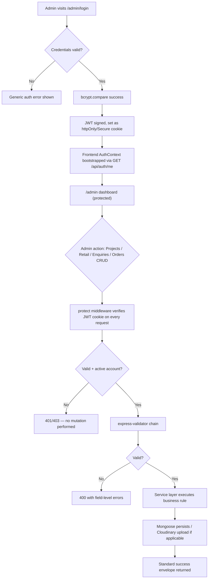

---

## 10. Authentication Architecture

**Authentication = Who is the user?** Applies only to the admin surface — the PRD defines no visitor-facing authentication (Section 5A-2).

### 10.1 Authentication Model
Stateless JWT carried in an httpOnly cookie. No session-store dependency (no Redis, no server-side session table) — the token itself, verified on each request, is the session (TRD AUTH-01–AUTH-05).

### 10.2 Login Flow
1. Admin submits credentials to `POST /api/auth/login` (public endpoint, rate-limited — Section 17).
2. Backend looks up the Admin document by email, explicitly `.select('+password')` (excluded by default — TRD §7 Admin), compares via `bcrypt.compare`.
3. On success: sign a JWT (claims: admin ID, role — never the password hash) with a bounded expiry; set as `httpOnly`, `Secure` (production), `SameSite`-flagged cookie; return admin identity (no token, no password hash) in the JSON body.
4. On failure (unknown email or wrong password): identical generic error response either way (PRD FR-J2, TRD AUTH-03) — no distinguishing signal.

### 10.3 Logout Flow
`POST /api/auth/logout` (requires a valid cookie) clears the cookie server-side (expired/empty cookie, matching attributes) so the browser stops sending a usable token (PRD FR-J4, TRD AUTH-04). Frontend clears `AuthContext` state and redirects to `/admin/login`.

### 10.4 Session / Token Flow
No refresh token — a single JWT with a defined expiry (PRD/TRD leave the exact duration as an implementation-tunable value; TRD AUTH-02 specifies "a few hours to a day, tuned to actual usage"). `Not Applicable — Reason: PRD/TRD define no refresh-token requirement; single-role, low-session-volume admin use does not justify the added complexity of a refresh-token rotation scheme.`

### 10.5 Cookie Strategy
`httpOnly: true` (inaccessible to JS, blocks XSS-based token theft) · `secure: true` in production (HTTPS-only) · `sameSite` set to balance the single-domain co-hosted topology with CSRF resistance (TRD SEC-15) · no `VITE_`-prefixed exposure of anything related to the token.

### 10.6 Storage Strategy
The JWT lives **only** in the httpOnly cookie. Never in `localStorage`, `sessionStorage`, Redux/Context state, or anywhere JavaScript can read it (TRD FE-09, AUTH-02) — this is the primary XSS-mitigation for admin session integrity.

### 10.7 Password Handling & Hashing
`bcrypt` with a standard, current cost factor (TRD AUTH-01). Passwords are never stored, logged, or returned in plaintext in any response, at any layer.

### 10.8 Credential Validation
`express-validator` on the login route validates request shape (email format, non-empty password) before the `bcrypt.compare` step even runs — this is a request-shape check, not a security boundary in itself (the generic-error rule still governs the actual auth outcome).

### 10.9 Session / Token Expiration
Expired tokens are rejected by the `protect` middleware with a 401-equivalent response (TRD AUTH-05), distinct from a 403 for a valid-but-disabled account.

### 10.10 Authentication Middleware
`protect` (a.k.a. `requireAuth`) — reads the cookie via `cookie-parser`, verifies the JWT signature/expiry via `jsonwebtoken`, loads the Admin document (status check included), attaches `req.admin`, calls `next()`; on any failure, responds 401 and does not call `next()`.

### 10.11 Protected API Routes / Protected Frontend Routes
Backend: every route under `/api/admin/*` (Section 12). Frontend: every route under `/admin/*` except `/admin/login` (Section 8.3). The backend boundary is authoritative; the frontend boundary is UX only (PRD FR-J5).

### 10.12 Unauthorized vs. Forbidden Behavior
- **401 (Unauthenticated)** — missing, invalid, or expired token.
- **403 (Unauthorized/Forbidden)** — valid token but the account is `disabled`, or (in a future multi-role scenario — Section 23) insufficient role.

### 10.13 Logout Invalidation
Because the token is stateless (not tracked server-side), "invalidation" means the cookie is cleared and the browser has no token to send. `Not Applicable — Reason: no server-side token blacklist/revocation store exists at this scope; a stolen-token-before-logout scenario is mitigated by a bounded expiry (10.9) and httpOnly/Secure storage (10.5–10.6), not by revocation infrastructure.` If a revocation requirement emerges later, see Section 23.

### 10.14 Security Considerations
Never store passwords in plaintext (10.7). Never expose the JWT to JavaScript (10.6). Never trust frontend route protection as a security boundary (10.11). Generic auth-failure messaging (10.2.4) prevents account enumeration.

### 10.15 Authentication Sequence Diagram

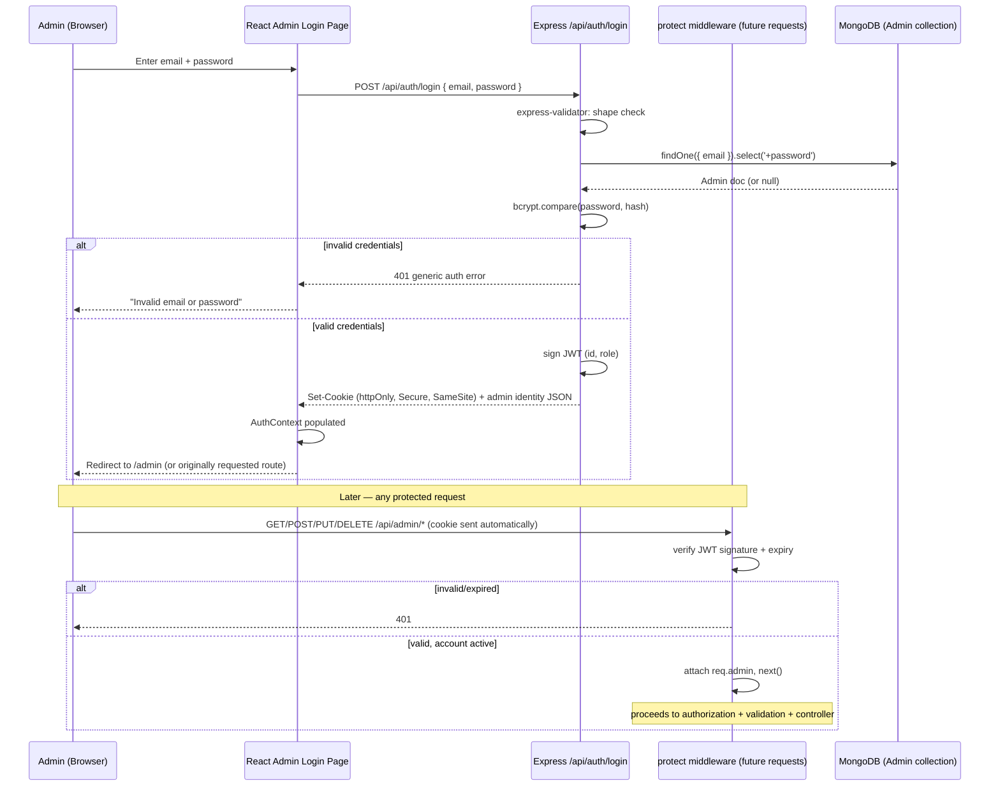

---

## 11. Authorization Architecture

**Authorization = What is the authenticated user allowed to do?**

### 11.1 Roles
Single role for current scope: `admin` (PRD §8, TRD AUTH-08). `Future Consideration`: a multi-role model (e.g., `admin` vs. `editor`) is not built now — see Section 23.

### 11.2 Permissions
Every authenticated, `active`-status admin may perform full CRUD on Projects, Retail, and Enquiries, and view/update-status on Orders (never manually mark payment successful — PRD FR-O3, enforced at the service layer, not merely the UI).

### 11.3 Resource Ownership
`Not Applicable — Reason: PRD defines a single admin role managing shared studio content; no per-admin resource ownership model exists (unlike, e.g., a multi-tenant system where each user owns their own records).`

### 11.4 Admin Permissions / User (Visitor) Permissions
Visitors (unauthenticated) may: read published Projects/Retail, submit enquiries, initiate checkout. Visitors may never: read unpublished content, read/write enquiries or orders directly, mark a payment successful, access any `/api/admin/*` endpoint.

### 11.5 Route-Level Authorization
Enforced by mounting all admin-mutation and admin-read routes exclusively under `/api/admin/*`, itself exclusively behind `protect` (TRD AUTH-09). No admin functionality is ever reachable through a public-prefixed route.

### 11.6 API-Level Authorization
Every `/api/admin/*` controller assumes `req.admin` is already populated and valid (guaranteed by `protect` running first in the middleware chain) — controllers never re-implement auth checks themselves; that would duplicate and risk diverging from the single `protect` implementation.

### 11.7 Database-Level Considerations
The Admin collection's `password` field is `select: false` by default (TRD §7 Admin) — a defense-in-depth measure so an accidental missing `.select()` elsewhere in the codebase cannot leak a password hash. No row-level/document-level database authorization exists beyond this (MongoDB Atlas access itself is restricted to the backend process only — Section 17, SEC-10).

### 11.8 Permission Matrix

| Action | Public Visitor | Authenticated Admin (active) |
|---|---|---|
| View published Projects/Retail | ✅ | ✅ |
| View unpublished Projects/Retail | ❌ | ✅ |
| Submit enquiry | ✅ | ✅ (not a typical flow, but not blocked) |
| View/manage enquiries | ❌ | ✅ |
| Add to cart / checkout | ✅ | ✅ |
| View orders | ❌ | ✅ |
| Update order status | ❌ | ✅ |
| Mark payment as successful manually | ❌ | ❌ (no one can — only verified Razorpay signature can, PRD FR-O3) |
| Create/Update/Delete Project or Retail item | ❌ | ✅ |
| Upload/delete images | ❌ | ✅ |
| Admin login | N/A | ✅ (with valid credentials) |

---

## 12. Backend Architecture

### 12.1 Server Entry Point / Application Initialization
`server.js` bootstraps, strictly in order (TRD BE-01): environment loading (`dotenv`) → security middleware (`helmet`) → CORS → body parsing (`express.json()`) → cookie parsing (`cookie-parser`) → route registration (`routes/index.js`) → static-file serving + SPA fallback (production only, Section 27.3) → centralized error handler (registered last). The server does not accept traffic until the MongoDB Atlas connection is confirmed (`connectDB()` resolves first).

### 12.2 Middleware Stack
Distinct, ordered layers (TRD BE-03): request parsing → CORS → security headers (`helmet`) → rate limiting (scoped to `/api/auth/login`, `/api/enquiries`, `/api/checkout`) → authentication (`protect`, on `/api/admin/*` and any other cookie-dependent route) → authorization (account-status check, part of `protect`) → validation (`express-validator` chains, per mutating route) → file upload handling (Multer, scoped to admin project/retail routes) → centralized error handling (last).

### 12.3 Route Layer
Routes are grouped by resource and access level, each in its own `*.routes.js`, aggregated once in `routes/index.js` (TRD BE-04): `auth.routes.js`, `projects.routes.js` (public), `admin/projects.routes.js`, `retail.routes.js` (public), `admin/retail.routes.js`, `checkout.routes.js`, `enquiries.routes.js` (public create) + `admin/enquiries.routes.js`, `admin/orders.routes.js`. Mounted under clear prefixes: `/api/auth`, `/api/projects`, `/api/admin/projects`, `/api/retail`, `/api/admin/retail`, `/api/checkout`, `/api/enquiries`, `/api/admin/enquiries`, `/api/admin/orders`.

### 12.4 Controller Layer
Controllers handle request/response concerns only — extract input, call the relevant service, shape the JSON response, forward errors via `next(err)` (TRD BE-05). **Controllers never contain a Mongoose query or an external-SDK call directly.**

### 12.5 Service Layer
Encapsulates business rules independent of HTTP concerns (TRD BE-06): publish-visibility filtering, checkout price re-validation, order-snapshot construction, Razorpay order creation/signature verification, enquiry-to-EmailJS orchestration, Cloudinary upload/delete orchestration. Testable without a `req`/`res` object.

### 12.6 Repository / Data-Access Layer
Folded into the Model layer for this project's scope — Mongoose models themselves carry schema, validation, indexes, and any instance/static methods that belong naturally on the model (TRD §5, "Models"). A separate repository abstraction is not introduced: `Not Applicable — Reason: Mongoose's query builder already provides sufficient data-access abstraction for five collections with no requirement to swap ODM/database technology; an extra repository layer would add indirection without a corresponding benefit at this scope.`

### 12.7 Validation Layer
`express-validator` chains attached per mutating route, followed by a shared `handleValidationErrors` middleware that inspects `validationResult(req)` and short-circuits with a structured 400 **before the controller body executes** (TRD BE-07).

### 12.8 Authentication / Authorization Layer
`protect` middleware (Section 10.10), mounted on every `/api/admin/*` route (Section 11.5).

### 12.9 Error Handling
All thrown/rejected errors funnel through `asyncHandler` (wraps async route handlers, forwards rejected promises to `next(err)`) to one centralized error-handling middleware, registered last (TRD BE-11, Section 14).

### 12.10 Configuration
`config/db.js` (Mongoose connection), `config/cloudinary.js` (Cloudinary SDK config) — environment-driven, no hardcoded values (TRD BE-14, Section 17).

### 12.11 Logging
Section 20 (Observability & Logging).

### 12.12 External Integrations
Cloudinary, Razorpay, EmailJS SDK calls live exclusively in the service layer, never in controllers or routes (TRD §5, §10).

### 12.13 Dependency Direction (strict)

```text
Routes
  ↓ (declares middleware chain, no logic)
Middleware (validation, auth, upload)
  ↓
Controllers (request/response shaping only)
  ↓
Services (business rules, external-integration orchestration)
  ↓
Models (schema, validation, queries)
  ↓
MongoDB Atlas
```

What must **not** be placed in each layer:
- **Routes**: no business logic, no direct Mongoose queries.
- **Controllers**: no Mongoose queries, no external-SDK calls, no business rules (e.g., "what counts as purchasable" belongs in a service, not a controller `if`-statement).
- **Services**: no `req`/`res` objects — services accept and return plain JS values so they are callable/testable outside an HTTP context.
- **Models**: no orchestration across multiple external services (that belongs in a service that composes multiple model calls plus SDK calls).

---

## 13. Backend Folder Structure

```text
backend/
├── config/
│   ├── db.js                    # connectDB() — single Mongoose connection, called once from server.js
│   └── cloudinary.js             # Cloudinary SDK configuration from env vars
├── routes/
│   ├── index.js                  # aggregates and mounts every *.routes.js
│   ├── auth.routes.js
│   ├── projects.routes.js        # public: GET /, GET /:slug
│   ├── retail.routes.js          # public: GET /, GET /:slug
│   ├── checkout.routes.js        # public: POST /, POST /verify
│   ├── enquiries.routes.js       # public: POST /
│   └── admin/
│       ├── projects.routes.js    # admin: full CRUD
│       ├── retail.routes.js      # admin: full CRUD
│       ├── enquiries.routes.js   # admin: list/detail/status/delete
│       └── orders.routes.js      # admin: list/detail/status
├── controllers/
│   ├── auth.controller.js
│   ├── project.controller.js     # shared by public + admin routes (branches on req.admin presence where relevant, or split into project.public.controller.js / project.admin.controller.js if clearer — implementation choice, not an architectural one)
│   ├── retail.controller.js
│   ├── checkout.controller.js
│   ├── enquiry.controller.js
│   └── order.controller.js
├── services/
│   ├── auth.service.js           # credential verification, JWT signing
│   ├── project.service.js        # publish filtering, Cloudinary cleanup orchestration
│   ├── retail.service.js
│   ├── checkout.service.js       # price re-validation, Razorpay order creation, signature verification
│   ├── enquiry.service.js        # persistence + EmailJS orchestration (decoupled failure handling)
│   ├── order.service.js          # order-snapshot construction, status transitions
│   └── upload.service.js         # Multer buffer → Cloudinary upload/destroy
├── models/
│   ├── Project.model.js
│   ├── Retail.model.js
│   ├── Enquiry.model.js
│   ├── Order.model.js
│   └── Admin.model.js
├── middleware/
│   ├── auth.middleware.js        # protect / requireAuth
│   ├── validate.middleware.js    # handleValidationErrors
│   ├── upload.middleware.js      # Multer configuration (memory storage, limits)
│   ├── rateLimit.middleware.js   # express-rate-limit instances (login, enquiry, checkout)
│   └── error.middleware.js       # centralized error handler (registered last)
├── validators/
│   ├── auth.validators.js        # express-validator chains
│   ├── project.validators.js
│   ├── retail.validators.js
│   ├── checkout.validators.js
│   └── enquiry.validators.js
├── utils/
│   ├── asyncHandler.js
│   ├── logger.js                 # structured console.error/warn wrapper (TRD LOG-06)
│   ├── responseEnvelope.js       # { success, data } / { success, message, errors } helpers
│   └── buildCloudinaryPublicId.js
├── public/                        # .gitignore'd — built frontend dist/ copied here at deploy time ONLY
├── server.js                       # entry point (TRD BE-01)
├── app.js                          # (optional split) Express app config, separate from server.listen()
├── package.json
└── .env.example
```

### 13.1 Folder Explanations

| Folder | Purpose | Belongs here | Does NOT belong here |
|---|---|---|---|
| `config/` | Environment/connection setup | DB connection, Cloudinary config | Route logic, business rules |
| `routes/` | Endpoint declaration + middleware wiring | Path/method + middleware chain | Business logic, DB queries |
| `controllers/` | Request/response orchestration | Extract input, call service, shape response | Mongoose queries, SDK calls |
| `services/` | Business logic, integration orchestration | Cross-cutting rules, external-service calls | Express `req`/`res` objects |
| `models/` | Schema, validation, indexes | Mongoose schema definitions, static/instance methods | Cross-resource orchestration |
| `middleware/` | Cross-cutting request concerns | Auth, validation runner, upload, rate limit, error handler | Resource-specific business rules |
| `validators/` | Field-level validation chains | `express-validator` rule sets | Persistence logic |
| `utils/` | Small, pure, shared helpers | Async wrapper, logger, response shape helper | Anything resource-specific |
| `public/` | Build artifact only | Copied `frontend/dist/` output | Anything hand-written or source-controlled |

### 13.2 Dependency Boundaries (Backend)
Same direction as Section 12.13. `models/` never imports from `services/` or `controllers/` (would invert the dependency graph). `utils/` never imports from any of `routes/`, `controllers/`, `services/`, or `models/` (pure, standalone helpers only).

---

## 14. Request Lifecycle

### 14.1 General Lifecycle

```text
Client
 → Router (Express path match)
 → Global middleware (helmet, CORS, body/cookie parsing)
 → Route-scoped rate limiter (login/enquiry/checkout only)
 → Authentication (protect — admin routes only)
 → Authorization (account-status check — part of protect)
 → Validation (express-validator chain — mutating routes only)
 → Controller (extract input, call service)
 → Service (business rules, DB/external calls)
 → Model / MongoDB
 → Service (shape result)
 → Controller (build response envelope)
 → Response
 → Client
```

### 14.2 Lifecycle Outcomes

| Scenario | Where it's caught | Response |
|---|---|---|
| Successful request | Controller, after service resolves | `200`/`201` with `{ success: true, data }` |
| Validation failure | `handleValidationErrors` middleware, before controller runs | `400` with `{ success:false, message, errors: [{field, message}] }` |
| Authentication failure | `protect` middleware | `401` |
| Authorization failure | `protect` middleware (disabled account) or service-level check | `403` |
| Resource not found | Service (query returns null) → controller | `404` |
| Business rule failure (e.g., checkout on an unavailable item) | Service layer | `400`/`409` with descriptive (non-internal) message |
| Database failure | `asyncHandler` catches rejected promise → `next(err)` | `500`, generic message, full detail logged server-side only |
| Unexpected server error | Centralized error middleware (last resort) | `500`, generic message, no stack trace in production |

### 14.3 Sequence Diagram — Generic Mutating Admin Request

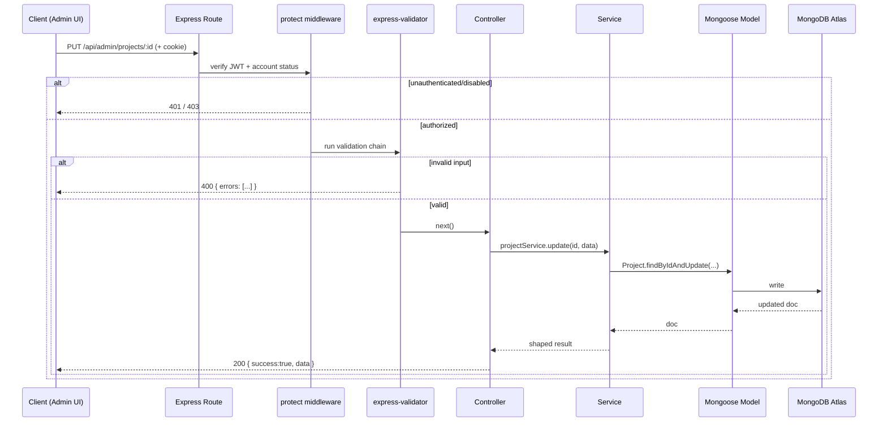

---

## 15. API Architecture

### 15.1 API Base Structure
All API routes are mounted under `/api`. Public resource routes and admin resource routes are namespaced separately (`/api/projects` vs. `/api/admin/projects`) rather than differentiated by query parameter or header, so authorization boundaries are visible in the URL structure itself and trivially enforceable by mounting order (TRD BE-04, AUTH-09).

### 15.2 Endpoint Grouping & Resource Naming
Grouped by resource: `auth`, `projects`, `retail`, `checkout`, `enquiries`, `orders` (orders has no public-create endpoint — created internally by the checkout service, not directly by a client POST to `/api/orders`).

### 15.3 HTTP Methods
Standard REST semantics: `GET` (read), `POST` (create / non-idempotent action like checkout initiation, payment verification, login), `PUT` (full update), `PATCH` (partial update — used specifically for status-only transitions on Enquiries/Orders, TRD API-22/API-26), `DELETE` (remove).

### 15.4 Full Endpoint Reference

**Authentication**
| Endpoint | Access | Purpose |
|---|---|---|
| `POST /api/auth/login` | Public | Authenticate admin, set session cookie |
| `GET /api/auth/me` | Admin (cookie) | Confirm current identity / bootstrap session |
| `POST /api/auth/logout` | Admin (cookie) | Clear session cookie |

**Projects**
| Endpoint | Access | Purpose |
|---|---|---|
| `GET /api/projects` | Public | List published projects |
| `GET /api/projects/:slug` | Public | Published project detail |
| `GET /api/admin/projects` | Admin | List all projects (any status) |
| `GET /api/admin/projects/:id` | Admin | Project detail by ID |
| `POST /api/admin/projects` | Admin | Create (multipart, image upload) |
| `PUT /api/admin/projects/:id` | Admin | Update (incl. publish toggle) |
| `DELETE /api/admin/projects/:id` | Admin | Delete + flag Cloudinary cleanup |

**Retail**
| Endpoint | Access | Purpose |
|---|---|---|
| `GET /api/retail` | Public | List published, available items |
| `GET /api/retail/:slug` | Public | Published item detail |
| `GET /api/admin/retail` | Admin | List all items |
| `GET /api/admin/retail/:id` | Admin | Item detail by ID |
| `POST /api/admin/retail` | Admin | Create (multipart) |
| `PUT /api/admin/retail/:id` | Admin | Update (incl. publish/availability toggles) |
| `DELETE /api/admin/retail/:id` | Admin | Delete + flag Cloudinary cleanup |

**Cart & Checkout**
| Endpoint | Access | Purpose |
|---|---|---|
| `POST /api/checkout` | Public | Re-validate cart server-side, create Razorpay order |
| `POST /api/checkout/verify` | Public (tied to order/payment reference) | Verify Razorpay signature, finalize order |

**Orders**
| Endpoint | Access | Purpose |
|---|---|---|
| `GET /api/admin/orders` | Admin | List orders |
| `GET /api/admin/orders/:id` | Admin | Order detail |
| `PATCH /api/admin/orders/:id/status` | Admin | Update order status only (never payment status) |

**Enquiries**
| Endpoint | Access | Purpose |
|---|---|---|
| `POST /api/enquiries` | Public | Submit enquiry |
| `GET /api/admin/enquiries` | Admin | List enquiries |
| `GET /api/admin/enquiries/:id` | Admin | Enquiry detail |
| `PATCH /api/admin/enquiries/:id/status` | Admin | Update status |
| `DELETE /api/admin/enquiries/:id` | Admin | Delete |

No endpoint beyond this list exists (TRD §6, closing statement). No endpoint corresponds to an Out-of-Scope PRD feature (customer accounts, bookings, reviews, wishlists).

### 15.5 Request / Response Structure
Standard envelope (TRD BE-12), used by every endpoint without exception:
```json
// Success
{ "success": true, "data": { /* resource or list */ } }

// Failure
{ "success": false, "message": "Human-readable summary", "errors": [ { "field": "email", "message": "Invalid email" } ] }
```
The `errors` array is present only for validation failures (400).

### 15.6 Authentication / Authorization Requirements
Stated per-endpoint above and enforced by route mounting (`/api/admin/*` behind `protect`) — never inferred implicitly.

### 15.7 Validation
Every mutating endpoint runs its `express-validator` chain before any service/DB call (Section 12.7).

### 15.8 Pagination, Filtering, Sorting, Searching
- **Public listings** (`/api/projects`, `/api/retail`): return published (and, for retail, available) items; category filtering is supported as a query parameter (`?category=`) mapped to the compound indexes defined in Section 18, matching UI-UX §45's `CategoryTabBar`. Full-catalog "Load More"/"View All" pagination (UI-UX §65/§67) is implemented via `?limit=&skip=` (or cursor-based if volume later requires it — TRD PERF-08), server-enforced, not a client-side slice of an over-fetched full list.
- **Admin listings** (`/api/admin/orders`, `/api/admin/enquiries`): paginated once volume makes an unbounded list impractical (TRD PERF-08); sorting defaults to newest-first (`createdAt: -1`), matching the Enquiries index (Section 18).
- **Searching**: not a named PRD requirement beyond category filtering. `Not Applicable — Reason: PRD does not define a text-search requirement for any resource; category filtering (already covered) is the only filtering behavior specified.`

### 15.9 CRUD Behavior
Documented per-resource in Section 9.8 (admin) and Section 14 (lifecycle).

### 15.10 Versioning Strategy
`Not Applicable — Reason: PRD/TRD define a single-client, co-deployed API with no external third-party API consumers and no requirement to support multiple API versions simultaneously; introducing `/v1/` prefixing now would be unused complexity. If a public API consumer is ever introduced (Section 23), versioning is added at that point, not preemptively.`

### 15.11 Per-Endpoint Flow (representative example — Checkout)
```text
Client (Cart page)
 → POST /api/checkout { items: [{ retailId, qty }], customerInfo }
 → express-rate-limit (checkout-scoped)
 → express-validator (shape check)
 → checkout.controller
 → checkout.service:
     - re-fetch each item from MongoDB by ID (never trust client price/name)
     - verify existence + availability + published status
     - compute server-side total
     - create Razorpay order via Razorpay SDK
     - persist a "pending" Order document with the snapshot + computed amount
 → Response: { success:true, data: { razorpayOrderId, amount, currency } }
 → Client opens Razorpay checkout widget with VITE_RAZORPAY_KEY_ID (public key only)
 → Razorpay → Client → POST /api/checkout/verify { razorpay_order_id, razorpay_payment_id, razorpay_signature }
 → checkout.service verifies signature server-side (Razorpay secret, backend-only)
 → On valid signature: Order.paymentStatus = 'paid', Order.orderStatus = 'confirmed'
 → On invalid/failed/cancelled: Order.paymentStatus = 'failed'/'cancelled'; never 'paid'
 → Response reflects final order state → Client renders confirmation or failure state
```

---

## 16. API Error Architecture

### 16.1 Error Response Format
Uniform across every endpoint (Section 15.5's failure shape). HTTP status code always accompanies the envelope; the envelope shape itself does not vary by status code, only its content does.

### 16.2 Error Categories & Status Codes

| Category | Status | Trigger | Detail Returned |
|---|---|---|---|
| Validation error | 400 | `express-validator` chain fails, or a business-rule check (e.g., empty-cart checkout — PRD FR-F5) fails | Field-level `errors` array or a descriptive `message` |
| Authentication error | 401 | Missing/invalid/expired JWT cookie | Generic message, no detail on *why* the token is invalid |
| Authorization error | 403 | Valid token, disabled account, or (future) insufficient role | Generic message |
| Not found | 404 | Invalid/deleted/unpublished slug or ID (public); invalid ObjectId format mapped to 404 rather than an uncaught cast error (TRD §11) | Generic "not found" message |
| Conflict | 409 | Reserved for cases like a duplicate `slug`/`email` uniqueness violation surfaced from Mongoose | Descriptive, non-internal message |
| Rate limited | 429 | `express-rate-limit` threshold exceeded on login/enquiry/checkout | Generic "too many requests" message |
| Server error | 500 | Uncaught exception, DB failure, unexpected condition | Generic message only; full detail logged server-side (Section 20), never returned to the client in any environment |

### 16.3 Frontend Consumption of API Errors
The `axiosClient` response interceptor (Section 6.10) normalizes every error into `{ status, message, errors? }` regardless of which layer produced it, and additionally distinguishes a **network/timeout failure** (no `response` object — request never reached the server) from a **server-returned error** (`response.status` present) so the UI renders the correct state (an offline/network error state vs. a validation/auth/not-found state) rather than an indefinite loading spinner (PRD FR-P3, TRD §11 "Network failures"). Field-level `errors` are mapped onto the corresponding form field's inline error display (Section 6.9); non-field errors render in the page/component's `ErrorState`.

---

## 17. Database Architecture

### 17.1 Database Technology
MongoDB Atlas (managed cluster), accessed exclusively via Mongoose from the backend's service/model layer (PRD §11, TRD §2.3/§7). No direct client access exists (PRD FR-P1).

### 17.2 Database Purpose
Single system of record for all dynamic application data: Projects, Retail items, Enquiries, Orders, Admin accounts. Cloudinary holds image binaries only; MongoDB holds the resulting URLs/public IDs (PRD §11).

### 17.3 Collections

#### `projects`
| Field | Type | Notes |
|---|---|---|
| `title` | String | Required |
| `slug` | String | Required, unique, lowercase, trim, URL-safe (generated server-side, TRD SEO-03) |
| `category` | String | Required where categories apply; validated against an approved constant list shared with the Mongoose `enum` |
| `location` | String | Optional |
| `year` | Number | Optional, four-digit |
| `description` | String | Required |
| `images` | [String] | Cloudinary URLs; required (≥1) when `published: true` |
| `details` | Object | Structured, explicitly-defined sub-fields (e.g., area, style, scope) — not a free-form blob |
| `price` | Number | Required only when the project is marked purchasable (conditional Mongoose validator) |
| `published` | Boolean | Required |
| `createdAt` / `updatedAt` | Date | `{ timestamps: true }`, backend-controlled |

**Indexes**: unique `slug`; compound `{ published: 1, category: 1 }`.
**Relationships**: referenced only via an embedded, point-in-time snapshot inside `orders` (never a live populate).

#### `retail`
| Field | Type | Notes |
|---|---|---|
| `title` | String | Required |
| `slug` | String | Required, unique, lowercase, trim |
| `category` | String | Per catalog needs, from an approved set |
| `description` | String | Required |
| `images` | [String] | Cloudinary URLs; required for published items |
| `price` | Number | Required, `min: 0` (non-negative) |
| `availability` | Boolean | Required, independent of `published` |
| `published` | Boolean | Required |
| `createdAt` / `updatedAt` | Date | Backend-controlled |

**Indexes**: unique `slug`; compound `{ published: 1, availability: 1 }`.

#### `enquiries`
| Field | Type | Notes |
|---|---|---|
| `name` | String | Required |
| `email` | String | Required, valid email format (schema-level regex as a second line of defense behind request validation) |
| `phone` | String | Required, String type (never Number, to preserve formatting/leading zeros) |
| `message` | String | Required, max length enforced |
| `source` | String | Origin page (e.g., `/contact`, `/projects/:slug`) |
| `status` | String enum | `new` / `in-progress` / `resolved` |
| `createdAt` | Date | Backend-controlled |

**Indexes**: `{ status: 1, createdAt: -1 }`.
**Visibility**: never exposed through any public endpoint (PRD FR-N4).

#### `orders`
| Field | Type | Notes |
|---|---|---|
| `orderId` / `_id` | ObjectId/String | Unique, backend-generated |
| `customerInfo` | Object | Name, email, phone, and any info collected at checkout |
| `items` | [Object] (embedded subdocuments) | Snapshot: item reference, name, quantity, unit price, total — **not** a live `ref` populate |
| `amount` | Number | Always server-computed at checkout time; never accepted from client input |
| `payment` | Object | Razorpay order/payment references, verification status |
| `paymentStatus` | String enum | `pending` / `paid` / `failed` / `cancelled` |
| `orderStatus` | String enum | `pending` / `confirmed` / `completed` / `cancelled` |
| `createdAt` / `updatedAt` | Date | Backend-controlled |

**Indexes**: `{ paymentStatus: 1, orderStatus: 1 }`; index on `razorpayOrderId`/`razorpayPaymentId` for fast verification lookup.
**Data integrity**: `amount` is computed exclusively in the checkout service; the schema/controller boundary never accepts it from client input (PRD FR-G3).

#### `admin`
| Field | Type | Notes |
|---|---|---|
| `name` | String | Required |
| `email` | String | Required, unique |
| `password` | String (hashed) | `select: false` by default; explicitly `.select('+password')`-ed only inside the login service |
| `role` | String enum | `admin` (single value at current scope) |
| `status` | String enum | `active` / `disabled` |
| `createdAt` / `updatedAt` / `lastLoginAt` | Date | Backend-controlled |

**Indexes**: unique `email`.

### 17.4 Entity Relationship Diagram

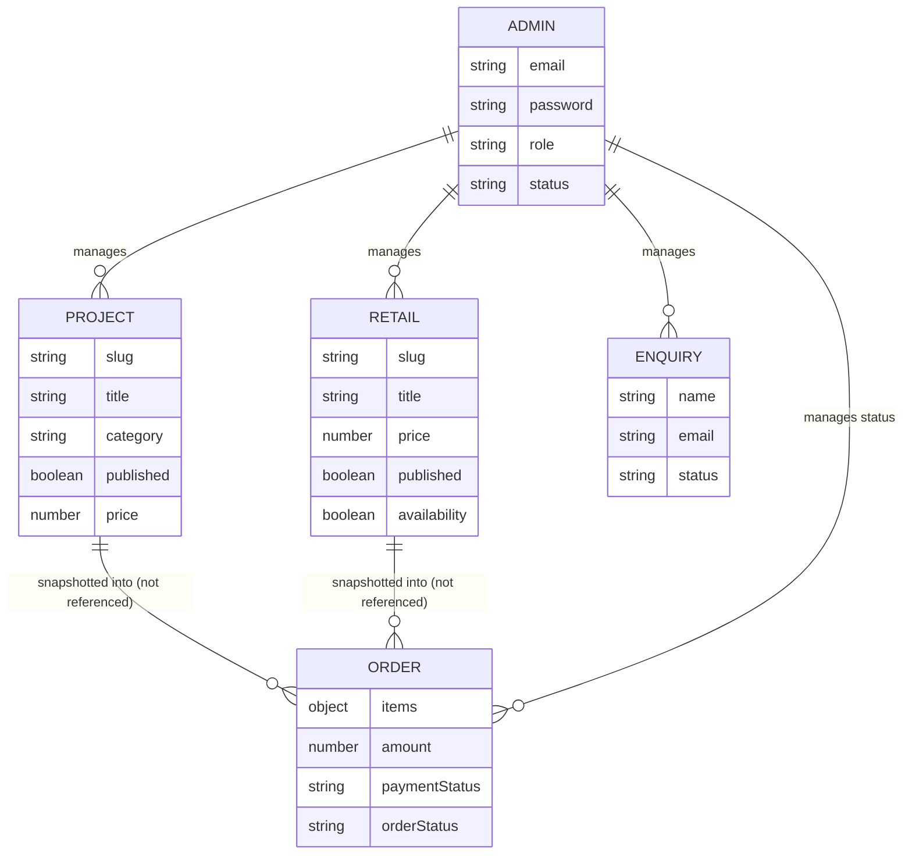

The dotted-in-spirit "snapshotted, not referenced" relationship is the single most important data-modeling decision in this system: `ORDER.items` embeds a copy of the purchased Project/Retail data at time of purchase, so a later edit or deletion of the source document never alters historical order records (PRD FR-H2, FR-M4; TRD §7 Orders "Mongoose specifics").

### 17.5 Primary Identifiers & References
Every collection uses MongoDB's default `_id` (ObjectId) as its primary identifier. `slug` (Projects, Retail) is a secondary unique, URL-facing identifier — never used as the actual foreign-key value anywhere (order snapshots store the item's `_id` reference alongside the snapshot data purely for admin traceability, never for live lookups).

### 17.6 Required Fields / Optional Fields / Unique Constraints
Documented per-collection above (17.3); enforced at both the `express-validator` request boundary (Section 12.7) and the Mongoose schema boundary (defense in depth, TRD §11 "Backend Validation").

### 17.7 Query Patterns
- Public listing queries always filter on `published: true` (and, for Retail, may additionally filter on `availability`), using the compound indexes defined per-collection.
- Public detail queries filter on `slug` + `published: true`, using the unique `slug` index.
- Admin listing queries have no `published` filter (see everything, regardless of status).
- Checkout re-validation queries fetch by `_id` (not `slug`) for each cart line item, since the cart already carries the item's ID from the listing/detail fetch.

### 17.8 Data Lifecycle
- **Projects/Retail**: created → (optionally) published/unpublished any number of times → deleted (hard delete). Deletion immediately removes public visibility (queries always filter on existence) and flags the associated Cloudinary asset(s) for cleanup via their stored public ID (Section 19).
- **Enquiries**: created (public) → status transitions (`new` → `in-progress` → `resolved`, admin-only) → optionally hard-deleted (admin-only).
- **Orders**: created at checkout initiation (`pending`/`pending`) → updated once by payment verification (`paid`/`confirmed` or `failed`/unchanged-`orderStatus`) → `orderStatus` may be further updated by admin over time (e.g., to `completed`). Orders are never deleted (no PRD requirement for order deletion — financial/historical record).
- **Admin**: provisioned out-of-band (no public registration endpoint — PRD explicitly scopes a single `admin` role with no self-service signup); `lastLoginAt` updated on each successful login.

### 17.9 Soft Delete
`Not Applicable — Reason: PRD defines hard deletion for Projects/Retail/Enquiries ("Delete" acceptance criteria, §12) with no requirement to retain a deleted record's own document — historical integrity for purchased items is achieved instead via the Order snapshot mechanism (17.3/17.4), not via soft-deleting the source Project/Retail document.` Orders themselves are never deleted at all (17.8), which serves the same "don't lose history" goal without needing a soft-delete flag anywhere.

### 17.10 Cascading Behavior
`Not Applicable — Reason: no true cascading relationship exists — Orders deliberately do not reference Projects/Retail live, specifically so that deleting a Project/Retail document has zero cascading effect on Order records (PRD FR-M4).` The only "cascade" in the system is deletion of a Project/Retail's associated Cloudinary images, which is an explicit service-layer step (Section 19), not a database-level cascade.

### 17.11 Mongoose Connection Management
Established once, at server startup, in `config/db.js`, exporting a single `connectDB()` called from `server.js` (TRD §7.1). Connection failures log clearly and exit the process rather than starting in a half-functional state. `mongoose.set('strictQuery', true)` is set explicitly. A single shared connection pool is reused across all requests — never reconnected per-request.

---

## 18. Data Flow Architecture

### 18.1 General Data Flow

```text
User Input (browser)
 → Frontend component state (controlled inputs) / route params
 → axiosClient request (feature api.js)
 → Express middleware pipeline (Section 12.2)
 → Controller → Service (business rules) → Model → MongoDB
 → Service shapes result → Controller builds envelope
 → API response
 → axiosClient interceptor normalizes success/error
 → Feature state updates (useState/useReducer, or AuthContext/CartContext for cross-cutting state)
 → UI re-renders (loading → success/error/empty/not-found state, per Section 6.11)
```

### 18.2 Data Flow — Project/Retail Browsing (representative "read" feature)

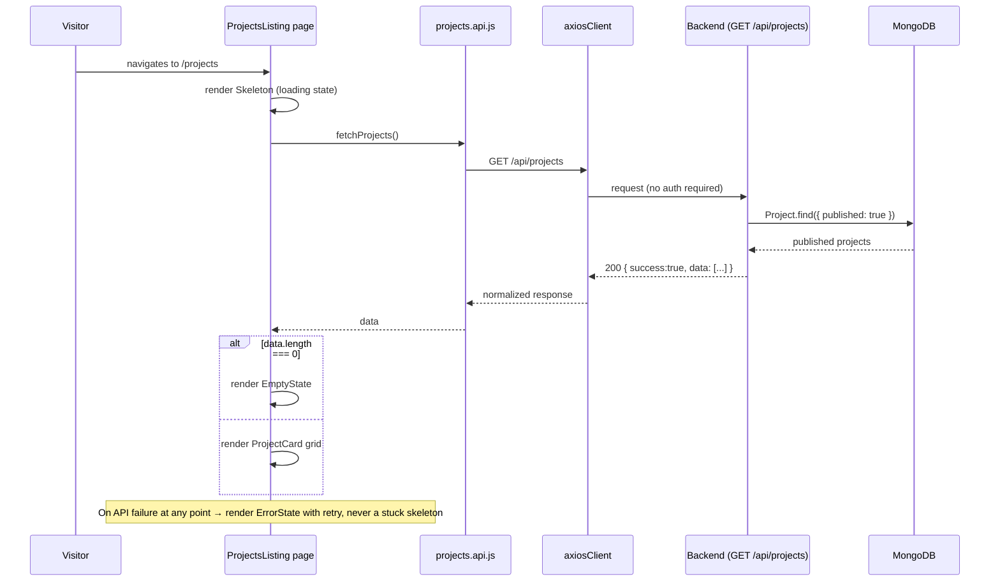

### 18.3 Data Flow — Enquiry Submission

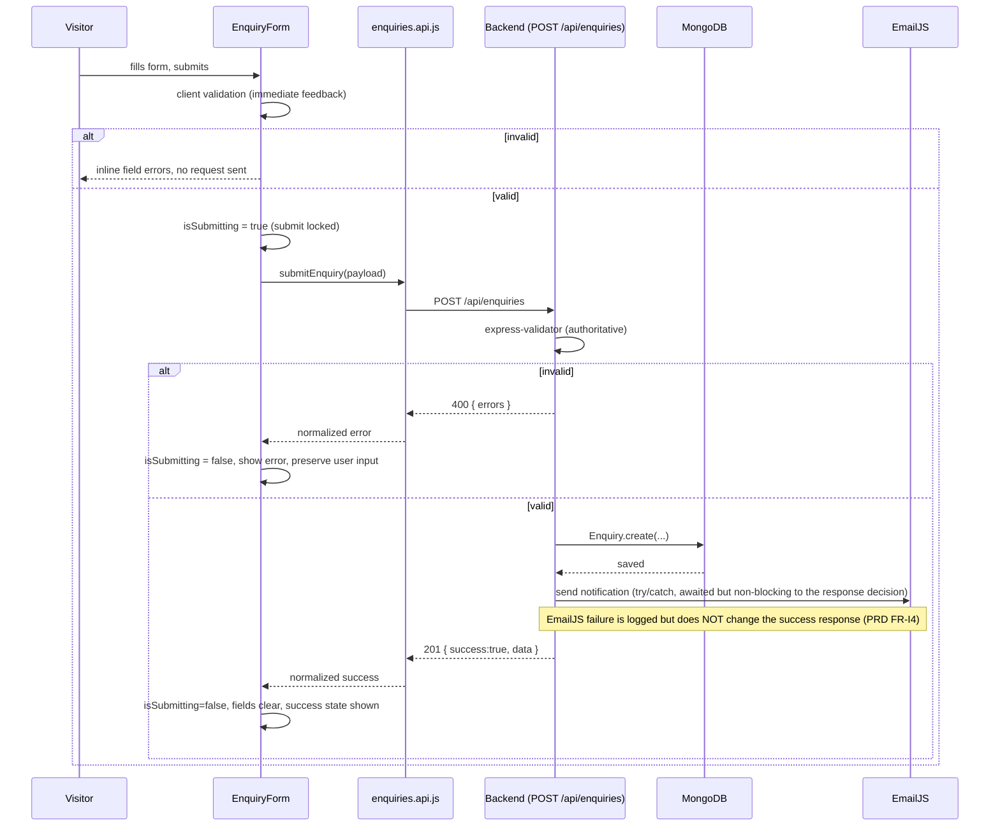

### 18.4 Data Flow — Retail Purchase (Cart → Checkout → Payment)

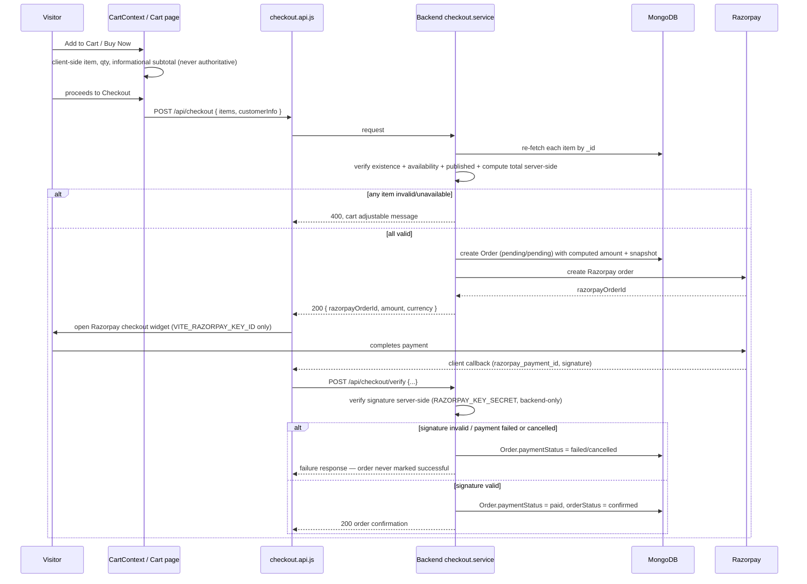

### 18.5 Data Flow — Admin CRUD (Create with Image Upload)

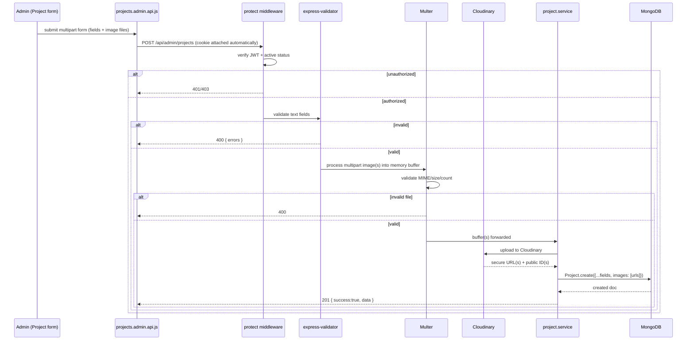

---

## 19. Feature-by-Feature Architecture

Each PRD-defined feature is documented below per the required template. Small but architecturally important features are not skipped.

### 19.1 Feature: Responsive Public Website Shell (Navbar/Footer/Layout)
- **Purpose**: Persistent chrome providing navigation, brand identity, and the cart entry point across every public page.
- **User Flow**: Any page load → `PublicLayout` renders `Navbar` + page content + `Footer`.
- **Frontend Components**: `Navbar`, `MobileDrawer`, `Footer`, `Button` (Login).
- **Backend Components**: None directly (static chrome); cart badge count derives from client `CartContext`, not an API call.
- **API**: None for the shell itself.
- **Database**: None.
- **Authentication**: N/A (public).
- **Authorization**: N/A.
- **Validation**: N/A.
- **Error Handling**: N/A — chrome is not data-dependent.
- **UI States**: N/A (always rendered).
- **Data Flow**: Static; no fetch.
- **Security Considerations**: The navbar's "Login" affordance routes to `/admin/login` per Section 5A-2's resolution.
- **Performance Considerations**: Zero additional requests; fonts loaded once at app root (UI-UX §07, TRD PERF-12).

### 19.2 Feature: Project Showcase (Listing + Detail)
- **Purpose**: Let visitors discover and evaluate the studio's past work (PRD §4, §7 FR-B/FR-C).
- **User Flow**: Home → Projects → Project Detail → Enquiry CTA (PRD §6 "Project Discovery").
- **Frontend Components**: `ProjectListingRow`/`ProjectCard`, `ProjectGallery`, `Skeleton`, `EmptyState`, `ErrorState`, not-found view.
- **Backend Components**: `projects.routes.js` (public), `project.controller.js`, `project.service.js`, `Project.model.js`.
- **API**: `GET /api/projects`, `GET /api/projects/:slug`.
- **Database**: `projects` collection, `{ published: 1, category: 1 }` index.
- **Authentication**: None (public).
- **Authorization**: Public read of published projects only.
- **Validation**: Slug format validated at read-time (reject obviously malformed slugs early); no write validation on this feature's public side.
- **Error Handling**: Invalid/deleted/unpublished slug → 404 → frontend not-found state (PRD FR-C4). API failure → `ErrorState` with retry.
- **UI States**: Loading (skeleton), Empty (no published projects), Error, Not-found (bad slug), Success.
- **Data Flow**: Section 18.2 pattern.
- **Security Considerations**: The public API must never leak `published: false` documents — enforced by the query filter in `project.service.js`, not by frontend filtering (PRD FR-B5).
- **Performance Considerations**: Listing query uses `.select()` to return only summary fields (title, slug, category, one thumbnail image) — full detail fetched only on the detail view (TRD PERF-05).

### 19.3 Feature: Retail Catalog (Listing + Detail)
- **Purpose**: Let visitors browse and evaluate purchasable retail products (PRD §4, §7 FR-D/FR-E).
- **User Flow**: Home → Retail → Retail Detail → Add to Cart (PRD §6 "Retail Discovery").
- **Frontend Components**: `RetailProductCard`, `CategoryTabBar`, `Skeleton`/`EmptyState`/`ErrorState`, not-found view.
- **Backend Components**: `retail.routes.js` (public), `retail.controller.js`, `retail.service.js`, `Retail.model.js`.
- **API**: `GET /api/retail` (with `?category=`), `GET /api/retail/:slug`.
- **Database**: `retail` collection, `{ published: 1, availability: 1 }` index.
- **Authentication**: None.
- **Authorization**: Public read of published + (for purchase-action visibility) available items.
- **Validation**: Slug/category query param format checks.
- **Error Handling**: Same not-found/error pattern as Projects. Unavailable items have their purchase action disabled/hidden client-side (PRD FR-D3), but this is a UX convenience — the checkout re-validates availability server-side regardless (Section 19.4).
- **UI States**: Loading, Empty, Error, Not-found, Success.
- **Data Flow**: Section 18.2 pattern.
- **Security Considerations**: Same visibility-filtering rule as Projects (PRD FR-D1/FR-D4).
- **Performance Considerations**: "Load More"/pagination per UI-UX §65/§67 (6 items initial load) rather than fetching the full catalog at once.

### 19.4 Feature: Cart & Checkout
- **Purpose**: Let visitors accumulate retail items and pay for them securely (PRD §4, §7 FR-F/FR-G).
- **User Flow**: Retail Detail → Add to Cart → Cart (view/update/remove) → Buy Now/Checkout → Razorpay → Payment Verification → Order Confirmation (PRD §6 "Retail Purchase").
- **Frontend Components**: `CartDrawer`, `CartLineItem`, Cart page, checkout form fields.
- **Backend Components**: `checkout.routes.js`, `checkout.controller.js`, `checkout.service.js`, `Order.model.js`, `Retail.model.js`/`Project.model.js` (read-only re-validation), Razorpay SDK integration.
- **API**: `POST /api/checkout`, `POST /api/checkout/verify`.
- **Database**: Reads `retail`/`projects` for re-validation; writes `orders`.
- **Authentication**: None (no visitor accounts — Section 5A-2).
- **Authorization**: Anyone may check out; no ownership model.
- **Validation**: Cart cannot be empty (PRD FR-F5, rejected server-side regardless of client state); customer info fields validated via `express-validator`.
- **Error Handling**: Item unavailable/invalid at checkout → rejected with a clear, cart-adjustable message (PRD acceptance criteria §12); payment failure/cancellation → explicit failure state, no order ever marked successful (PRD FR-G6).
- **UI States**: Empty cart (checkout disabled), item-invalid-at-checkout, payment success (only after backend verification), payment failure/cancellation.
- **Data Flow**: Section 18.4.
- **Security Considerations**: This is the highest-stakes feature in the system — **price and payment success are never trusted from the client** (PRD FR-G3/FR-G5, TRD SEC-13/14). Razorpay secret never reaches the frontend (PRD FR-G4).
- **Performance Considerations**: Checkout re-validation is a small, bounded set of by-ID lookups (cart size is naturally small) — no pagination/index concern here beyond the existing `_id` primary index.

### 19.5 Feature: Order Management (Admin)
- **Purpose**: Let admins track and progress orders/payments (PRD §4, §7 FR-O).
- **User Flow**: Admin Login → Orders → View Order → View Customer/Payment Details → Update Order Status (PRD §6 "Order Management").
- **Frontend Components**: `OrdersAdminPage`, order detail view/table.
- **Backend Components**: `admin/orders.routes.js`, `order.controller.js`, `order.service.js`, `Order.model.js`.
- **API**: `GET /api/admin/orders`, `GET /api/admin/orders/:id`, `PATCH /api/admin/orders/:id/status`.
- **Database**: `orders` collection, `{ paymentStatus, orderStatus }` index.
- **Authentication**: Required (`protect`).
- **Authorization**: Admin-only.
- **Validation**: `orderStatus` must be one of the defined enum values; the endpoint structurally cannot accept a `paymentStatus` field at all (PRD FR-O3 — enforced by the service only ever reading/writing `orderStatus` from this request, never `paymentStatus`).
- **Error Handling**: Attempt to set payment status via this endpoint is not merely rejected — the field is not part of the accepted request shape in the first place.
- **UI States**: Loading, empty (no orders yet), error, success/failure per status update.
- **Data Flow**: Standard admin CRUD read/update pattern (Section 18.5, minus the upload step).
- **Security Considerations**: PRD FR-O3 is one of the system's non-negotiable rules — payment status only ever derives from a verified Razorpay signature (Section 19.4), never from any admin action, by construction (no code path exists for it).
- **Performance Considerations**: Pagination once order volume grows (TRD PERF-08).

### 19.6 Feature: Enquiry System (Submission + Management)
- **Purpose**: Convert visitor interest into tracked leads (PRD §4, §7 FR-I, FR-N).
- **User Flow (submission)**: Enquiry Form → Client Validation → Backend Validation → MongoDB → EmailJS → Success/Error (PRD §6 "Enquiry Submission"). **User Flow (management)**: Admin Login → Enquiries → View/Update Status/Delete (PRD §6 "Order Management" analog, listed under FR-N).
- **Frontend Components**: `InquiryForm` (shared, rendered on Contact and optionally Home/Services/project/retail pages per UI-UX §61/§75), `EnquiriesAdminPage`.
- **Backend Components**: `enquiries.routes.js` (public create), `admin/enquiries.routes.js`, `enquiry.controller.js`, `enquiry.service.js`, `Enquiry.model.js`, EmailJS integration.
- **API**: `POST /api/enquiries`, `GET /api/admin/enquiries`, `GET /api/admin/enquiries/:id`, `PATCH /api/admin/enquiries/:id/status`, `DELETE /api/admin/enquiries/:id`.
- **Database**: `enquiries` collection, `{ status, createdAt }` index.
- **Authentication**: Submission — none; management — required.
- **Authorization**: Submission — public; management — admin-only; enquiry data is **never** exposed through any public API (PRD FR-N4) — there is no `GET /api/enquiries` (public) endpoint at all.
- **Validation**: Required fields (name, phone, project type on the frontend per UI-UX §75; PRD's backend field set additionally requires email format and message length caps) validated client- and server-side.
- **Error Handling**: Section 18.3's full flow — critically, an EmailJS failure never surfaces as an enquiry-submission failure once the MongoDB write has succeeded (PRD FR-I4).
- **UI States**: Initial, Validation error, Submitting (duplicate-submission-locked), Success, Failure (PRD §9 "Enquiry States").
- **Data Flow**: Section 18.3.
- **Security Considerations**: Free-text fields (message) are trimmed and length-capped (TRD §11); enquiry data's public-invisibility (FR-N4) is enforced by never defining a public-read route, not by filtering.
- **Performance Considerations**: Rate-limited (`express-rate-limit`) to reduce spam/abuse (TRD SEC-06).

### 19.7 Feature: Admin Authentication
- Fully specified in Section 10 (Authentication Architecture) and Section 10.15 (sequence diagram) — cross-referenced here to satisfy per-feature documentation completeness rather than duplicated.

### 19.8 Feature: Admin Dashboard
- **Purpose**: Central navigation hub + at-a-glance counts (PRD §4, §7 FR-K).
- **User Flow**: Admin Login → Dashboard → navigate to any management area.
- **Frontend Components**: `DashboardPage`, count cards.
- **Backend Components**: Lightweight count queries per resource (implemented either as dedicated `GET /api/admin/dashboard` aggregation or as the admin already fetches each list — implementation detail; either satisfies FR-K2 without a new architectural concept).
- **API**: `GET /api/auth/me` (session bootstrap) + count source (Section 15.4 endpoints, `.countDocuments()` server-side).
- **Database**: Read-only counts across all five collections.
- **Authentication/Authorization**: Admin-only.
- **Validation**: N/A (read-only).
- **Error Handling**: Standard error state per count widget.
- **UI States**: Loading, error, success.
- **Data Flow**: Simple read fan-out.
- **Security Considerations**: Counts reveal no sensitive field values, only aggregate numbers.
- **Performance Considerations**: `.countDocuments()` uses existing indexes; no additional index required.

### 19.9 Feature: Project Management (Admin CRUD)
### 19.10 Feature: Retail Management (Admin CRUD)
Both fully specified in Section 9.8 (CRUD Architecture) and Section 18.5 (sequence diagram) — cross-referenced here rather than duplicated. Distinct points: Retail additionally exposes an independent `availability` toggle alongside `published` (PRD FR-M3); Project additionally supports an optional `price` + purchasable flag (PRD FR-L1, FR-C3).

### 19.11 Feature: Image Handling (Upload/Delete)
- **Purpose**: Let admins attach media to Projects/Retail without direct file-system access (PRD §4, §11).
- **User Flow**: Embedded within Project/Retail create/update (Section 9.8) and delete (Section 9.10) flows.
- **Frontend Components**: File input within `ProjectForm`/`RetailForm`.
- **Backend Components**: Multer upload middleware, `upload.service.js`, Cloudinary SDK.
- **API**: Embedded in `POST`/`PUT /api/admin/projects[/:id]` and `.../retail[/:id]` (multipart), and implicitly in `DELETE` (triggers Cloudinary cleanup).
- **Database**: `images: [String]` field on Project/Retail documents (URLs only).
- **Authentication/Authorization**: Admin-only (upload is always embedded in an already-protected CRUD route).
- **Validation**: File type (image MIME types only), size limit, count limit — enforced by Multer configuration before Cloudinary is ever called (TRD §17).
- **Error Handling**: Invalid file → 400 before any Cloudinary call; Cloudinary failure → caught, logged, generic error returned (PRD §11 "Integration Security").
- **UI States**: Upload-in-progress (part of the form's `isSubmitting` state), success, error.
- **Data Flow**: Section 18.5.
- **Security Considerations**: In-memory buffering only — uploads are never written to local disk (TRD §17, since the production server's local filesystem is not durable/scalable at this scope and Multer's disk-storage mode is deliberately not used).
- **Performance Considerations**: Cloudinary transformation parameters (`f_auto`, `q_auto`, sized per context) applied at render time on the frontend, not at upload time — a single stored original serves every display size (TRD PERF-01, FE-28).

---

## 20. UI-UX to Architecture Mapping

This section translates the visual/interaction system (UI-UX §06–§25, §57–§65) into where each concern lives technically, without duplicating the UI-UX document itself.

### 20.1 Design System Architecture
- **Color, typography, spacing, radius, shadow tokens** (UI-UX §06–§08, §18–§20) → defined **once** in `tailwind.config.js` as theme extensions (TRD FE-15/FE-17). No component hardcodes a hex value, a pixel spacing value, or a font stack — every value is a Tailwind class resolving to a config token.
- **The single `<Button />` component** (UI-UX §23) → `shared/components/Button.jsx`; every call site passes only `label`/`variant`/`icon` props per UI-UX §23's usage-mapping table (Section 6.5, tier 1).

### 20.2 Typography
Abhaya Libre + Inter, weights {400, 500, 600} only (UI-UX §07) → loaded once via `@font-face` in `styles/globals.css` (the one sanctioned global stylesheet, TRD FE-16a), referenced through Tailwind's `fontFamily` theme tokens (`font-heading`, `font-body`) rather than inline `font-family` declarations anywhere else.

### 20.3 Color Tokens
UI-UX §06's full palette → `tailwind.config.js` `colors` extension (`ink`, `muted`, `border`, `surface`, `cream`, `brown`, `footer-bg`, `footer-text`, `footer-muted`), plus the interactive/system colors (error, success, brand-hover colors) as named tokens, never as one-off arbitrary values (TRD FE-17 explicitly flags `mt-[13px]`-style arbitrary values as a signal to add a config token instead).

### 20.4 Spacing Tokens
UI-UX §08's 8px-based scale maps directly onto Tailwind's default spacing scale (values `1,2,3,4,6,8,12,16,24,32` already correspond to `4/8/12/16/24/32/48/64/96/128px`) — no custom spacing scale override is needed since Tailwind's defaults already align.

### 20.5 Breakpoints
UI-UX §69: `640, 768, 1024, 1280, 1440` → Tailwind's default `sm/md/lg/xl/2xl` breakpoints are used as-is (no custom breakpoint config required), satisfying TRD RESP-01's 320px–3840px range via `min-width` progressive enhancement from the unprefixed (mobile) base styles upward.

### 20.6 Component Variants
The `Button` component's `variant` prop (`Primary`, `Secondary/Outline`, `Secondary/Text`) is the only styling variance mechanism for buttons anywhere (UI-UX §23) — no per-page button styling override is introduced.

### 20.7 Responsive Behavior
See Section 21 (dedicated section below).

### 20.8 Interaction Behavior (Hover/Focus/Active/Disabled/Selected)
UI-UX §52–§56's state rules → implemented via Tailwind's `hover:`, `focus-visible:`, `active:`, `disabled:` (or `aria-disabled` + conditional classes), `data-[state=selected]`-style variants directly on each shared component — never a separate CSS-in-JS state layer. Focus rings (UI-UX §54) use Tailwind's `ring-2 ring-offset-2` utilities matching the documented `#111111` value, applied consistently via a shared `focus-visible:` class set on every interactive shared component rather than redefined per instance.

### 20.9 Animation Behavior
See Section 24 (Animation Architecture).

### 20.10 Loading / Empty / Error States
UI-UX §49–§51 → implemented through the shared `Skeleton`, `EmptyState`, `ErrorState` components (Section 6.11), parameterized (dimensions, message, icon) per call site rather than re-implemented per feature.

### 20.11 Accessibility Behavior
See Section 22 (Accessibility Architecture).

### 20.12 Which Layer Owns Which UI-UX Concern

| UI-UX Concern | Technical Layer |
|---|---|
| Colors, spacing, radius, shadow, typography tokens | `tailwind.config.js` |
| Layout, responsive reflow | Tailwind utility classes directly in JSX |
| Component variants (Button, Card) | Component `props`, not new components |
| Cross-cutting session/cart UI state | `AuthContext` / `CartContext` |
| Route-driven active states (nav underline) | `react-router-dom`'s `NavLink` + Tailwind |
| Scroll-position-driven animation (pinning, scroll reveals) | GSAP + ScrollTrigger, synced to Lenis (Section 24) |
| Component-scoped animation (hover, mount/unmount, drawers, modals) | Framer Motion (Section 24) |
| Visibility-gated behavior (lazy mount, deferred image load) | `react-intersection-observer` |
| Static section copy (FAQ questions, service descriptions, footer links) | `*.data.js` files (Section 7) |
| Backend-driven content (project/retail data) | API layer, never a data file |

No UI-UX requirement is duplicated verbatim in this document — this section explains only its architectural implication, consistent with the "explain implications, don't rewrite" instruction.

---

## 21. Responsive Architecture

### 21.1 Breakpoints (from UI-UX §09/§63, mapped to Tailwind defaults — Section 20.5)
| Breakpoint | Width | Container max-width | Horizontal padding |
|---|---|---|---|
| Mobile | < 640px | 100% | 20px |
| Tablet | 640–1024px | 100% | 32px |
| Desktop | 1024–1440px | 1280px, centered | 40px |
| Large desktop | ≥ 1440px | 1400px, centered | 48px |

Tested boundary widths (UI-UX §63): 320, 360, 375, 390, 414, 480, 640, 768, 1024, 1280, 1440, 1920+ (TRD DEV/acceptance criteria additionally names ~2560–3840px for 4K).

### 21.2 Mobile Layout
Single-column stacking for every grid (Expertise, Services, Retail, Contact cards); `MobileDrawer` replaces the inline nav link row; touch targets ≥ 44×44px (UI-UX §64, RESP-09).

### 21.3 Tablet Layout
2-column grids where desktop uses 3–4 columns (UI-UX §11's per-section grid table); nav links may still collapse into the drawer below 1024px per UI-UX §27.

### 21.4 Desktop Layout
Full grid column counts per UI-UX §11 (e.g., Retail 3-column, Services 3-column, Home Expertise 2×2); inline nav link row visible.

### 21.5 Navigation Behavior
Collapses into `MobileDrawer` below the point where nav links no longer fit (UI-UX §27, effectively < 1024px) — implemented as a single Tailwind breakpoint toggle (`hidden lg:flex` / `lg:hidden`), not a JS-computed width check, so it stays correct under browser zoom and OS text-scaling too.

### 21.6 Grid Behavior
Every grid reflows by column-count reduction only — content is never hidden at smaller widths (PRD §10, TRD RESP-03/RESP-06). Implemented via Tailwind's responsive `grid-cols-*` utilities per the counts documented in UI-UX §11, never a second, separate mobile-only markup tree.

### 21.7 Typography Scaling
`clamp()`-based fluid sizing for display headings (UI-UX §07's H1–H3 `clamp()` values) — one of the sanctioned plain-CSS exceptions (TRD FE-16d), fed into Tailwind via CSS custom properties/arbitrary-value syntax; body/UI text uses Tailwind's standard responsive text-size utilities.

### 21.8 Image Behavior
Every image renders inside a fixed aspect-ratio box (`aspect-[4/5]`, `aspect-video`, `aspect-square` per UI-UX §14–17/§22) with `object-cover object-center`, never `object-fill` — this combination is what guarantees both "no unintended cropping/stretching" and "no layout shift" simultaneously (TRD RESP-04).

### 21.9 Form Behavior
Inputs use `w-full` within appropriately constrained containers, never fixed pixel widths (TRD RESP-05); the `InquiryForm`'s textarea auto-grows up to a max-height then scrolls internally (UI-UX §75).

### 21.10 Modal / Drawer Behavior
`MobileDrawer` and `CartDrawer` are full-height, right-slide overlays at mobile/tablet widths (UI-UX §27–28); any confirm/payment-status modal (UI-UX §42) is centered with a `max-width: 480px` cap so it never touches viewport edges even on the smallest supported width.

### 21.11 Admin Responsive Behavior
`AdminLayout` remains usable at tablet/desktop widths; complex tables (Orders, Enquiries, Project/Retail lists) scroll horizontally within their own `overflow-x-auto` container, never causing the whole page to scroll sideways (PRD §10, TRD RESP-08). Not optimized for sub-tablet mobile widths, since the PRD does not require full mobile admin usability, only tablet-and-up (PRD §10: "must remain usable on tablet and desktop widths").

### 21.12 Implementation Without Duplicating Components
No component is ever forked into a "mobile version" and a "desktop version." Every responsive behavior described above is expressed as Tailwind responsive-prefix classes (`sm:`, `md:`, `lg:`, `xl:`, `2xl:`) on a single component tree, per TRD FE-15/RESP-01 — this is the architectural guarantee that responsive behavior stays consistent and doesn't drift between two parallel implementations over time.

---

## 22. State Management Architecture

### 22.1 State Inventory & Classification

| State | Classification | Owner | Modifiable By | Synchronization | Reset Condition |
|---|---|---|---|---|---|
| Admin session (`isAuthenticated`, `admin` identity) | Authentication state | `AuthContext` | Login/logout flows only | Bootstrapped via `GET /api/auth/me` on app load; re-checked after any 401 response | On logout, on 401 interceptor trigger, on tab close (cookie-backed, not client-persisted) |
| Cart contents + informational subtotal | Global (cross-page) state | `CartContext` | Add/update/remove actions | Purely client-side; re-validated server-side only at checkout (never synced back from server pre-checkout) | Session/tab lifetime only — no persistence (TRD FE-09); resets on full page reload by design |
| Form field values (Enquiry, Checkout, Admin CRUD forms) | Local/component state | The owning form component | User input | N/A (local) | On successful submit (fields clear) or component unmount |
| `isSubmitting` / loading flags | Local UI state | The owning component | Request lifecycle | N/A | On request settle (success or failure) |
| Fetched listing/detail data (Projects, Retail, Enquiries, Orders) | Server state | The owning page/feature component | Re-fetch on mount/param change | Not cached/synced globally — refetched per navigation (no client cache layer introduced, Section 27) | On navigation away / component unmount |
| Active route / `:slug` params | URL state | `react-router-dom` | Navigation | Browser history | N/A — always derived from the URL |
| Mobile drawer open/closed, cart drawer open/closed, FAQ accordion open item | Local UI state | The owning component | User interaction | N/A | On close/route change |
| `prefers-reduced-motion` flag | Persistent (OS-level) state | `useReducedMotion` hook wrapping `window.matchMedia` | OS setting only | Read once, listened for changes | N/A (reflects OS setting live) |

### 22.2 Global State Mechanism
`AuthContext` and `CartContext` are the **only two** cross-cutting Context providers (TRD FE-09). All other state is local to the component/feature that owns it — no global store (Redux/Zustand) is introduced, since React Context + component state is sufficient at this project's scope (TRD §2.1's explicit exclusion list).

### 22.3 Avoiding Premature Global State
Per-page fetched data (Projects listing, Retail listing, admin tables) is **not** lifted into global state or a client-side cache layer — each page/feature fetches what it needs on mount. This is a deliberate simplicity choice matching TRD's "avoid global state when local state is sufficient" principle; if duplicate-fetch cost or cross-page cache-sharing becomes a measured problem, see Section 41 (Scalability) for the evolution path (e.g., introducing a data-fetching library), not a default introduced now.

### 22.4 State That Never Lives in Global/Client State
The JWT itself (httpOnly cookie only — Section 10.6); Razorpay secret and any backend-only credential (never reaches the client at all — Section 26); server-authoritative price/availability/payment-status (always re-derived from the backend, never cached client-side as a source of truth for a subsequent mutating action).

---

## 23. Form Architecture

### 23.1 Forms in Scope
`InquiryForm` (shared, Contact + optionally Home/Services/project/retail pages), Checkout contact-info fields (Cart/Checkout page), Admin CRUD forms (`ProjectForm`, `RetailForm`), Admin login form.

### 23.2 Form Ownership
Each form is a controlled component owned by its feature (`features/enquiry/components/EnquiryForm.jsx`, `features/admin/projects/ProjectForm.jsx`, etc.) — no form logic lives in a page component directly; the page composes the form.

### 23.3 Input Components
Built from the shared primitives (`TextInput`, `TextArea`, `Select`, `FormLabel`, `FormError` — Section 6.5 tier 1), styled per UI-UX §25's Form System spec (border, radius, focus, error, success, disabled states) — never a one-off input markup per form.

### 23.4 Validation
- **Client-side**: immediate feedback via `shared/utils/validators.js`, matching UI-UX §75's field-level rules for the InquiryForm (required-ness, min-length, phone pattern, email pattern where applicable) and equivalent rules for other forms — non-authoritative (Section 6.9).
- **Server-side**: `express-validator` chains, authoritative regardless of client outcome (Section 12.7, TRD §11).

### 23.5 Submission Lifecycle
1. `isSubmitting = false` (Initial state, PRD §9).
2. On submit attempt: client validation runs; failures shown inline, request never sent (Validation error state).
3. On valid submit: `isSubmitting = true`, submit control disabled, request sent (Submitting state) — this is the mechanism that satisfies duplicate-submission prevention (PRD FR-I5), not a separate debounce/lock flag.
4. On response: `isSubmitting = false`; **Success** (fields clear, confirmation shown per UI-UX §75/§25) or **Failure** (error shown inline, user's entered data is preserved, not cleared, so they can retry — PRD §9 Enquiry States "Failure").

### 23.6 Loading / Success / Error State
Rendered exactly per PRD §9 and UI-UX §25 — the Button component's own loading state (spinner replacing the label) is reused for every form's submit control (UI-UX §23), never a bespoke per-form spinner.

### 23.7 Field-Level Errors
Every validation error is associated with its field via `aria-describedby` pointing at the error message's `id` (TRD A11Y-05), satisfying both the UX requirement (inline, near the field) and the accessibility requirement (programmatic association) with one mechanism.

### 23.8 Security Considerations
Server-side validation is authoritative regardless of what client validation allowed through (Section 23.4) — this is the form-layer instance of the system-wide rule that the backend never trusts client state. Free-text fields (Enquiry message, admin descriptions) are trimmed and length-capped server-side (TRD §11); if any such content is ever rendered as raw HTML (it is not, per current scope), it would additionally require sanitization before storage — flagged defensively, not implemented, since no rich-text rendering exists in the PRD.

### 23.9 Data Transformation
Phone numbers are handled as strings end-to-end (never cast to Number, which would drop leading zeros/formatting — PRD §8 Enquiry Data, TRD §7 Enquiries). Prices are handled as numbers with a `min: 0` schema constraint (Retail) or conditional-required constraint (purchasable Projects).

### 23.10 Client Validation Does Not Replace Server Validation
Stated explicitly because it is easy to erode in practice: **every** mutating endpoint re-validates server-side even when the frontend's own validation already passed (TRD §11 "Backend Validation is authoritative for every mutating endpoint regardless of client-side outcome").

---

## 24. File and Image Architecture

### 24.1 Upload Flow
Admin selects image(s) in `ProjectForm`/`RetailForm` → `multipart/form-data` submission → Multer middleware (in-memory storage) → server-side validation (MIME type, size, count) → forwarded to Cloudinary via the upload service → Cloudinary returns secure URL(s) + public ID(s) → persisted on the Project/Retail document's `images` array (Section 19.11).

### 24.2 File Validation
- **MIME validation**: image types only (e.g., JPEG, PNG, WebP) — enforced at the Multer layer before any bytes reach Cloudinary.
- **Size limits**: a defined per-file maximum (implementation-tunable value; PRD/TRD do not specify an exact byte ceiling, so this is an `Architectural Decision`, set conservatively enough to keep upload latency and Cloudinary storage cost reasonable, and revisited if the studio's actual photography file sizes require adjustment).
- **Count limits**: a defined maximum image count per Project/Retail item (same tunable-value note).

### 24.3 Storage Location
Cloudinary is the **sole** store for image binaries (PRD §11, TRD §17). MongoDB stores only the resulting secure URL and public ID — never binary image data.

### 24.4 File Naming / Organization
Cloudinary asset organization uses a per-resource folder/naming convention (e.g., `projects/<projectId>/`, `retail/<retailId>/`) so the stored public ID alone is always sufficient to issue a `destroy` call on deletion, with no additional lookup required (TRD §17).

### 24.5 Public / Private Files
All Project/Retail images are public-by-nature (they back public listing/detail pages once the parent document is published) — Cloudinary delivery URLs are public CDN URLs. `Not Applicable — Reason: no private/access-controlled media requirement exists anywhere in the PRD (no user-uploaded content, no gated media).`

### 24.6 Image Optimization
Cloudinary transformation parameters — `f_auto` (automatic best format, e.g. WebP/AVIF) and `q_auto` (automatic quality) — appended at render time via a shared `buildCloudinaryUrl` helper (TRD FE-28, PERF-01), sized appropriately per usage context (a smaller transform for a grid card, a larger one for a detail-page hero) — never a single fixed full-resolution URL reused everywhere.

### 24.7 CDN Strategy
Cloudinary's own CDN is the sole image-delivery CDN (TRD §2.4). No additional CDN layer (e.g., CloudFront in front of Cloudinary) is introduced — `Not Applicable — Reason: Cloudinary's built-in delivery network already satisfies the PRD's performance requirements at this project's scale; layering a second CDN would add operational complexity with no corresponding named requirement.`

### 24.8 Delete Behavior
On Project/Retail deletion, the admin service flags the associated Cloudinary public ID(s) for cleanup and issues the `destroy` call via the Cloudinary SDK as part of the deletion service method (PRD FR-L4, TRD §9/§17) — this happens synchronously within the delete request's service-layer logic, not as a deferred background job (no job-queue infrastructure exists at this scope, per TRD's exclusion list).

### 24.9 Replacement Behavior
An image replaced during an Update operation triggers an upload of the new image (as in Create) and, where the old image is no longer referenced, the same Cloudinary `destroy` cleanup path as Delete — so orphaned Cloudinary assets do not accumulate across repeated edits.

### 24.10 Security Considerations
Upload endpoints are always embedded within an already `protect`-guarded admin route (Section 11.5) — there is no standalone, unauthenticated upload endpoint. File-type/size/count validation happens server-side before any data reaches Cloudinary, preventing arbitrary file-type upload abuse. Cloudinary API credentials live only in backend environment variables (Section 26), never exposed to the frontend.

### 24.11 No Private Files Publicly Exposed
Restated as a hard rule (mirrors PRD's data-visibility principle): since all stored media is inherently public-facing content for published resources, and unpublished resources' images are simply not linked from any public page/API response (the parent document itself is filtered out — Section 17.7), there is no separate "private file" access-control mechanism to get wrong.

---

## 25. Security Architecture

Security is treated as a cross-cutting concern spanning both frontend and backend, with the backend as the **only** real enforcement boundary. Frontend security measures are defense-in-depth/UX; they are never the sole protection for anything.

### 25.1 Authentication
Fully specified in Section 10. Summary: `bcrypt`-hashed credentials, JWT in an httpOnly/Secure/SameSite cookie, generic failure messaging, no client-readable token anywhere.

### 25.2 Authorization
Fully specified in Section 11. Summary: single `admin` role, server-side `protect` middleware is the only real boundary, frontend route gating is UX-only.

### 25.3 Password Security
`bcrypt` hashing (never reversible encryption, never plaintext), standard current cost factor, `select: false` on the Admin schema's `password` field by default (Sections 10.7, 17.3).

### 25.4 Session Security
Stateless JWT, bounded expiry, httpOnly/Secure/SameSite cookie attributes (Section 10.5–10.6, 10.9).

### 25.5 Cookie Security
`httpOnly: true` always; `secure: true` in production; `sameSite` chosen to balance the single-domain co-hosted topology (frontend and API share an origin in production per Section 27) with CSRF resistance (TRD SEC-15). Because frontend and API are same-origin in production, CSRF risk is already substantially reduced by `SameSite` cookie behavior; a dedicated CSRF-token mechanism is **not** introduced — `Not Applicable — Reason: same-origin, SameSite-cookie-protected, JSON-only (not form-POST-driven) API surface removes the classic cross-site form-submission CSRF vector; TRD does not list a CSRF-token package among approved dependencies, and none is force-justified by a named requirement.`

### 25.6 CSRF
Addressed structurally per 25.5 rather than via an additional library, consistent with TRD's closed-dependency-list principle.

### 25.7 XSS Prevention
- React's default JSX escaping prevents injected markup from rendering as HTML in the vast majority of the app.
- The JWT is never placed anywhere JS-readable (Section 10.6), which is the specific mitigation for XSS-driven **token theft** even if an XSS vector were ever found elsewhere.
- No feature in the PRD renders user-supplied content as raw/trusted HTML (`dangerouslySetInnerHTML` is not used anywhere) — enquiry messages and similar free text are always rendered as plain text.

### 25.8 Injection Prevention (incl. NoSQL Injection)
Mongoose's query builder (object-based queries, not string-concatenated) inherently avoids classic NoSQL operator-injection when combined with `express-validator`'s type/shape checks on every mutating and query-param-driven route (TRD §11, SEC-05) — request bodies/query params are validated for expected shape before ever reaching a Mongoose query, so an attacker cannot smuggle a MongoDB query operator (e.g., `$where`, `$gt`) through an unvalidated field.

### 25.9 Input Validation / Output Sanitization
Input validation: Section 12.7/23.4 (backend-authoritative `express-validator` chains on every mutating endpoint). Output: the standard response envelope never echoes back more than the resource's own fields (no reflected raw input beyond what was legitimately persisted); error responses never include the original malicious payload verbatim.

### 25.10 File Upload Security
Section 24.2/24.10 — MIME/size/count validation before any Cloudinary call, uploads never written to local disk, always embedded within an already-authenticated admin route.

### 25.11 Rate Limiting / Brute-Force Protection
`express-rate-limit` applied specifically to: admin login (`POST /api/auth/login`), enquiry submission (`POST /api/enquiries`), checkout initiation (`POST /api/checkout`) (TRD SEC-06, BE-16) — the three endpoints with the highest abuse/spam/credential-stuffing risk. Failed login attempts are additionally logged (Section 33) to support basic abuse-pattern detection alongside the rate limiter.

### 25.12 CORS
Restricted to known origin(s) per environment — the local Vite dev server URL in development, the single production domain in production (TRD SEC-04). Wildcard origins are never used for credentialed (cookie-carrying) endpoints. In production, since frontend and API share an origin (Section 27), CORS functions as a defensive/explicit allowlist rather than a functional necessity, but remains configured, never disabled (TRD DEP-07).

### 25.13 HTTP Security Headers
`helmet` applied globally before route registration (Section 12.1–12.2), providing baseline protective headers (e.g., `X-Content-Type-Options`, `X-Frame-Options`) with a single, well-maintained dependency rather than hand-rolled header logic.

### 25.14 Secrets Management / Environment Variables
Fully specified in Section 26. Summary: every secret lives only in backend `process.env`, populated by `dotenv` locally and Hostinger's environment panel in production; nothing secret ever receives a `VITE_` prefix.

### 25.15 API Abuse Prevention
Rate limiting (25.11) + input validation (25.9) + authentication/authorization (25.1–25.2) together form the abuse-prevention surface. No additional bot-detection/CAPTCHA service is introduced — `Not Applicable — Reason: no PRD requirement names CAPTCHA or bot-detection; rate limiting on the three sensitive endpoints is the scoped, requirement-justified mitigation.`

### 25.16 Error Information Leakage
Stack traces, database internals, and credential values are never included in any client-facing error response, in any environment (TRD SEC-09) — production and development differ only in **server-side log verbosity**, never in what the client receives (Section 32/33).

### 25.17 Dependency Security
Governed by TRD's closed-dependency-list discipline (TRC TECH-14): every dependency has a named justification (Section 23 of the TRD / Section 38 of this document), which minimizes attack surface by construction. `npm audit` (or the platform-equivalent) as a pre-deploy check is a reasonable operational practice; `Not Applicable — Reason: TRD does not name a specific dependency-scanning tool as a requirement, so none is mandated here beyond the general discipline of a minimal, justified dependency list.`

### 25.18 Admin Security
Every admin-mutation and admin-read endpoint is authenticated + authorized (Sections 10–11); account `status` (`active`/`disabled`) is checked on every request, not just at login (TRD AUTH-08) — a disabled account's existing, still-valid JWT is rejected on its next request.

### 25.19 Production Security
HTTPS enforced end-to-end via Hostinger's SSL (Section 27, DEP-05); `secure: true` cookie flag active only in production (so local HTTP development still works); `NODE_ENV=production` toggles error verbosity and cookie defaults (Section 26).

### 25.20 Frontend vs. Backend Security — Explicit Separation

| Concern | Frontend Role | Backend Role (authoritative) |
|---|---|---|
| Route access | Redirects unauthenticated users away from admin UI (UX) | Rejects every request lacking a valid session, regardless of how it arrives (SEC-02) |
| Field validation | Immediate inline feedback | Re-validates every field before persistence (SEC-05) |
| Price display | Shows an informational cart subtotal | Computes the actual payable amount, always (SEC-13) |
| Payment success | Reads the confirmation the backend returns | Determines success solely from a verified gateway signature (SEC-14) |
| Publish visibility | Never renders unpublished items in public views | Never returns unpublished items from public queries, regardless of what the frontend requests (SEC-12) |

**Never rely on frontend authorization alone** — restated as the single most important sentence in this section, matching TRD §12's own framing.

---

## 26. Environment Configuration

### 26.1 Environments
Development, Production. `Staging: Not Applicable — Reason: neither PRD nor TRD define a staging environment or deployment target; TRD §20's Hostinger topology is explicitly single-environment production plus local development (TRD §19 DEV-02's "development vs. production" framing, with no third tier named).` A staging tier can be added later (Section 43, Future Consideration) by duplicating the Hostinger application configuration with its own environment variables, without any code change.

### 26.2 Frontend Environment Variables (`VITE_`-prefixed — bundled into client-visible code)
| Variable | Purpose |
|---|---|
| `VITE_API_BASE_URL` | Backend API base path — relative `/api` in production (same-origin), explicit `http://localhost:<port>/api` in development |
| `VITE_RAZORPAY_KEY_ID` | Razorpay **public** key identifier, needed client-side to open the checkout widget (the secret never gets this prefix) |
| An EmailJS public identifier, if the chosen EmailJS integration pattern requires one client-side | Only if the provider's own docs designate it public-facing |

### 26.3 Backend Environment Variables (server-only, never bundled)
| Variable | Purpose |
|---|---|
| `MONGODB_URI` | MongoDB Atlas connection string |
| `JWT_SECRET` | Admin session token signing secret |
| `JWT_EXPIRES_IN` | Token/cookie expiry duration |
| `RAZORPAY_KEY_ID` / `RAZORPAY_KEY_SECRET` | Full Razorpay credential pair — secret never reaches the frontend |
| `CLOUDINARY_CLOUD_NAME` / `CLOUDINARY_API_KEY` / `CLOUDINARY_API_SECRET` | Cloudinary SDK credentials |
| EmailJS server-side credentials (if the integration pattern requires any) | Enquiry notification |
| `CORS_ORIGIN` | Allowed frontend origin per environment |
| `COOKIE_SECURE` / `COOKIE_SAME_SITE` | Explicit auth-cookie security attribute flags per environment |
| `PORT` | Port Express listens on (Hostinger-provided in production) |
| `NODE_ENV` | `development` / `production` — toggles error verbosity, cookie defaults, whether static-serving middleware is mounted |

### 26.4 Rule, Stated Plainly
Anything prefixed `VITE_` ends up readable in the browser's network tab / bundled JS. If a value is a secret, it never gets that prefix and never lives in the frontend's `.env` file at all (TRD §18, restated as SEC-03/TECH-18/AUTH-10). This is the single enforcement mechanism for the "never expose secrets to the frontend" rule — not a manual review step, but a naming convention the build tool itself respects (Vite only bundles `VITE_`-prefixed variables into client code).

### 26.5 Environment Variable Responsibility Table

| Variable Category | Belongs In | Never In |
|---|---|---|
| Backend secrets (DB URI, JWT secret, payment/cloud/email private credentials) | Backend `.env` / Hostinger env panel | Frontend `.env`, any `VITE_`-prefixed variable, source code, version control |
| Public, non-sensitive config (API base URL, Razorpay public key) | Frontend `.env` (`VITE_`-prefixed) | Nowhere restricted — genuinely public by design |
| Environment-specific flags (`NODE_ENV`, `COOKIE_SECURE`) | Backend `.env` / Hostinger env panel | Hardcoded conditionals scattered through code |

### 26.6 Development vs. Production Configuration
Frontend and backend each maintain independent `.env` files per environment; `.env` is `.gitignore`d, `.env.example` (names only, no real values) is committed so required configuration is discoverable (TRD DEV-02). Never a production credential used in local development, or vice versa.

---

## 27. Caching Architecture

### 27.1 Whether Caching Is Needed
At current scale (a portfolio/e-commerce site with five bounded collections, no PRD-defined high-QPS requirement), a dedicated caching layer is **not** required. This is an explicit TRD exclusion (Redis is named as excluded "since no caching/session-store requirement exists at this scope" — TRD §2.2), not an oversight.

### 27.2 Browser Caching
Standard browser HTTP caching applies to static assets (the built frontend's JS/CSS bundles, fonts) via Vite's production build's content-hashed filenames (`main.[hash].js`) — a changed file gets a new URL, so long-lived `Cache-Control` headers on hashed assets are safe (a build/deploy detail, not a new architectural component).

### 27.3 HTTP Caching
`Not Applicable — Reason: no PRD requirement defines conditional-GET (ETag/Last-Modified) behavior for API responses; API responses are small, resource-scoped JSON, not large cacheable payloads where this would meaningfully help at current scale.`

### 27.4 API Caching
`Not Applicable — Reason: TRD explicitly excludes Redis; no in-memory or external API-response cache is introduced. Every API request hits MongoDB directly, which the defined indexes (Section 17) keep fast enough at this project's data volume.`

### 27.5 Database Query Caching
`Not Applicable — Reason: same as 27.4 — no caching layer exists between Mongoose and MongoDB Atlas; correctness (always-fresh publish-status/availability/price data) matters more than the marginal latency saving at this scale, and a cache-invalidation mechanism would itself be new complexity the PRD doesn't ask for.`

### 27.6 CDN Caching
Cloudinary's own CDN caches and serves transformed image variants (Section 24.6–24.7) — this is the one caching layer genuinely present in the system, and it is entirely owned by the Cloudinary service, not built/maintained by this application.

### 27.7 Static Asset Caching
Handled by Vite's build output (content-hashed filenames) plus Hostinger/Express's default static-file serving of `backend/public/` in production (Section 27's Deployment Architecture) — no custom cache-control middleware is required beyond what `express.static` provides by default, which is sufficient at this scope.

### 27.8 Cache Invalidation
`Not Applicable — Reason: with no application-level cache introduced (27.4–27.5), there is no cache-invalidation problem to solve; content-hashed static assets self-invalidate on every new deploy by producing new filenames.`

### 27.9 Why Redis Is Not Included (Explicit)
Stated directly per the required-document-structure instruction: Redis would add a second stateful infrastructure component (its own hosting, connection management, failure mode) to a single-server deployment (TRD §20) whose entire premise is operational simplicity, for a caching/session-store need that does not exist — sessions are stateless JWTs (Section 10), not server-tracked sessions, and no endpoint's read volume at this project's scale exceeds what direct, indexed MongoDB queries comfortably serve.

---

## 28. Performance Architecture

### 28.1 Code Splitting / Lazy Loading
The entire admin route tree loads via `React.lazy` + `Suspense` (TRD FE-31/PERF-03), so public visitors never download admin JavaScript. Vite's Rollup-based build performs automatic code-splitting/tree-shaking on top of this (TRD PERF-13).

### 28.2 Image Optimization
Cloudinary `f_auto`/`q_auto` transformation parameters, context-sized delivery (a smaller transform for a grid card vs. a detail-page hero), explicit `width`/`height`/`aspect-ratio` to prevent layout shift, lazy-loaded below-the-fold (`loading="lazy"`), hero images `loading="eager"`/`fetchpriority="high"` (TRD PERF-01/02, FE-28–30, UI-UX §66).

### 28.3 Font Optimization
Only the six required weight/style combinations (Abhaya Libre 400/500/400-italic, Inter 400/500/600) are loaded — nothing else — with `font-display: swap` so text remains visible during font load (TRD PERF-12, UI-UX §07/§76).

### 28.4 Bundle Size
Kept small by construction: TRD's closed-dependency list (§0/§2/§23/TECH-14) means every added package must clear a named-requirement bar, so the bundle never accumulates unused libraries. Periodically checked via `vite build` output stats or a local/dev-time-only bundle analyzer (never a production dependency) — TRD PERF-14.

### 28.5 JavaScript Execution / Rendering Performance
List rendering (project/retail grids, admin tables) uses stable keys (`_id`/`slug`, never array index for reorderable data) and `React.memo`/`useMemo`/`useCallback` only where a measured re-render cost justifies it — not applied speculatively everywhere (TRD FE-32/PERF-06).

### 28.6 API Performance
Listing endpoints return only summary fields via Mongoose `.select()`; full detail is fetched only on the detail view — never over-fetching entire documents on a listing page (TRD PERF-05).

### 28.7 Database Indexes / Query Optimization
The indexes defined in Section 17 (unique `slug`, compound `published`/`category`/`availability`, `paymentStatus`/`orderStatus`, `razorpayOrderId`) are used by exactly the query patterns Section 17.7 describes, avoiding full-collection scans as each collection grows (TRD PERF-07).

### 28.8 Pagination
Admin listing endpoints (Orders, Enquiries) paginate once volume makes an unbounded list impractical (TRD PERF-08); public listings implement "Load More"/"View All" server-enforced pagination matching UI-UX §65/§67's stated per-page counts (6 retail items initial, 3-more-per-click for projects).

### 28.9 Animation Performance
Framer Motion and GSAP animations are restricted to `transform`/`opacity` (TRD FE-23/PERF-09) — never animating layout-triggering properties except the FAQ's `grid-template-rows` technique, which is GPU-cheap and deliberately chosen for that reason (UI-UX §38/§57). `will-change` is applied sparingly, only on actively-animating elements, then reset. GSAP timelines/ScrollTriggers are always killed/reverted in cleanup functions to prevent memory leaks and duplicate triggers across re-renders/route changes (TRD FE-23).

### 28.10 Smooth Scroll Performance
Lenis's RAF loop is the single driver of both scroll position and `ScrollTrigger.update()` — never two competing scroll-update loops, which TRD PERF-10 explicitly names as "the most common cause of janky smooth-scroll implementations." Easing/duration values are tuned, not left at aggressive defaults.

### 28.11 Low-End Device Considerations
Animation complexity (simultaneous animating elements, blur/shadow-during-animation use, scrub granularity) is deliberately restrained (TRD FE-25/PERF-11) — validated against a throttled CPU/network profile, not only developer hardware.

### 28.12 Core Web Vitals (LCP / CLS / INP)
- **LCP**: hero images optimized (≤ ~300KB, `fetchpriority="high"`, `loading="eager"` — UI-UX §66), fonts non-render-blocking (28.3).
- **CLS**: every image reserves space via explicit dimensions/aspect-ratio before load (28.2, TRD RESP-04/FE-29); the FAQ's grid-rows animation technique is specifically chosen to guarantee zero layout shift on expand/collapse (UI-UX §38).
- **INP**: restrained animation (28.9), no unnecessary scroll listeners (a single shared passive listener or `IntersectionObserver` sentinel drives the sticky-navbar border app-wide, not one per component — UI-UX §76), debounced/locked form submission preventing redundant interaction handling.

### 28.13 Network Optimization / Compression
Production builds are minified via Vite/Rollup automatically (TRD PERF-13); standard HTTP compression (gzip/brotli, typically handled at the Hostinger platform or Express `compression`-middleware level — `Architectural Assumption`: enabled via Hostinger's platform defaults or a lightweight `compression` middleware if the platform does not provide it, since TRD does not explicitly list a compression package but does list minimized bundle size as a hard requirement).

### 28.14 Avoiding Unnecessary Optimization Complexity
No performance optimization beyond what's listed above is introduced speculatively (e.g., no service-worker/offline-caching layer, no server-side rendering migration) — none is named as a requirement, and each would add meaningful complexity against TRD's explicit "no unnecessary complexity" principle.

---

## 29. SEO Architecture

### 29.1 Page Metadata
A shared `<Seo />` component (TRD FE-26) sets `<title>`, meta description, and canonical URL per page — sourced from the page's `*.data.js` file (static pages) or the fetched resource (Project/Retail detail pages), never hardcoded per-page markup (PRD §10 SEO Requirements, TRD SEO-01).

### 29.2 Title / Description
Every indexable public page has a unique `<title>` and meta description reflecting actual page content (PRD §10, TRD SEO-01).

### 29.3 Canonical URLs
Derived from a single `SITE_URL` constant plus the current path, so canonical URLs can never drift out of sync with an environment change (TRD SEO-02).

### 29.4 Open Graph
Included for key public pages — at minimum Home, Project Detail, Retail Detail (PRD §10, TRD SEO-08, FE-27) — via the same `<Seo />` component, with sensible fallback description/image when a specific resource has none of its own.

### 29.5 Twitter Metadata
`Not Applicable — Reason: PRD §10 names Open Graph explicitly as a requirement ("should be included for key public pages") but does not separately require Twitter Card metadata; Open Graph tags are respected by most platforms including Twitter/X as a fallback, so no separate tag set is added without a named requirement.`

### 29.6 Sitemap
A valid XML sitemap including indexable public pages — including published Project/Retail detail pages — excluding admin routes and unpublished/deleted content, generated dynamically (`GET /sitemap.xml` querying published items at request time) rather than a stale, hand-maintained file (PRD §10, TRD SEO-05).

### 29.7 Robots
A valid `robots.txt` allows crawling of public pages and disallows `/admin/*` — served as a static file from `backend/public/` or generated at build time — explicitly documented as **not** a security control; admin routes remain protected by authentication regardless (PRD §10, TRD SEO-04).

### 29.8 Structured Data
`Not Applicable — Reason: PRD §10 does not name JSON-LD/structured-data markup as a requirement; the defined SEO surface is title/description/canonical/OG/sitemap/robots/alt-text/heading-hierarchy only.` `Future Consideration`: Product/Article structured data could be added later for Retail/Project detail pages without any architectural change, since the `<Seo />` component is already the single injection point.

### 29.9 Semantic HTML
Semantic elements (`<nav>`, `<main>`, `<header>`, `<footer>`, list/heading elements) used for structural content rather than generic `<div>`-only markup — Tailwind styles semantic elements exactly as easily, so there is no styling tradeoff for doing this correctly (TRD A11Y-01, shared with Section 30).

### 29.10 URL Structure
Clean, lowercase, crawlable public URLs (`/projects/:slug`, `/retail/:slug`), with slugs generated server-side (a `slugify`-style transformation applied at creation time), never left to free-text admin input alone (PRD §10, TRD SEO-03).

### 29.11 Dynamic Route SEO
Project/Retail detail pages set their `<Seo />` values from the fetched resource's own title/description (29.1) — dynamic metadata generation is a per-fetch step in the detail page component, not a static value.

### 29.12 404 Behavior (SEO Angle)
The generic not-found route (Section 8.6) and per-resource not-found states (Section 8.4) both render without fabricating misleading metadata — the `<Seo />` component either omits itself or sets a clearly "not found" title, never re-using a stale prior page's metadata.

### 29.13 Frontend vs. Deployment/Server SEO Responsibilities

| Responsibility | Owner |
|---|---|
| Per-page `<title>`/description/canonical/OG | Frontend (`<Seo />` component) |
| `robots.txt` | Backend static serving (or build-time generation) |
| XML sitemap | Backend dynamic route (queries live publish state) |
| HTTPS (a prerequisite for trustworthy indexing) | Deployment/Hostinger (Section 25.19, 27) |
| Heading hierarchy, alt text, semantic HTML | Frontend component implementation discipline |

---

## 30. Accessibility Architecture

Target: WCAG 2.2 AA across public and admin interfaces (PRD §10, TRD §14). Accessibility is treated architecturally — built into shared components once, not patched per-page.

### 30.1 Semantic HTML
`<nav>`, `<main>`, `<header>`, `<footer>`, `<section>`, list/heading elements used throughout; one `<h1>` per page with a logical `<h2>`/`<h3>` structure beneath it (TRD A11Y-01/SEO-07) — enforced as a code-review discipline since React does not enforce this automatically.

### 30.2 Keyboard Navigation
Every interactive element (links, buttons, form controls, cart icon, hamburger, accordion triggers, tabs, carousel dots) is reachable and operable via keyboard (TRD A11Y-02, UI-UX §74). Tab/Shift+Tab moves focus in DOM order; Enter/Space activates buttons and accordion triggers; Escape closes drawers/modals (UI-UX §74).

### 30.3 Focus Management / Focus Visibility
Every focusable element carries a visible focus ring (`outline: 2px solid #111111; outline-offset: 2px`, or Tailwind's `ring-2 ring-offset-2 ring-black` — UI-UX §54), applied via `focus-visible:` explicitly on every custom interactive element rather than relying on (or removing) the browser default (TRD A11Y-02). Modal/drawer interactions manage focus on open (moves into the dialog, typically its first focusable element or a heading) and close (returns to the triggering element) — implemented explicitly, since neither React nor Framer Motion provides this automatically (TRD A11Y-10, UI-UX §27–28/§42).

### 30.4 ARIA Usage
Used only where semantic HTML is insufficient; native semantics are preferred first (TRD A11Y-06). Concrete uses: `aria-expanded` on the hamburger toggle reflecting open/closed state (UI-UX §27, A11Y-11), `aria-label` on every icon-only control (30.5), `aria-describedby` linking form errors to their fields (30.6).

### 30.5 Form Labels
Every form field has a properly associated `<label>` via `htmlFor`/`id` pairing — placeholder text alone never substitutes for a label (TRD A11Y-03, PRD §10).

### 30.6 Error Announcements
Validation/error messages are programmatically associated with their fields via `aria-describedby` pointing at the error message's `id`, so assistive technology announces them when they appear (TRD A11Y-05, Section 23.7).

### 30.7 Modal Accessibility
Covered in 30.3 — focus-trapped while open, Escape/outside-click closes, scroll-locked background (UI-UX §42, §60).

### 30.8 Image Alt Text
Meaningful images carry descriptive, non-keyword-stuffed alt text sourced from stored content (project/retail title or description field), not generic filenames; purely decorative images use `alt=""` so assistive technology skips them (TRD A11Y-08/SEO-06, shared requirement).

### 30.9 Contrast
Text/background contrast meets WCAG AA requirements, verified against the actual color tokens in `tailwind.config.js` (not assumed) — UI-UX §06/§64 confirms body text (`#111111` on `#FFFFFF`, `#F5F5F5` on `#0D0D0D`) and `color-muted` (`#666666` on white) both pass AA for normal text size. Color is never the sole means of conveying state — publish status, order status, and validation errors also carry text/icon indicators, not color alone (TRD A11Y-07).

### 30.10 Reduced Motion
The app reads `prefers-reduced-motion` via a small `useReducedMotion` hook wrapping `window.matchMedia`; when set, non-essential Framer Motion/GSAP animation is disabled or significantly reduced (skip scroll-scrubbing, use instant/opacity-only transitions) without ever hiding or delaying functional content or controls (TRD FE-24/A11Y-09, UI-UX §77 — exact per-animation reduced-motion behaviors enumerated there: instant hero swap, shadow-only card hover, shortened 120ms linear drawer, crossfade/instant testimonial transition, 100ms no-bounce FAQ expand).

### 30.11 Screen Reader Behavior
A consequence of 30.1–30.6 rather than a separate implementation step: correct semantic structure + labeled controls + `aria-describedby` error association + `aria-label`ed icon buttons together constitute the screen-reader-usable experience; no separate screen-reader-only code path is built.

### 30.12 Touch Target Sizing
All interactive elements meet a minimum ~44×44px effective hit area on touch devices (TRD RESP-09, UI-UX §64) — icon buttons smaller than 44px visually (e.g., the 22–24px navbar icons) get invisible padding to reach this target.

### 30.13 Accessibility Is Architectural, Not Just Visual
Restated as the section's closing principle: every rule above is implemented once, in a shared component or a shared hook, and inherited everywhere that component/hook is used — not re-implemented (and potentially forgotten) per page.

---

## 31. Animation Architecture

### 31.1 Animation Library / Ownership Boundary (Non-Negotiable — TRD §0)
| Library | Owns | Never Used For |
|---|---|---|
| **Framer Motion** | Component-scoped animation: mount/unmount transitions, hover/tap states, shared-layout animation, modal/drawer open-close, list-item stagger on mount | Anything tied to scroll position |
| **GSAP + ScrollTrigger** | Anything tied to scroll position: scroll-linked reveals, timeline sequences spanning multiple elements, **section pinning**, scrubbed animation | Component-local hover/tap/mount transitions (Framer Motion's job) |
| **Lenis** | Owns the scroll container / scroll position for the whole site | Component animation of any kind |
| **`react-intersection-observer`** | Deferring work (lazy mount, one-time reveal-triggered Framer Motion state change, deferred image load) | Substituting for genuine scroll-scrubbed or pinned behavior |

**The same interaction is never implemented in both Framer Motion and GSAP** (TRD §0, restated as a hard rule). If a component's animation is scroll-position-driven, it is GSAP's responsibility, full stop.

### 31.2 Lenis Setup
Initialized once at the application root (`SmoothScrollProvider`, wrapping the whole app inside `App.jsx` — Section 6.1), driving a `requestAnimationFrame` loop that updates scroll position with easing/inertia. This is the single source of truth for "where the user has scrolled to" (TRD FE-18).

### 31.3 GSAP + ScrollTrigger Sync with Lenis
`ScrollTrigger`'s internal scroll listener is told to use Lenis's scroll value instead of the native `window.scroll` event — Lenis's `scroll` event updates `ScrollTrigger` on every tick via `ScrollTrigger.scrollerProxy`/`ScrollTrigger.update`, called from Lenis's RAF loop, so pinning and scrubbing stay frame-accurate (TRD FE-19). Framer Motion's `whileInView`/`useScroll` hooks read from this same Lenis-driven position, never a second, disconnected scroll listener.

### 31.4 Section Pinning
Any section that must remain fixed while its internal content animates as the user scrolls (the Home "How We Work" process section is the primary UI-UX-documented candidate, per UI-UX §36's step-reveal framing — an `Architectural Decision` to implement as a pinned GSAP sequence if the final interaction spec calls for scroll-driven step reveal, rather than the simpler mount-once stagger, since UI-UX §36 itself describes a static stacked layout without explicitly mandating pin-on-scroll — flagged here so the implementer checks the final client-approved interaction before building) is implemented with GSAP's `pin: true`, correct `pinSpacing`, set up inside `useLayoutEffect`/`useGSAP` (from `@gsap/react` if adopted, otherwise a manually cleaned-up `useEffect`) so timelines are created after layout and torn down (`.kill()`) on unmount — preventing duplicate ScrollTriggers on route change or hot-reload (TRD FE-20).

### 31.5 Framer Motion Usage
Page/route transition wrapping via `AnimatePresence` (though UI-UX §62 explicitly states **page transitions are not used** — see 31.7), card hover/tap states (UI-UX §33's card hover-lift), modal/drawer open-close (`MobileDrawer`, `CartDrawer`), list stagger on initial mount (project/retail grid items), shared-layout animation where applicable (TRD FE-21).

### 31.6 `react-intersection-observer` Usage
Gates when a heavy component mounts (e.g., a future large gallery/embedded map), triggers a one-time Framer Motion `animate` state change when a section first becomes visible (simple fade/slide-in reveals not needing scroll-scrubbing/pinning), defers non-critical image loads until near-viewport (TRD FE-22).

### 31.7 Explicitly Not Implemented
Per UI-UX §62: **route/page-level transition animation is not built** — the client's spec does not request it, and UI-UX §04's "do not add unsupported UI patterns" rule explicitly rules it out. `AnimatePresence` is therefore used only for component-local mount/unmount (modals, drawers, list items), never wrapping the router's `<Outlet />`. Similarly not implemented (UI-UX §62/§73/§74): custom cursors, drag/swipe gestures, tooltips, numbered pagination controls (replaced by Load More/View All per UI-UX §65/§483).

### 31.8 Documented Animation Specifications
The concrete trigger/duration/easing/reduced-motion values for every named animation (Hero Cross-fade, Card Hover Lift, FAQ Expand/Collapse, Mobile Drawer Open, Testimonial Slide) are fully specified in UI-UX §57–59 and are implemented verbatim rather than re-derived — this document does not duplicate those exact values, only confirms which library implements each (31.1) and where its cleanup/performance discipline lives (31.9).

### 31.9 Performance Discipline for Animation
Restricted to `transform`/`opacity` wherever possible (GPU-accelerated, no layout/reflow trigger); `will-change` applied sparingly and reset after use; GSAP timelines/ScrollTriggers always killed/reverted in cleanup functions (TRD FE-23, cross-referenced with Section 28.9).

### 31.10 Reduced Motion
Cross-referenced with Section 30.10 — the same `useReducedMotion` hook gates both Framer Motion and GSAP animation intensity, so reduced-motion handling is implemented once and respected by both libraries consistently, not duplicated per-library.

### 31.11 Low-End Device Strategy
Cross-referenced with Section 28.11 — animation complexity is a deliberate constraint on *how much* is animated at once (number of simultaneously animating elements, blur/shadow-during-animation avoidance, scrub granularity), not just *how* it's coded (TRD FE-25).

---

## 32. Error Handling Architecture

### 32.1 Frontend Error Handling

| Error Type | Handling |
|---|---|
| Route errors (unmatched URL) | Catch-all route renders generic 404 view (Section 8.6) |
| Route errors (invalid/deleted/unpublished `:slug`) | Not-found state specific to that resource (Section 8.4) |
| API errors (4xx/5xx) | `axiosClient` interceptor normalizes → feature renders `ErrorState` with retry where applicable (Section 6.11, 16.3) |
| Component errors (uncaught render exceptions) | A top-level React error boundary around `<App />` prevents a single component crash from white-screening the whole app; renders a minimal fallback rather than an unhandled exception |
| Form errors | Inline, field-associated (Section 23.7) |
| Network errors (request never reached the server) | Distinguished from server-returned errors by the interceptor (no `response` object present); rendered as a distinct "connection" error state, not conflated with a 500 (TRD §11) |
| Empty states | `EmptyState`, distinct from an error (Section 6.11) |

### 32.2 Backend Error Handling

| Error Type | Handling |
|---|---|
| Validation errors | `handleValidationErrors` middleware short-circuits with 400 + field-level detail before the controller runs (Section 12.7) |
| Authentication errors | `protect` middleware → 401 (Section 10.10, 10.12) |
| Authorization errors | `protect` middleware (disabled account) or service-level check → 403 (Section 11.5–11.6) |
| Database errors | `asyncHandler` wraps every async route handler, forwarding rejected promises to `next(err)` (TRD BE-11); centralized error middleware logs full context and returns a generic message |
| External service errors (EmailJS, Razorpay, Cloudinary) | Caught at the service layer, logged, translated to a controlled generic response — provider internals/credentials never surfacd to the client (PRD §11, Section 25.16) |
| Unexpected errors | Centralized error-handling middleware, registered last, as the final catch-all (TRD BE-01/BE-11) |

### 32.3 Error Boundaries
One top-level React error boundary (32.1) is sufficient at this project's scope — `Not Applicable — Reason: PRD/TRD do not define per-feature isolation requirements (e.g., "a crash in the Testimonials carousel must not affect the rest of Home"); a single top-level boundary matches the project's complexity level. Feature-level boundaries can be added later (Section 43) if a specific feature proves fragile in production without requiring any other architectural change.`

### 32.4 Global Error Middleware
The single centralized Express error-handling middleware, registered last in the middleware stack (Section 12.1), is the only place that formats the final client-facing error envelope (Section 15.5's failure shape) and decides what gets logged vs. returned (32.5).

### 32.5 Logging vs. User-Safe Messages
Full error context (stack trace, request method/path/timestamp, and — for authenticated requests — the admin identity, never the password/token) is logged server-side only (Section 33). The client-facing message is always generic for 500-class errors, and specific-but-safe (field names, "not found," "too many requests") for 4xx-class errors — never internal implementation detail either way, in any environment (TRD SEC-09).

### 32.6 Developer Debugging Information
Available only via server-side logs (Section 33), never via the HTTP response, in any environment including local development — this keeps the client-handling code path identical between development and production, reducing the chance of a dev-only leak accidentally shipping to production.

---

## 33. Observability & Logging

### 33.1 Application / Server Logs
Uncaught exceptions and errors passed to the centralized error middleware are logged with request context (route, method, timestamp), excluding secrets and full payment payloads (TRD LOG-01).

### 33.2 Request Logs / API Failures
Failed validation, authentication, and authorization attempts on sensitive endpoints (login, checkout, admin mutations) are logged for operational visibility (TRD LOG-02).

### 33.3 Authentication / Security Logs
Failed login attempts are logged — **without ever logging the submitted password** — to support basic abuse detection alongside `express-rate-limit` (TRD LOG-03, cross-referenced with Section 25.11).

### 33.4 Database Errors
Connection failures and query errors are logged server-side with enough detail to diagnose the failure, including at the initial `connectDB()` call, so a bad Atlas URI or network-access misconfiguration fails loudly and immediately rather than silently (TRD LOG-04, Section 17.11).

### 33.5 External Integration Failures
EmailJS delivery failures and Razorpay verification failures are logged server-side; EmailJS failures do not affect the user-facing enquiry success response (PRD FR-I4); Razorpay verification failures correctly prevent order success (PRD FR-G6) (TRD LOG-05).

### 33.6 Admin Activity Logs
Admin mutations are attributable via the `req.admin` identity already available post-`protect` (Section 10.10) when logging errors/actions on admin-scoped routes (TRD LOG-06's "admin identity for admin-scoped errors") — a dedicated, queryable audit-log collection is **not** built (Section 9.12, `Future Consideration`).

### 33.7 Monitoring / Alerting / Performance Monitoring
`Not Applicable — Reason: TRD §21 explicitly states "No dedicated monitoring/alerting infrastructure is introduced beyond baseline server-side logging, as the PRD does not define a requirement for one."` Structured `console.error`/`console.warn` calls through a single small `logger.js` utility are sufficient at this scope (TRD LOG-06) — a dedicated logging library (Winston/Pino) is only introduced if production log volume later genuinely proves this insufficient (TRD §2.2's explicit exclusion).

### 33.8 What Is Never Logged
Passwords (plaintext or hashed-in-transit context), JWTs/tokens, full Razorpay/Cloudinary/EmailJS credentials, full payment payloads (TRD LOG-01/LOG-03, Section 25.16).

### 33.9 Production Debugging
Logs are structured enough (timestamp, route, error type, and — where relevant — admin identity) to diagnose production incidents without exposing sensitive data in the log output itself (TRD LOG-06).

---

## 34. Third-Party Integrations

### 34.1 MongoDB Atlas
- **Purpose**: Sole application datastore.
- **Integration point**: `config/db.js`, via Mongoose, connected once at server startup.
- **Authentication method**: Connection-string credentials (`MONGODB_URI`), stored server-side only.
- **Data sent**: All application reads/writes.
- **Data received**: Query results.
- **Failure behavior**: Process logs the error and exits rather than starting half-functional (Section 17.11).
- **Retry behavior**: `Not Applicable — Reason: TRD §7.1 specifies fail-fast-and-exit on initial connection failure, not a retry-with-backoff loop, matching the single-process/no-orchestrator deployment model where a process manager (or manual redeploy) is the recovery mechanism, not in-process retry.`
- **Security concerns**: Atlas IP allowlist scoped to the Hostinger server's outbound access (Section 35, DEP-08); no direct client access ever exists.
- **Environment configuration**: `MONGODB_URI` (Section 26.3).
- **Dependency risk**: Single point of failure by design at this scale (Section 42).

### 34.2 Cloudinary (via Multer)
- **Purpose**: Image storage/delivery.
- **Integration point**: `services/upload.service.js`, called from Project/Retail admin controllers.
- **Authentication method**: API key/secret pair (`CLOUDINARY_API_KEY`/`CLOUDINARY_API_SECRET`), server-side SDK config.
- **Data sent**: Validated image buffers (Section 24.2).
- **Data received**: Secure URLs + public IDs.
- **Failure behavior**: Caught at the service layer, logged, translated to a generic error response (Section 32.2).
- **Retry behavior**: `Not Applicable — Reason: no PRD/TRD requirement defines upload-retry behavior; a failed upload surfaces as an error to the admin, who retries manually via the form.`
- **Security concerns**: Credentials never exposed to the frontend (Section 25.14/26.4); uploads embedded only within already-authenticated admin routes (Section 24.10).
- **Environment configuration**: `CLOUDINARY_CLOUD_NAME`/`CLOUDINARY_API_KEY`/`CLOUDINARY_API_SECRET`.
- **Dependency risk**: A Cloudinary outage blocks new image uploads/deletes but does not block reads of already-delivered images (those are served from Cloudinary's own CDN independent of the application's uptime) or any non-image-related functionality.

### 34.3 Razorpay
- **Purpose**: Payment gateway for retail (and configured purchasable project) purchases.
- **Integration point**: `services/checkout.service.js` — order creation (`POST /api/checkout`) and signature verification (`POST /api/checkout/verify`).
- **Authentication method**: `RAZORPAY_KEY_ID`/`RAZORPAY_KEY_SECRET` pair, server-side SDK; only `RAZORPAY_KEY_ID` (public) is ever exposed to the frontend via `VITE_RAZORPAY_KEY_ID`.
- **Data sent**: Server-computed order amount, currency, and a reference to the internal Order document.
- **Data received**: Razorpay order ID; later, payment ID + signature for verification.
- **Failure behavior**: Order-creation failure → 400/500 with a generic message, no order marked successful; verification failure → order remains `failed`/`cancelled`, never `paid` (PRD FR-G6, Section 25.16).
- **Retry behavior**: `Not Applicable — Reason: PRD/TRD define no automatic payment-retry orchestration; a failed/cancelled payment surfaces to the visitor, who may re-attempt checkout from the Cart as a new, independent flow.`
- **Security concerns**: Section 25's highest-stakes integration — amount and success state are never trusted from the client (SEC-13/14); signature verification uses Razorpay's official server-side method with the secret, never a client-side callback alone.
- **Environment configuration**: `RAZORPAY_KEY_ID` (both), `RAZORPAY_KEY_SECRET` (backend only).
- **Dependency risk**: A Razorpay outage blocks checkout entirely (no fallback payment method exists in the PRD) — an accepted, documented limitation at this scope (Section 42).

### 34.4 EmailJS
- **Purpose**: Enquiry notification channel.
- **Integration point**: `services/enquiry.service.js`, invoked after successful MongoDB persistence.
- **Authentication method**: Service/template ID plus whichever key the chosen EmailJS integration pattern requires; any key that must remain private is server-side only, never `VITE_`-prefixed.
- **Data sent**: Enquiry field values (name, email, phone, message, source).
- **Data received**: Delivery confirmation/failure (not surfaced to the end user either way — PRD FR-I4).
- **Failure behavior**: Caught in its own `try/catch`, logged (Section 33.5), and **does not** alter the already-determined success response, since MongoDB persistence — not email delivery — is what the success response reflects (PRD FR-I4).
- **Retry behavior**: `Not Applicable — Reason: PRD FR-I4 explicitly decouples email-delivery outcome from the user-facing result; no retry queue is introduced for a notification that is already non-blocking by design.`
- **Security concerns**: No customer payment or admin-secret data ever flows through EmailJS — only enquiry content, which is not treated as highly sensitive (though still transmitted server-side, not exposed client-side, where the integration pattern allows).
- **Environment configuration**: EmailJS service/template identifiers, backend-scoped where private (Section 26.3).
- **Dependency risk**: An EmailJS outage degrades notification delivery only — enquiries are still reliably captured in MongoDB (PRD FR-I3/FR-I4), the core lead-capture guarantee is unaffected.

No other third-party services are integrated (PRD §2 Out of Scope: no analytics platform, no SMS/push provider, no additional CMS).

---

## 35. Deployment Architecture

### 35.1 Deployment Model
**One Hostinger Business (Node.js-capable) hosting plan, one Git-imported repository, one running Node process serving both the API and the built frontend** — the definitive, non-negotiable production topology (TRD §20).

### 35.2 Repository Shape
Two packages — `frontend/` (Vite React app) and `backend/` (Express app) — with the frontend's build output ending up inside `backend/public/`, since that is the folder Express serves as static files in production. `backend/public/` is `.gitignore`d — a build artifact, never hand-edited or committed (TRD §20.1).

### 35.3 Build Step (Pre-Start Sequence)
1. Install frontend dependencies, run `vite build` → `frontend/dist/`.
2. Copy `frontend/dist/` contents into `backend/public/` (or configure Vite's `build.outDir` to output there directly).
3. Install backend dependencies (production only — `nodemon` and other dev-only tooling declared as `devDependencies`, excluded from a production install).
4. Start the backend with `node server.js` (mapped to `npm start` in `backend/package.json`).

Expressed as a single top-level `package.json` `build`/`start` script pairing if Hostinger's Node.js application setup expects one command to build and one to start (TRD §20.2).

### 35.4 Express Static-Serving Configuration (Production Only)
When `NODE_ENV === 'production'`, **after** all `/api/*` routes are registered, Express serves `backend/public/` as static files (`express.static`). A final catch-all route — registered after the static middleware and all `/api/*` routes, so it never intercepts a legitimate API call — responds to any non-API GET request with `backend/public/index.html`, the SPA fallback that makes direct URL access and browser refresh work for every `react-router-dom` route (`/projects/some-slug`, `/admin/orders`, etc.). In development, this block is skipped entirely — the Vite dev server serves the frontend on its own port, and the backend only serves `/api/*` (TRD §20.3).

### 35.5 Hostinger-Specific Requirements

| Requirement | Detail |
|---|---|
| Git import | Repository connected directly via Hostinger's Node.js application feature; every push to the production branch (or a manual trigger) pulls the latest code |
| Single Node process | The backend's start command is the one persistent process serving both API and static frontend; no second process/service |
| Node version | Pinned via an `engines` field in `backend/package.json`, matching Hostinger's configured version, so a mismatch surfaces clearly |
| Environment variables | Entered into Hostinger's Node.js application environment panel — never committed, never hardcoded as a production fallback |
| Domain & SSL | Hostinger-issued or connected custom domain, with SSL (Let's Encrypt or equivalent) enabled so the entire site is served over HTTPS |
| Port binding | Express listens on `process.env.PORT` (Hostinger-provided), with a sensible local-development fallback — never a hardcoded production port |
| CORS in production | Defensive/explicit allowlist (`CORS_ORIGIN`) even though same-origin makes it non-functionally-required |
| MongoDB Atlas network access | Atlas's IP allowlist configured to permit Hostinger's server (specific outbound IP if available, or an appropriately scoped allowance for dynamic IPs) — a manual, required deploy-time configuration step |
| Restarts | Deploying restarts the single Node process; because there is only one process (no load balancer/multiple instances at this scope), a brief restart window is expected and documented as acceptable, not a bug |
| Rollback | Git-based — rolling back means redeploying a previous commit/branch state; the production branch is kept always either the current intended release or a clean previous one |
| Static/media handling | Cloudinary continues to serve all project/retail images directly in production; `backend/public/` holds only the built frontend app shell/assets, never user-uploaded media |
| Build reproducibility | Hostinger runs the build on its own infrastructure at deploy time; the build must succeed with only `package-lock.json`-pinned dependencies and the environment variables already configured — no reliance on local-machine-only state |

### 35.6 Production Request Flow (End to End)

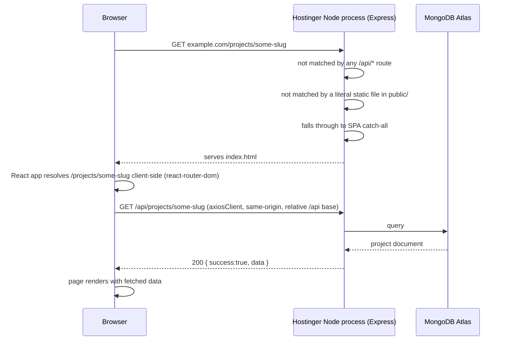

This flow is the concrete demonstration that the "one server, one process, `backend/public/` holds the frontend `dist`" requirement is coherent and complete — no missing piece in the topology (TRD §20.5).

### 35.7 SPA Routing Configuration / API Configuration / CORS Configuration
All three are handled within the single Express process (35.4–35.5) — no separate reverse proxy, load balancer, or edge-routing layer exists at this scope.

### 35.8 Deployment Architecture Diagram

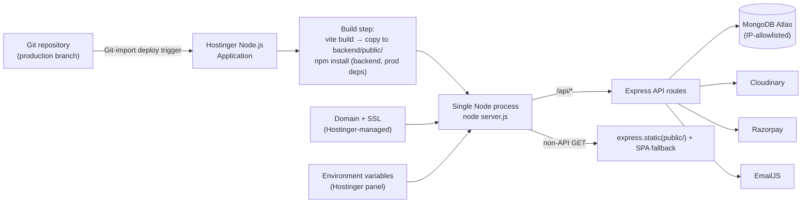

---

## 36. Development Architecture

### 36.1 Local Development
Backend runs via `nodemon` (auto-restart on change); frontend runs via `vite` (hot-reloading dev server) — both pointed at development-scoped `.env` files. The two run on separate ports locally; CORS is configured to allow the Vite dev server's origin (TRD DEV-01, §5 BE-15).

### 36.2 Frontend Startup
`npm run dev` (Vite dev server) inside `frontend/`, reading `VITE_API_BASE_URL=http://localhost:<backend-port>/api` from the local `.env`.

### 36.3 Backend Startup
`nodemon server.js` (or the equivalent npm script) inside `backend/`, reading local `.env` via `dotenv`, connecting to MongoDB Atlas (development still points at Atlas, not a local MongoDB instance — TRD §2.3, "no local MongoDB dependency once past initial setup").

### 36.4 Database Connection (Development)
Same MongoDB Atlas cluster architecture as production, differentiated by environment variables/allowlist scope rather than a separate local database technology — this keeps development and production behaviorally identical at the data layer, avoiding "works locally, breaks in production" schema-behavior drift.

### 36.5 Environment Configuration (Development)
Independent `.env` files per package (`frontend/.env`, `backend/.env`), `.gitignore`d, with `.env.example` committed for discoverability (Section 26.6, TRD DEV-02).

### 36.6 API Proxy
`Not Applicable — Reason: the frontend's axiosClient reads an explicit VITE_API_BASE_URL pointing directly at the local backend port in development (Section 6.10/26.2); no Vite dev-server proxy configuration is required as an additional indirection layer.`

### 36.7 Development Tooling
Vite dev server, `nodemon`, ESLint (React + Node JavaScript configs, no TypeScript rule sets), Prettier (optional, formatting only, never a build dependency), Git (TRD §2.5).

### 36.8 Formatting / Linting
ESLint runs against the JavaScript codebase as a pre-deploy sanity check; there is no TypeScript compiler step anywhere in the pipeline, by design (TRD DEV-06, TECH-05).

### 36.9 Testing
See Section 37.

### 36.10 Git Workflow
A clean, buildable `main`/`production` branch is a hard requirement (not a nicety), since Hostinger's deployment pipeline is Git-import-based on that branch (TRD §2.5). `Not Applicable beyond this — Reason: neither PRD nor TRD define a specific branching strategy (e.g., GitFlow, trunk-based) beyond "the production branch must always be buildable/deployable" — that single constraint is what this document enforces; the team's day-to-day branching convention is an operational choice outside architectural scope.`

### 36.11 Build Process
`npm run build` inside `frontend/` (`vite build`) must complete without errors and produce a static, deployable `dist/` bundle (TRD DEV-03); the production backend must start without errors under production configuration, including a successful MongoDB Atlas connection, before it is considered deployable (TRD DEV-04). Both are treated as a hard gate before any deployment (TRD DEV-07).

---

## 37. Testing Architecture

TRD does not mandate a specific testing framework (no test library appears in TRD §0/§2/§23's closed dependency list) — this section defines what **should** be tested and at what system boundary, as a forward-looking architectural target; introducing an actual test runner (e.g., Vitest, matching the Vite toolchain, or Jest) is a `Future Consideration` requiring the same "named requirement" justification as any other dependency addition (TRD TECH-14), to be confirmed with the project owner before adding to `package.json`.

### 37.1 Unit Tests
Target: pure functions — `shared/utils/validators.js`, `formatPrice.js`, `slugify`-adjacent helpers, `buildCloudinaryUrl.js` (frontend); service-layer business logic functions that don't require a live DB/HTTP context — e.g., checkout total computation given a set of items (backend). These are the cheapest, highest-value tests given the service layer's explicit design goal of being "testable and reusable without a request/response object" (TRD BE-06).

### 37.2 Component Tests
Target: shared components (`Button` variants render correctly, `EnquiryForm` validation states, `Skeleton`/`EmptyState`/`ErrorState` render the right content for given props) — verifying UI-UX §23/§25/§49–51's documented states are actually reachable via props/state, not just documented.

### 37.3 Integration Tests
Target: a full request lifecycle (Section 14) through the Express app with a test MongoDB instance/in-memory MongoDB — e.g., "POST /api/enquiries with valid data persists a document and returns 201," "POST /api/admin/projects without a valid cookie returns 401 and creates no document."

### 37.4 API Tests
Target: every endpoint in Section 15.4's reference table, covering at minimum: the success path, the validation-failure path, and (for admin endpoints) the unauthenticated/unauthorized path — directly verifying the acceptance criteria enumerated in PRD §12 and TRD §24.

### 37.5 Authentication Tests
Target: valid login sets the correctly-flagged cookie and returns admin identity without a password hash; invalid login returns the generic error without revealing account existence; expired/invalid token on a protected route returns 401; disabled-account token returns 403 (Section 10, TRD §24's authentication-specific acceptance criteria).

### 37.6 Authorization Tests
Target: every `/api/admin/*` endpoint rejects an unauthenticated request and a request from a `disabled` account, performing no data mutation in either case (Section 11, TRD SEC-08).

### 37.7 Database Tests
Target: schema-level validation (required fields, `slug` uniqueness, `price: min 0`, enum constraints on `status`/`paymentStatus`/`orderStatus`) rejects invalid documents at the Mongoose layer even if application-level validation has a bug (TRD §7's "defense in depth" framing); index existence/usage on the queries defined in Section 17.7.

### 37.8 E2E Tests
Target: the PRD's named user flows end-to-end (Section 45) — Project Discovery, Retail Purchase (through a Razorpay test-mode payment), Enquiry Submission, Admin Authentication → CRUD, Order Management — verifying the full stack behaves as the architecture describes, not just each layer in isolation.

### 37.9 Responsive Tests
Target: the boundary widths named in UI-UX §63/TRD §24 (320, ~375–430, ~768, ~1280–1440, ~1920, ~2560–3840px) — no horizontal scroll, no image stretch/crop, no layout shift, at each.

### 37.10 Accessibility Tests
Target: keyboard-only navigation through every interactive element, focus-visible presence, label/`aria-describedby` association, contrast (automatable via an accessibility linter/axe-style tool as a dev-time check), `prefers-reduced-motion` behavior.

### 37.11 Performance Tests
Target: bundle-size regression checks (Section 28.4), throttled-CPU/network Lighthouse-style runs validating Core Web Vitals targets are approached (Section 28.12) — "no specific performance score is guaranteed; requirements are measurable and technically reasonable rather than aspirational" (TRD §16, carried through here unchanged).

### 37.12 Security Tests
Target: attempted direct API calls to every `/api/admin/*` endpoint without a cookie (must 401), attempted checkout with a client-tampered price (must be ignored — server recomputes), attempted `PATCH /api/admin/orders/:id/status` with a `paymentStatus` field in the body (must have no effect — the field isn't part of the accepted shape at all, Section 19.5), attempted access to `GET /api/enquiries` (public — must not exist/must 404, PRD FR-N4).

### 37.13 Mapping Tests to System Boundaries

| Boundary | Test Type(s) |
|---|---|
| Pure logic (validators, price computation, formatters) | Unit |
| Shared UI components | Component |
| Full request lifecycle | Integration |
| Public contract of every endpoint | API |
| Auth/session behavior | Authentication |
| `/api/admin/*` access control | Authorization |
| Schema constraints/indexes | Database |
| Cross-cutting user journeys | E2E |
| Visual layout across breakpoints | Responsive |
| WCAG 2.2 AA compliance | Accessibility |
| Core Web Vitals / bundle size | Performance |
| Payment-integrity, admin-boundary, data-visibility rules | Security |

---

## 38. Architectural Dependency Rules

### 38.1 Global Dependency Direction

```text
Frontend:  shared/  ←  features/*/  ←  app/
Backend:   models/  ←  services/  ←  controllers/  ←  routes/  (middleware cross-cuts all layers)
System:    Frontend  →  Backend (via /api/* only)  →  MongoDB / Cloudinary / Razorpay / EmailJS
```

### 38.2 Allowed Imports

| From | May import from |
|---|---|
| `frontend/src/app/` | Any `features/*/pages`, any `shared/` module |
| `frontend/src/features/<X>/` | `shared/` freely; another feature's `pages/` or `api/` **exports only** (never another feature's `components/` internals) |
| `frontend/src/shared/` | Other `shared/` modules only |
| `backend/routes/` | `middleware/`, `validators/`, `controllers/` |
| `backend/controllers/` | `services/`, `utils/` |
| `backend/services/` | `models/`, `utils/`, external SDKs (Cloudinary/Razorpay/EmailJS clients) |
| `backend/models/` | `mongoose`, `utils/` (pure helpers only) |
| `backend/middleware/` | `utils/`, `services/` (e.g., `auth.middleware.js` may call `auth.service.js`'s token-verification helper) |

### 38.3 Forbidden Imports
- A frontend component never calls `axios`/`fetch` directly — always through `axiosClient` via a feature's `api.js` (TRD FE-01/FE-10).
- `shared/` never imports from `features/` (would invert the dependency direction).
- A backend controller never imports `mongoose` or a Model directly (TRD BE-05).
- A backend model never imports a service or controller (would invert the dependency direction, Section 12.13).
- A backend route file never contains business logic beyond declaring its middleware chain (TRD §5 "Layer separation (strict)").
- No frontend code ever imports a backend module or vice versa (they are separate npm packages/processes — TRD §20.1's repository shape).

### 38.4 Circular Dependency Prevention
Enforced by the one-directional rules above (38.2–38.3) on both frontend (Section 7.3–7.4) and backend (Section 13.2). A circular import between two feature folders is resolved by promoting the shared piece to `shared/`, never by one feature reaching into the other's internals.

### 38.5 Shared Utility Rules
A utility function is promoted from a feature's local scope to `shared/utils/` **only once genuinely used by ≥ 2 features** — not by default, and not speculatively (TRD §3.1's "genuinely used by two or more features, not by default" principle, restated for the backend's `utils/` folder as well).

### 38.6 Component Reuse Rules
A component is promoted to `shared/components/` under the same "≥ 2 features" test (Section 7.1). The single `<Button />` component (UI-UX §23) is the canonical example — never re-implemented, only re-parameterized via props.

### 38.7 Business Logic Placement
Belongs exclusively in the backend `services/` layer (Section 12.5/12.13). Frontend "business logic" is limited to UX-layer concerns (form validation for immediate feedback, cart subtotal display) that are explicitly documented as non-authoritative (Section 25.20) — anything that determines actual persisted state, price, or payment outcome is backend-only, with no exception.

### 38.8 Database Access Restrictions
Only `backend/models/` (and, through them, `backend/services/`) ever issue a Mongoose query (TRD BE-10). The frontend never accesses MongoDB directly, under any circumstance (PRD FR-P1) — this is not merely a convention but a physical impossibility in the deployed topology (the frontend has no MongoDB driver, no connection string, and no network path to Atlas; only the backend process's IP is Atlas-allowlisted, Section 35.5).

### 38.9 Summary Table (For an AI Coding Agent's Quick Reference)

| I need to add... | It goes in... |
|---|---|
| A new static section's copy | `features/<feature>/data/<name>.data.js` |
| A new field on an existing form | The form's own feature folder, plus its validator in `shared/utils/validators.js` if the rule is reusable |
| A new API call | The relevant feature's `api/<name>.api.js`, using the shared `axiosClient` |
| A new reusable UI primitive | `shared/components/`, only once ≥ 2 features need it |
| A new business rule (e.g., a new checkout constraint) | The relevant backend `services/*.service.js` |
| A new database field | The relevant `models/*.model.js`, plus its `express-validator` rule in `validators/*.validators.js` |
| A new admin-only capability | A new route under `/api/admin/*`, behind `protect`, following the existing controller→service→model chain |

---

## 39. Data Ownership

| Data | Created By | Read By | Updated By | Deleted By | Owner | Source of Truth | Consistency Mechanism |
|---|---|---|---|---|---|---|---|
| Project | Admin (via admin CRUD) | Public (published only) + Admin (all) | Admin | Admin (hard delete) | Admin (studio) | MongoDB `projects` collection | Single writer path (admin service layer); public reads are filtered, never separately mutated |
| Retail item | Admin | Public (published+available) + Admin (all) | Admin | Admin (hard delete) | Admin (studio) | MongoDB `retail` collection | Same as Project |
| Enquiry | Public visitor (via form) | Admin only | Admin (status only) | Admin | Admin (studio) | MongoDB `enquiries` collection | Single write on create; status is the only mutable field thereafter |
| Order | Backend checkout service (never a direct client write) | Admin (full) + the purchasing visitor implicitly via the confirmation response only (no later re-read access, since no visitor account exists) | Backend (payment verification, one-time) + Admin (`orderStatus` only, ongoing) | Never deleted | Admin (studio), backend-authoritative for `amount`/`paymentStatus` | MongoDB `orders` collection | `amount` computed once, server-side, at creation; `paymentStatus` set once by verified Razorpay signature; `orderStatus` admin-mutable afterward, independently |
| Admin account | Provisioned out-of-band (no self-service signup) | Backend (auth flow only — never returned to any client in full) | Not user-editable via any documented API (out of current PRD scope) | Not user-deletable via any documented API | Studio/operator (out-of-band process) | MongoDB `admin` collection | `password` never round-trips to any client; `lastLoginAt` updated by the login service only |
| Image binaries | Admin (upload) | Public (via Cloudinary CDN URL) + Admin | Admin (replace) | Admin (triggers Cloudinary `destroy`) | Admin (studio), stored by Cloudinary | Cloudinary | MongoDB stores only the URL/public ID reference; Cloudinary is the binary source of truth |
| Cart contents | Public visitor (client-side only) | The same visitor's browser session only | The same visitor | The same visitor, or session end | The visitor (ephemeral, never persisted server-side pre-checkout) | Client `CartContext` state | Re-validated in full against MongoDB at checkout — the cart itself is never a source of truth for price/availability |

**Where consistency could be at risk, and how it's maintained**: the only place stale client-held data could cause a real-world problem is the Cart → Checkout boundary (a visitor's cart may reflect a price/availability that has since changed). This is resolved structurally, not by a sync mechanism: the checkout service **always** re-fetches and re-validates every item from MongoDB before creating a payment order (Section 19.4) — the client's cart is treated as a set of item *references* the visitor wants, never as authoritative data about those items.

---

## 40. Concurrency and Consistency

### 40.1 Concurrent Updates
Two admins editing the same Project/Retail item simultaneously is a possible but low-likelihood scenario given the single-`admin`-role, small-team scope. `Architectural Decision`: last-write-wins (standard Mongoose `findByIdAndUpdate` behavior) is accepted rather than introducing optimistic-locking version fields — `Not Applicable — Reason: PRD does not define a multi-concurrent-admin-editing requirement or a "warn on stale edit" UX; introducing version-conflict detection would be speculative complexity against TRD's "no unnecessary complexity" principle. Revisit if the studio's admin team grows enough that concurrent edits of the same item become a real, observed problem (Section 43).`

### 40.2 Duplicate Submissions
Prevented at the UX layer by the `isSubmitting` lock (Section 23.5, PRD FR-I5) for forms, and inherently prevented for checkout by the fact that each `POST /api/checkout` call creates a fresh Order document tied to a fresh Razorpay order — a double-click resulting in two Orders is a real possibility the frontend's submit-lock mitigates but does not structurally eliminate at the database level; `Architectural Assumption`: this is deemed acceptable at current scope since an unpaid duplicate `pending` Order carries no financial consequence (it simply never receives a successful payment verification) and is visible to the admin as a distinguishable stale/abandoned record in Order Management.

### 40.3 Race Conditions
The most significant race-condition-prone flow is checkout re-validation racing against an admin concurrently marking a Retail item unavailable/unpublished/deleted. The checkout service's re-validation step (Section 19.4) reads the item's current state at the moment of `POST /api/checkout`, so a race window exists only between that read and the Razorpay payment order's creation (a few hundred milliseconds to seconds, not the full payment-completion window) — the actual payment success is what finalizes the order, and the item's state is not re-checked a second time at `POST /api/checkout/verify` (`Architectural Assumption`, flagged for confirmation: if the studio wants zero tolerance for this narrow race window, a second availability check could be added at verification time; PRD/TRD do not explicitly require this level of strictness, so it is not built by default).

### 40.4 Idempotency
`POST /api/checkout/verify` should tolerate being called more than once for the same `razorpay_payment_id` (e.g., a client retry after a network blip) without double-processing the order — `Architectural Decision`: the verification service checks the Order's current `paymentStatus` before applying a transition; if already `paid`, a repeat verification call is a safe no-op returning the existing confirmed state, rather than attempting a second state transition or erroring.

### 40.5 Atomic Operations
Mongoose's single-document update operations (`findByIdAndUpdate`, `findOneAndUpdate`) are atomic at the document level, which is sufficient for this system's needs — every write that matters (Order status transition, publish toggle) is a single-document update, never a multi-document operation requiring cross-document atomicity.

### 40.6 Transaction Requirements
`Not Applicable — Reason: no operation in this system requires a multi-document ACID transaction — Order creation is a single-document insert; Order status updates are single-document updates; even checkout's "re-validate then create" sequence does not require transactional atomicity across the Retail/Project read and the Order write, since the re-validated data becomes an immutable snapshot embedded in that same Order document (Section 17.4) rather than a separate write requiring coordination.` MongoDB Atlas's multi-document transaction support (available if ever needed) is not invoked, consistent with TRD's no-unnecessary-infrastructure principle.

### 40.7 Optimistic Updates
`Not Applicable — Reason: no frontend flow in the PRD calls for optimistic UI updates (updating the UI before the server confirms); every mutation (cart add is a pure client-state change with no server round-trip needed to feel instant; every server-backed mutation shows its loading/submitting state honestly until the server responds — Section 6.11/23.5) already matches the desired UX without needing optimistic-update complexity.`

### 40.8 Data Consistency
Maintained through the ownership/single-writer-path model (Section 39) rather than through distributed-system consistency mechanisms — every piece of data has exactly one write path (Section 39's "Consistency Mechanism" column), which is what keeps consistency simple at this scale without needing eventual-consistency handling, conflict-free replicated data types, or similar distributed-systems machinery, none of which any PRD requirement justifies.

---

## 41. Scalability Architecture

### 41.1 Current Scale Assumptions
A single-studio portfolio + retail catalog with a bounded number of Projects/Retail items (tens to low hundreds, not millions), a modest daily visitor volume typical of a design-studio marketing site, and a single admin team — not a high-traffic consumer marketplace. TRD's single-server topology (§20) is an explicit, deliberate match to this assumption.

### 41.2 Current Architecture Limits
- **Single Node process** — no horizontal redundancy; a crash or deploy causes a brief full-site outage (Section 42, documented as accepted per TRD DEP-09).
- **Single MongoDB Atlas cluster** — vertical scaling only within the chosen Atlas tier; no sharding configured (unnecessary at current data volume).
- **No caching layer** — every read hits MongoDB directly (Section 27); fine at current query volume given the defined indexes, but the first ceiling this architecture will hit under sustained traffic growth.

### 41.3 Horizontal Scaling Possibility
Not implemented now (single process, per TRD's explicit topology). If ever required: the Express API could be extracted from the "serves-the-frontend-too" role and run as N replicas behind a load balancer, with the frontend build served separately (e.g., a static host or CDN) — this is a deployment-topology change, not a code-architecture change, since the layered routes→controllers→services→models structure already contains no in-process state that would prevent running multiple instances (the only state that would need externalizing first is... none — JWT auth is already stateless, Section 10.3).

### 41.4 Vertical Scaling Possibility
The simplest, lowest-effort lever available today: increasing the Hostinger plan's allocated resources (CPU/RAM) and/or the MongoDB Atlas cluster tier, with zero code change required — this is the recommended first response to any near-term capacity pressure, consistent with "don't over-engineer the initial system."

### 41.5 Database Scaling
MongoDB Atlas supports vertical tier upgrades first; read replicas or sharding are available from Atlas if a specific collection's read/write volume ever genuinely requires it — not configured now, since the defined indexes (Section 17) already keep the current five-collection, moderate-volume workload fast.

### 41.6 API Scaling
Covered by 41.3 (horizontal) and 41.4 (vertical). No architectural change to the routes→controllers→services→models layering is required for either path — both are deployment/infrastructure decisions layered on top of the same code structure.

### 41.7 Static Asset Scaling
Already effectively solved: Cloudinary's CDN handles all image delivery scaling independent of the application server (Section 27.6); the built frontend's static JS/CSS/font assets are small and cacheable (Section 27.2) and would be the natural first candidate to move to a dedicated CDN/static host if the single Node process's static-serving role ever became a bottleneck (a low-risk, incremental change — see Section 41.3's note that this doesn't require restructuring the API layer).

### 41.8 CDN Scaling
`Not Applicable at current scope — Reason: no CDN beyond Cloudinary's own is used (Section 27.6/27.7); introducing one for the frontend's static assets is the concrete Section 41.7 evolution path, not a currently active concern.`

### 41.9 Caching Opportunities (If Scale Demands It)
If read volume genuinely outgrows direct-MongoDB-query performance: an in-memory or Redis-backed cache for public listing/detail responses (the highest-read-volume, lowest-write-frequency data — published Projects/Retail) would be the natural first caching candidate, invalidated on admin publish/update/delete actions. This is explicitly **not built now** (Section 27.1) — named here only as the concrete, scoped evolution path, not a present recommendation.

### 41.10 Required Now / Useful Later / Not Currently Needed

| Category | Items |
|---|---|
| **Required now** | Single-process deployment (TRD §20), MongoDB indexes (Section 17), Cloudinary CDN, stateless JWT auth |
| **Useful later** (clear trigger, no premature build) | API-layer caching if read volume grows (41.9); static-asset CDN split if the single process becomes a static-serving bottleneck (41.7); read replicas/sharding if a single collection's volume genuinely requires it (41.5) |
| **Not currently needed** | Microservices, message queues, Kubernetes/container orchestration, GraphQL, multi-region deployment, database transactions/optimistic locking (Section 40) |

---

## 42. Reliability and Failure Modes

| Failure | Impact | Detection | Recovery | User Experience |
|---|---|---|---|---|
| MongoDB Atlas unavailable | All data-dependent reads/writes fail | `connectDB()` failure at startup (loud, immediate — Section 17.11) or a runtime query error caught by `asyncHandler` | Startup: process exits, requiring redeploy/restart once connectivity is restored. Runtime: individual requests fail with a logged 500; the process itself stays up (a query-time DB blip doesn't necessarily crash the whole server) | Frontend renders `ErrorState` with retry (Section 6.11); no silent/blank failure |
| Express API unavailable (process crash/restart) | Entire site (frontend + API) unavailable, since both are served by the same process | Hostinger platform-level process monitoring (operational, outside application code) | Process restart (manual redeploy or Hostinger's own process supervision, if provided at the plan tier) | Full site outage for the restart duration — documented as an accepted, brief window (TRD DEP-09) |
| Network failure (client ↔ server) | Individual request fails to complete | `axiosClient` interceptor detects "no `response` object" | User can retry the action | Distinct network/connection error state, not conflated with a validation or server error (Section 16.3) |
| Razorpay unavailable | Checkout initiation or verification fails | Service-layer `try/catch` around the SDK call | No automatic fallback payment method (Section 34.3, accepted limitation) — visitor retries later | Clear failure state; cart contents preserved so the visitor doesn't lose their selection (Section 22.1) |
| Cloudinary unavailable | New image upload/delete fails; **existing images continue to display** (served from Cloudinary's own CDN, independent of the application's or Cloudinary's admin-API uptime in most outage scenarios) | Service-layer `try/catch` | Admin retries the upload later | Admin sees a clear upload-failure message; public site is otherwise unaffected |
| EmailJS unavailable | Enquiry notification email is not sent | Service-layer `try/catch`, logged (Section 33.5) | No retry queue (Section 34.4) — the enquiry itself is still safely persisted | Visitor sees the same success confirmation regardless (PRD FR-I4) — by design, this failure is invisible to the user |
| Authentication failure (token issues) | Admin cannot access protected routes/APIs | `protect` middleware returns 401 | Admin re-authenticates via `/admin/login` | Clean redirect to login, no stuck/broken admin UI |
| Invalid data submitted | Request rejected before persistence | `express-validator` chain / Mongoose schema validation | User corrects and resubmits | Field-level inline errors (Section 23.7) |
| Deployment failure (build error) | New code never reaches production; the previously-deployed version keeps running until the build issue is fixed | Hostinger's build step fails visibly (TRD DEV-07's "hard gate") | Fix the build locally, redeploy | No end-user-visible impact — the prior working deployment is untouched until a successful build supersedes it |
| Missing environment variable | Server may fail to start, or a specific integration silently misbehaves depending on which variable | `connectDB()`/SDK initialization failures surface loudly where checked (Section 33.4); a missing non-critical variable (e.g., an optional EmailJS field) could be a quieter failure | Configuration audit against Section 26's variable tables before deploy; TRD DEV-07's build/start gate catches the most critical cases (e.g., a missing `MONGODB_URI` prevents startup entirely) | N/A — a pre-production configuration issue, not a live user-facing failure once correctly deployed |

---

## 43. Backup and Recovery

### 43.1 Database Backups
MongoDB Atlas's own managed backup features (continuous backups / scheduled snapshots, tier-dependent) are the backup mechanism — `Architectural Assumption`: the specific Atlas tier's backup frequency/retention is an infrastructure-provisioning decision made when the Atlas cluster is created, not something this application's code controls or needs to implement itself. Neither PRD nor TRD name a specific RPO/RTO target, so none is asserted here as a hard requirement; `Future Consideration`: if the studio has a specific backup-frequency/retention requirement, it should be captured explicitly and matched to an appropriate Atlas tier/backup policy.

### 43.2 Backup Frequency / Retention
`Architectural Assumption` (per 43.1) — governed by the provisioned Atlas tier's backup policy, not by application code.

### 43.3 Restore Process
Atlas's point-in-time-restore tooling (tier-dependent) is the restore mechanism — an operational/infrastructure procedure, outside this codebase's scope to implement.

### 43.4 Disaster Recovery Considerations
Given the single-region, single-cluster, single-process topology (TRD §20), a full disaster-recovery plan spanning multiple regions/redundant infrastructure is **not** built — `Not Applicable — Reason: no PRD/TRD requirement defines a multi-region availability target; the accepted failure mode for a full regional outage at either Hostinger or MongoDB Atlas's provider level is "the site is down until the provider's own infrastructure recovers," consistent with this project's deliberately minimal-infrastructure scope.`

### 43.5 Data-Loss Risks
The primary data-loss risk is between an Atlas backup snapshot and the moment of an incident (bounded by whatever the provisioned tier's backup frequency is, per 43.1–43.2) — accepted as a reasonable risk profile for a studio portfolio/retail site of this scale, where the most business-critical data (Orders, for payment/audit purposes) is written once and rarely mutated further, minimizing the window's practical impact. Cloudinary-stored images carry their own separate durability guarantee from Cloudinary's own infrastructure, independent of MongoDB's backup policy.

---

## 44. Security Boundaries

### 44.1 Security Boundary Diagram

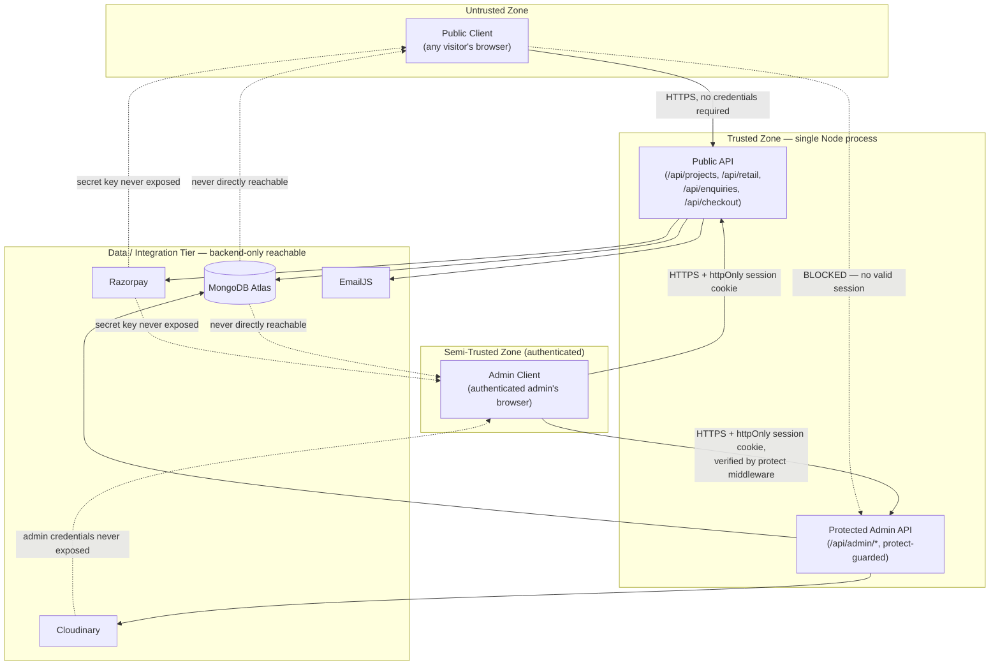

### 44.2 What Can Trust What

| Component | Trusts | Never Trusts |
|---|---|---|
| Public API | Nothing about the client's claimed identity (there is none) | Any client-supplied price, availability flag, or payment-success claim (Section 25.20) |
| Protected Admin API | A verified, unexpired, active-account JWT (checked fresh on every request) | The frontend's own claim of "I already checked auth" — re-verifies independently every time (Section 10.11) |
| Database (MongoDB Atlas) | Only the backend process's IP-allowlisted connection | Any direct client connection — none is possible (Section 38.8) |
| Cloudinary / Razorpay / EmailJS | Only the backend's server-held credentials | The frontend's `VITE_`-prefixed values are deliberately limited to what's safe to be public (e.g., Razorpay's public key ID) — no service ever accepts the frontend as a fully-trusted caller |
| Frontend | The backend's response data, within the bounds of what each endpoint is documented to return | Its own client-side computed values (cart subtotal, form pre-validation) as authoritative for anything server-persisted (Section 25.20) |

### 44.3 The Boundary That Matters Most
The single most important boundary in this entire system is the **public-vs-admin API split enforced by `protect`** (44.1's Trusted Zone division) combined with **never trusting client-supplied price/payment-success** (44.2's Public API row) — every other security measure in this document (Sections 10, 11, 25) exists in service of these two boundaries holding under all conditions, including direct API calls that bypass the frontend entirely (PRD FR-J5, restated once more here because it is the architecture's central safety property).

---

## 45. Complete User Flow Architecture

Each major PRD-defined journey (PRD §6), expressed as the full User → Page → Interaction → State → API → Backend → Database → Response → UI cycle, including failure paths.

### 45.1 Project Discovery
`Home → Projects → Project Detail → Enquiry`
```text
User → /projects → ProjectsListing renders Skeleton → GET /api/projects → project.service filters {published:true}
  → 200 [projects] → ProjectCard grid renders (or EmptyState if none)
User → clicks a card → /projects/:slug → ProjectDetail renders Skeleton → GET /api/projects/:slug
  → SUCCESS PATH: 200 project → detail renders + "Enquire" CTA → user submits InquiryForm (Section 45.4)
  → FAILURE PATH: 404 (invalid/deleted/unpublished slug) → Not-found state rendered, no fabricated data
  → ERROR PATH: network/5xx → ErrorState with retry
```

### 45.2 Project Purchase (where configured purchasable)
`Home → Projects → Project Detail → Purchase → Checkout → Razorpay → Payment Verification → Order Confirmation`
```text
Same as 45.1 through Project Detail → if project.price exists (purchasable) → "Purchase" CTA shown
User → clicks Purchase → follows the same checkout flow as Retail Purchase (45.3/18.4), with the
  cart/checkout service treating a purchasable Project exactly as it treats a Retail item for
  re-validation/snapshot purposes (PRD §6 explicitly lists this as a parallel flow to Retail Purchase)
  → SUCCESS PATH: verified payment → Order Confirmation
  → FAILURE PATH: payment failed/cancelled → failure state, no order marked successful
```

### 45.3 Retail Discovery
`Home → Retail → Retail Detail`
```text
User → /retail → RetailListing renders Skeleton → GET /api/retail (+ optional ?category=)
  → project.service filters {published:true, availability:true-or-not-per-display-rule}
  → 200 [items] → RetailProductCard grid (or EmptyState)
User → clicks a product → /retail/:slug → GET /api/retail/:slug
  → SUCCESS: renders detail + Add to Cart/Buy Now (disabled if unavailable, PRD FR-D3)
  → FAILURE: 404 → not-found state
```

### 45.4 Retail Purchase
`Retail Detail → Add to Cart → Cart → Buy Now/Checkout → Razorpay → Payment Verification → Order Confirmation`
Fully diagrammed in Section 18.4. Failure branches: empty-cart checkout blocked client-side and rejected server-side regardless (PRD FR-F5); item-invalid-at-checkout → clear rejection message, cart remains adjustable (PRD acceptance criteria §12); payment failed/cancelled → explicit failure state, `paymentStatus` never `paid` (PRD FR-G6).

### 45.5 Enquiry Submission
`Enquiry Form → Client-Side Validation → Backend Validation → MongoDB Storage → EmailJS Notification → Success/Error Response`
Fully diagrammed in Section 18.3.

### 45.6 Payment Processing
`Cart/Project → Checkout → Backend Creates Payment Order → Razorpay → Payment → Backend Verification → Database Update → Order Confirmation`
Fully diagrammed in Section 18.4/19.4 — the canonical, shared payment-processing flow underlying both 45.2 and 45.4.

---

## 46. Admin User Flow

`Admin Login → Authentication → Admin Dashboard → Protected Routes`, and the resource-management flows built on top of it.

### 46.1 Admin Authentication → Dashboard
Fully diagrammed in Section 10.15.

### 46.2 Project / Retail Management
`Admin Login → Projects (or Retail) → Create/Read/Update/Delete → Database & Media Update → Updated Public Listing`
```text
Admin → /admin/projects → GET /api/admin/projects (protect-guarded) → table renders (all statuses)
Admin → Create/Edit → ProjectForm submitted (multipart) → protect → validate → Multer → Cloudinary
  → Mongoose persist → 201/200 → table refreshes → public /projects immediately reflects the change
  on its next fetch (no cache to invalidate, Section 27.1)
Admin → Delete → protect → confirm → DELETE /api/admin/projects/:id → Mongoose remove
  → Cloudinary destroy (flagged assets) → public listing immediately excludes it (query-time filter,
  not a cache eviction) → any historical Order referencing this project remains intact (embedded
  snapshot, Section 17.4/17.10)
FAILURE PATHS: validation failure → field-level errors on the form; unauthorized (expired session
  mid-edit) → redirect to /admin/login (Section 8.8); Cloudinary/DB failure → generic error, form
  data preserved for retry (mirrors 45.5's enquiry-failure UX pattern)
```

### 46.3 Enquiry Management
`Admin Login → Enquiries → View/Update Status/Delete`
```text
Admin → /admin/enquiries → GET /api/admin/enquiries (sorted by createdAt desc, per the
  {status,createdAt} index) → table renders
Admin → updates status (new → in-progress → resolved) → PATCH /api/admin/enquiries/:id/status
  → validated against the enum → persisted → table reflects new status
Admin → deletes an enquiry → DELETE /api/admin/enquiries/:id → hard removal → confirmation shown
```

### 46.4 Order Management
`Admin Login → Orders → View Order → View Customer/Payment Details → Update Order Status`
```text
Admin → /admin/orders → GET /api/admin/orders → table renders (paymentStatus + orderStatus both visible)
Admin → opens an order → GET /api/admin/orders/:id → full detail incl. snapshot items, customer info,
  Razorpay references
Admin → updates orderStatus (pending → confirmed → completed, or → cancelled)
  → PATCH /api/admin/orders/:id/status → validated against the orderStatus enum only
  → paymentStatus is structurally unreachable through this endpoint (PRD FR-O3, Section 19.5) —
  there is no UI control and no accepted request field for it
FAILURE PATHS: unauthorized → 401/403, no mutation; invalid status value → 400
```

### 46.5 Admin Flow Diagram

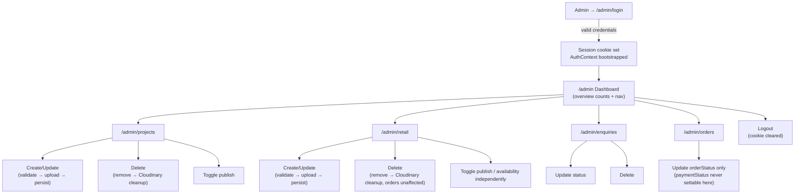

---

## 47. System Sequence Diagrams

The following required diagrams are already fully specified, in full Mermaid form, in the sections noted — cross-referenced here rather than duplicated, per this document's own no-duplication discipline (Section 59, Writing Quality Rules):

| # | Workflow | Location |
|---|---|---|
| 1 | User browsing public content (Projects/Retail) | Section 18.2 |
| 2 | User authentication (visitor) | `Not Applicable — Reason: no visitor authentication exists (Section 5A-2)` |
| 3 | Admin login | Section 10.15 |
| 4 | Admin creating data | Section 18.5 |
| 5 | Admin updating data | Same pattern as Section 18.5, minus the create-specific Cloudinary-new-upload step where an image isn't replaced; Section 9.10 documents the update contract |
| 6 | Admin deleting data | Section 9.10 (Delete/Update/Publish-Unpublish Behavior) |
| 7 | File/image upload | Section 18.5 |
| 8 | Form submission (enquiry) | Section 18.3 |
| 9 | Error flow (generic) | Section 14.3 (request lifecycle) + Section 16 (API error architecture) |
| 10 | Retail/Project purchase & payment | Section 18.4 |
| 11 | Production request/deployment flow | Section 35.6 |
| 12 | Admin end-to-end flow | Section 46.5 |

Only diagrams relevant to actual project functionality are included — no diagram exists for an Out-of-Scope flow (customer registration, booking, reviews, wishlist).

---

## 48. Architecture Decision Records

### ADR-01: Modular Monolith, Single Deployed Process
- **Context**: Need to serve a public site + admin panel + REST API against a bounded, well-enumerated PRD feature set, deployed on a single Hostinger Node.js plan.
- **Options considered**: Microservices; separate frontend-hosting + backend-hosting; single-process monolith.
- **Selected approach**: Single Express process serving both the API and the built frontend (TRD §20).
- **Reason**: Matches TRD's explicit, non-negotiable topology; minimizes operational surface for a bounded feature set; no per-resource independent-scaling requirement exists.
- **Trade-offs**: No horizontal redundancy (Section 42); a deploy/crash briefly takes the whole site down.
- **Consequences**: Simple deployment, simple environment-variable management, simple debugging (one log stream, one process).
- **Future revisit condition**: Sustained traffic growth that a single process/vertical scaling can no longer absorb (Section 41.3).

### ADR-02: REST over GraphQL
- **Context**: Frontend needs to fetch five well-defined resource shapes.
- **Options considered**: REST, GraphQL.
- **Selected approach**: REST, resource-grouped, standard HTTP verbs (Section 15).
- **Reason**: TRD explicitly mandates REST; PRD's data needs are fixed-shape, not flexible ad-hoc queries; REST keeps the dependency list smaller (no GraphQL server/client libraries).
- **Trade-offs**: Slightly more endpoints than a single GraphQL endpoint would need; no client-driven field selection (mitigated by `.select()`-scoped listing responses, Section 28.6).
- **Consequences**: Simple, cacheable-if-ever-needed, widely-understood API surface.
- **Future revisit condition**: A genuinely flexible, client-varying query need that REST endpoints can't reasonably enumerate (not currently present).

### ADR-03: Context API over Redux/Zustand
- **Context**: Need cross-cutting client state for admin session and cart.
- **Options considered**: Redux, Zustand, React Context + local state.
- **Selected approach**: Two Context providers (`AuthContext`, `CartContext`) + local component state everywhere else (Section 22).
- **Reason**: TRD explicitly excludes external state libraries "since React Context + component state is sufficient for this project's scope."
- **Trade-offs**: Would need revisiting if cross-cutting state grows significantly beyond auth/cart (e.g., a complex multi-step admin wizard with deeply shared state).
- **Consequences**: Fewer dependencies, less boilerplate, easier onboarding.
- **Future revisit condition**: A third or fourth genuinely cross-cutting state domain emerges with performance problems Context can't handle well (Context re-render characteristics at scale).

### ADR-04: JWT-in-httpOnly-Cookie over Session-Store / Passport.js
- **Context**: Need admin authentication for a single role.
- **Options considered**: Passport.js + session store (Redis-backed), hand-rolled JWT + bcrypt + httpOnly cookie.
- **Selected approach**: Hand-rolled JWT + bcrypt + httpOnly cookie (Section 10).
- **Reason**: TRD explicitly excludes Passport.js ("a hand-rolled JWT + bcrypt flow is simpler and sufficient for a single admin role") and Redis (no session-store requirement exists).
- **Trade-offs**: No built-in token-revocation-before-expiry mechanism (Section 10.13); a stateless-token tradeoff accepted at this scope.
- **Consequences**: No session-store infrastructure to run/secure/scale; simpler mental model.
- **Future revisit condition**: A requirement emerges for immediate, server-enforced session revocation (e.g., "kick out a compromised admin session instantly") — would require introducing a token-blacklist store.

### ADR-05: Embedded Order Snapshot over Live Reference/Populate
- **Context**: Orders need to record what was purchased, at the price/name that applied at purchase time.
- **Options considered**: Live Mongoose `ref`/`populate` from Order to Project/Retail; embedded snapshot subdocuments.
- **Selected approach**: Embedded snapshot (Section 17.3/17.4).
- **Reason**: PRD FR-H2/FR-M4 require historical accuracy independent of later product edits or deletion — a live reference would break (or silently change) historical order data the moment the source product changes or is removed.
- **Trade-offs**: Slight data duplication (item name/price stored twice — once live on the product, once frozen in the order).
- **Consequences**: Orders remain accurate and intact forever, regardless of catalog changes; deletion of a Project/Retail item is always safe (Section 17.10).
- **Future revisit condition**: None anticipated — this is a correctness requirement, not a scale-driven one.

### ADR-06: No Caching Layer (No Redis)
- **Context**: Read-heavy public listing endpoints.
- **Options considered**: Redis-backed API/query cache; no cache, direct indexed MongoDB queries.
- **Selected approach**: No cache (Section 27).
- **Reason**: TRD explicitly excludes Redis; current data/traffic volume is well-served by the defined indexes; a cache introduces invalidation complexity with no corresponding named requirement.
- **Trade-offs**: Every read hits the database; acceptable at current scale, a future scaling lever if needed (Section 41.9).
- **Consequences**: Simpler system, always-fresh data (no stale-cache risk on publish/availability changes), one fewer infrastructure component to run and secure.
- **Future revisit condition**: Measured read-latency or database-load problems that vertical scaling (Section 41.4) doesn't resolve.

### ADR-07: Feature-Based Frontend Organization
- **Context**: Frontend needs a folder structure that scales with the PRD's page-oriented feature set.
- **Options considered**: File-type-first (`components/`, `pages/`, `hooks/` at the root); feature-based (`features/<name>/`).
- **Selected approach**: Feature-based (Section 7), per TRD §3.1's explicit mandate.
- **Reason**: Keeps each feature self-contained and legible to both human developers and an AI coding agent; matches the PRD's inherently page/feature-oriented structure.
- **Trade-offs**: Slightly more nested folders than a flat structure; requires discipline about the "≥2 features" promotion-to-shared rule to avoid premature duplication.
- **Consequences**: Small, bounded blast radius when adding/changing one feature.
- **Future revisit condition**: None anticipated — this is TRD-mandated, not open for reconsideration without an explicit TRD amendment.

### ADR-08: Vite + React SPA over a Meta-Framework (Next.js/Remix)
- **Context**: Need SEO-capable public pages plus a rich, animation-heavy interactive site.
- **Options considered**: Next.js/Remix (SSR/SSG), Vite + React SPA with client-side dynamic metadata.
- **Selected approach**: Vite + React SPA, SEO handled via a dynamic `<Seo/>` component (Section 29).
- **Reason**: TRD §0 mandates Vite specifically; a meta-framework migration is out of scope and would conflict with the single-process Express-serves-static-build deployment model (Section 35).
- **Trade-offs**: SEO relies on client-side-rendered metadata rather than true server-rendered HTML per page — acceptable given modern search-engine JS-rendering capability and the PRD's SEO requirements (title/description/canonical/OG/sitemap/robots) being fully achievable this way.
- **Consequences**: Simpler build/deploy pipeline (Section 35.3), consistent with the closed-dependency-list philosophy.
- **Future revisit condition**: A hard requirement for true server-rendered HTML (e.g., for a search engine or social-preview limitation not solvable client-side) — not currently present.

---

## 49. Trade-offs

Stated honestly, per the instruction that this architecture "has trade-offs" and must not claim otherwise:

- **Simplicity vs. scalability**: The single-process, no-cache, no-microservices design (ADR-01, ADR-06) optimizes hard for operational simplicity and low cost today, at the cost of needing deliberate, non-trivial follow-up work (Section 41) if traffic grows substantially. This is an accepted, explicit trade-off, not an oversight.
- **Performance vs. development complexity**: Choosing not to introduce a data-fetching/caching library (e.g., React Query) on the frontend (Section 22.3) keeps the mental model simple (fetch-on-mount, no cache) at the cost of every page navigation re-fetching data it may have already fetched moments earlier — acceptable given this project's navigation patterns (a visitor typically visits each page once per session), revisited only if duplicate-fetch cost is measured as a real problem.
- **Flexibility vs. maintainability**: REST's fixed-shape endpoints (ADR-02) are less flexible than GraphQL for hypothetical future client-driven queries, but far easier to reason about, secure, and document for this bounded feature set.
- **Client-side vs. server-side responsibility**: Client-side validation and cart-total display exist purely for responsiveness/UX and are **fully duplicated** by authoritative server-side logic (Section 25.20) — this is deliberate redundancy, not wasted effort: the UX benefit (immediate feedback) is worth the small maintenance cost of keeping two validation rule sets (client UX rules, server authoritative rules) logically aligned.
- **Reusable abstraction vs. feature-specific implementation**: The strict "≥2 features" promotion rule (Section 38.5/38.6) deliberately tolerates some short-term duplication (a similar-but-not-identical card layout in two features, before a genuine shared pattern is proven) in exchange for avoiding a premature, wrong abstraction that would need unwinding later.
- **Caching vs. consistency**: ADR-06's no-cache decision favors always-correct, always-fresh data (critical for publish-status and price accuracy — the system's core correctness guarantees) over the marginal latency win a cache would provide, at the cost of every read paying the full database round-trip.
- **Snapshot duplication vs. single source of truth**: ADR-05's embedded order snapshot deliberately duplicates data (Section 39's Order row) to guarantee historical accuracy, trading a small amount of storage/consistency-mental-overhead for a correctness guarantee the PRD explicitly requires.

---

## 50. Current vs. Future Architecture

### 50.1 Required for V1
- Single-process Express + React SPA deployment (Section 35).
- Five MongoDB collections with the indexes defined in Section 17.
- JWT-in-httpOnly-cookie admin auth, single `admin` role (Sections 10–11).
- All 27 API endpoints in Section 15.4.
- Cloudinary/Razorpay/EmailJS integrations exactly as scoped in Section 34.
- Full responsive/SEO/accessibility/animation implementation per Sections 21, 29–31.
- All loading/empty/error/not-found states per Section 6.11/32.

### 50.2 Recommended After V1
- A dedicated `DATABASE.md` with full field-by-field Mongoose schema definitions (referenced but explicitly deferred by both PRD §8 and TRD §7 to a separate document).
- Automated test suite (Section 37) — architecturally described but not mandated as a V1 dependency by TRD.
- A dedicated admin UI-UX design pass (Section 5A-4, `Future Consideration`).
- Structured request/response logging refinement if operational visibility proves insufficient (Section 33.7's "only if production log volume genuinely requires it").
- Staging environment (Section 26.1).

### 50.3 Only Needed at Scale
- API/query caching layer (Section 27.9, 41.9).
- Horizontal scaling / multi-instance deployment (Section 41.3).
- Database read replicas/sharding (Section 41.5).
- Dedicated static-asset CDN split from the API process (Section 41.7).
- Multi-role admin authorization model (Section 11.1, 23's ADR-04 future-revisit note).
- Audit-log collection for admin actions (Section 9.12).
- Optimistic-locking/version-conflict detection for concurrent admin edits (Section 40.1).

No future-scale complexity (queues, microservices, GraphQL, container orchestration) is implemented prematurely — each is named only as a scoped, triggered future step, never a present recommendation (consistent with the PRD/TRD's shared "no over-engineering" principle).

---

## 51. Architecture Evolution

### 51.1 If Users/Traffic Increase
First lever: vertical scaling of the Hostinger plan and Atlas tier (Section 41.4) — zero code change. Second lever: introduce a targeted API-response cache for the highest-read-volume public endpoints (published Projects/Retail listings — Section 41.9), invalidated on admin mutation. Third lever (only if the first two are exhausted): extract the API into its own horizontally-scaled deployment, separate from static-frontend serving (Section 41.3) — a deployment-topology change built on the same unmodified layered backend structure.

### 51.2 If Content Increases (More Projects/Retail Items)
The existing compound indexes (Section 17) already anticipate this; pagination (already specified for admin listings, Section 15.8/28.8) would extend to public listings if "Load More" volume grows large enough to warrant cursor-based pagination over offset-based. No schema change required.

### 51.3 If Admin Functionality Expands
A multi-role authorization model (e.g., `admin` vs. `editor` with restricted permissions) slots into the existing `protect` middleware + Admin schema's `role` field (already an enum, Section 17.3) without restructuring the route/controller/service layering — only the authorization check inside `protect`/route-level guards would grow from "any active admin" to "role-appropriate active admin" (Section 11.1's noted future path).

### 51.4 If Integrations Increase
New external services (e.g., a future SMS provider, if the PRD's Out-of-Scope exclusion is ever lifted) would follow the exact same pattern already established for Cloudinary/Razorpay/EmailJS: a new service-layer module, server-only credentials (Section 26), orchestrated from the relevant feature's existing service, never called directly from a controller or the frontend.

### 51.5 If Database Grows
Atlas's built-in vertical scaling first (41.5), then read replicas for read-heavy public traffic if write/read load genuinely needs separating, then sharding only if a single collection's volume exceeds what a well-indexed single cluster comfortably serves (unlikely at this project's data shape — five bounded collections, not a high-cardinality, ever-growing event log).

### 51.6 If Performance Requirements Increase
The existing performance discipline (Section 28) already covers the standard levers (code-splitting, image optimization, indexed queries, restrained animation); the next increment would be introducing a frontend data-fetching/caching library (Section 22.3's deferred decision) to eliminate redundant re-fetches, and/or the API-cache path (51.1) — both additive, non-breaking changes to the existing architecture, not a rewrite.

### 51.7 Migration Paths, Not Just "Scale Horizontally"
Every evolution path above names the **specific, concrete change** (which layer, which component, what triggers it) rather than a generic "add more servers" — consistent with the instruction to explain migration paths, not merely assert scalability. In every case, the layered architecture (Sections 12–13, 38) is designed so that these changes are additive/substitutive at a single layer, never requiring a full-system rewrite.

---

## 52. AI Coding Agent Architecture Rules

This section is written specifically for an AI coding agent (or a human developer wanting an unambiguous quick-reference) implementing or extending this system. It restates decisions already established elsewhere in this document as direct, imperative rules.

### 52.1 Where New Things Go

| Adding... | Location | Reference |
|---|---|---|
| A new public page | `frontend/src/features/<feature>/pages/`, registered in `AppRouter.jsx` | Section 6.4, 8.1 |
| A new admin page | `frontend/src/features/admin/<area>/pages/`, wrapped in `ProtectedRoute` + `AdminLayout` | Section 9.5–9.6 |
| A new reusable component | `frontend/src/shared/components/` — **only** once used by ≥ 2 features | Section 7.1, 38.6 |
| A new feature-specific component | `frontend/src/features/<feature>/components/` | Section 6.5, 7.1 |
| A new API call | `frontend/src/features/<feature>/api/<name>.api.js`, via the shared `axiosClient` — never inline `axios`/`fetch` in a component | Section 6.10, 38.3 |
| A new static content block | `frontend/src/features/<feature>/data/<name>.data.js` — plain object/array export only, no JSX/logic | Section 7.1, TRD DATA-01–04 |
| A new backend route | `backend/routes/<resource>.routes.js` (public) or `backend/routes/admin/<resource>.routes.js` (admin), mounted in `routes/index.js` | Section 13, 15 |
| A new business rule | `backend/services/<resource>.service.js` — never in a controller or route | Section 12.5, 38.7 |
| A new database field | `backend/models/<Resource>.model.js`, plus a matching `express-validator` rule in `backend/validators/<resource>.validators.js` | Section 12.7, 17.3, 38.9 |
| A new validation rule | `backend/validators/<resource>.validators.js` (backend, authoritative) and, if it's a UX-facing rule, `frontend/src/shared/utils/validators.js` (frontend, non-authoritative) | Section 12.7, 23.4 |

### 52.2 Files/Patterns an AI Agent Must Not Modify Without Explicit Instruction
- `middleware/auth.middleware.js` (`protect`) and any JWT-signing/verification logic — this is the system's single most security-critical file; a subtle change here can silently break the entire authorization boundary (Section 44.3).
- `services/checkout.service.js`'s price re-computation and Razorpay signature-verification logic — changing this without explicit instruction risks reintroducing a client-trusted-price or unverified-payment vulnerability (PRD FR-G3/FR-G5, Section 25.20).
- Any `.env`/environment-variable naming — especially never adding a `VITE_` prefix to a value that isn't genuinely meant to be public (Section 26.4).
- The Order schema's snapshot-vs-reference design (Section 17.4/ADR-05) — never "simplify" this into a live `populate` reference; that would silently break historical order accuracy.

### 52.3 Dependency Direction (Restated as a Hard Rule)
Never import "downward-to-upward" against the direction established in Section 38.1–38.3. If a new piece of code seems to need to do this, the correct fix is almost always: promote a shared piece, or move logic to the correct layer — never add a backward import as a shortcut.

### 52.4 Naming Conventions (Restated)
`PascalCase.jsx` components, `camelCase.data.js` data files, `useCamelCase.js` hooks, `camelCase.api.js` frontend API modules, `camelCase.controller.js`/`.service.js`/`.model.js`/`.middleware.js`/`.routes.js`/`.validators.js` backend files (Section 7.2, 13). An AI agent should infer a file's role from its suffix alone, and should never invent a new suffix convention.

### 52.5 Reuse Rules
Before creating a new component/utility, check whether an equivalent already exists in `shared/` (frontend) or `utils/`/`services/` (backend) — the single `<Button/>` component (UI-UX §23) is the canonical example of "reuse, never reimplement." Before creating a new backend endpoint, check Section 15.4's full endpoint reference — if a close match exists, extend it (e.g., add a query parameter) rather than creating a parallel endpoint.

### 52.6 No-Duplication Rules
Static content is never hardcoded inline when a `*.data.js` file pattern already exists for that feature (TRD DATA-01/DATA-04). Validation rules are never re-written per-form when a shared validator already covers the same field type (Section 23.4). Card/list/grid markup is never copy-pasted per page when the generic card contract (UI-UX §33, Section 6.7) already covers it.

### 52.7 No-Unnecessary-Abstraction Rules
Do not introduce a repository/data-access-object layer beyond Mongoose models (Section 12.6). Do not introduce a generic "form builder"/schema-driven form system — forms remain plain controlled components per TRD FE-08. Do not introduce a state-management library beyond the two established Contexts (Section 22.2) without an explicit, justified architectural decision recorded as a new ADR (Section 48's format).

### 52.8 No-Unnecessary-Library Rules
Before adding any package to either `package.json`, an AI agent must verify it against TRD §0/§2/§23's closed list, or be able to name the specific, otherwise-unsatisfiable PRD requirement that forces its addition (TRD TECH-14). If no such requirement exists, the task should be accomplished with what's already available, or flagged back to the requester rather than silently adding a dependency.

### 52.9 Source-of-Truth Rules (Restated)
When implementing, PRD defines *what*; TRD defines *how* (stack/technical rules); UI-UX defines *what it looks/feels like*. If an implementation detail is genuinely ambiguous across all three, prefer the smallest, most easily reversible choice and note it as an `Architectural Assumption` in code comments or a PR description — never silently invent a requirement that contradicts any of the three source documents, and never resolve a real contradiction (like Section 5A's) differently from how this document has already resolved it, without raising that explicitly.

### 52.10 The One-Sentence Summary
**Preserve the existing pattern for the next similar feature — don't invent a new one.** Every rule in this section exists to keep the codebase looking like it was written by one disciplined team (or one consistent AI agent) over its entire lifetime, not like a patchwork of ad-hoc, one-off decisions accumulated feature by feature.

---

## 53. Implementation Mapping

| Requirement (PRD) | Frontend | Backend | Database | API | Security |
|---|---|---|---|---|---|
| FR-A — Public website accessible without auth | `PublicLayout`, all public routes | No `protect` on public routes | — | Public-prefixed endpoints | N/A |
| FR-B/FR-C — Project listing/detail | `ProjectsListing`, `ProjectDetail` | `project.controller/service` | `projects` collection | `GET /api/projects[/:slug]` | Publish-filter enforced server-side |
| FR-D/FR-E — Retail listing/detail | `RetailListing`, `RetailDetail` | `retail.controller/service` | `retail` collection | `GET /api/retail[/:slug]` | Publish/availability-filter server-side |
| FR-F — Cart | `CartContext`, `CartDrawer`, `Cart` page | N/A (client-only until checkout) | N/A pre-checkout | N/A pre-checkout | Cart total is informational only (Section 25.20) |
| FR-G — Checkout & Payment | Cart/Checkout page, Razorpay widget integration | `checkout.controller/service` | `orders` (write), `retail`/`projects` (read) | `POST /api/checkout`, `POST /api/checkout/verify` | Server-computed amount, server-verified signature (SEC-13/14) |
| FR-H — Order/Payment records | Order confirmation view | `order.service` (snapshot construction) | `orders` collection | (internal to checkout flow) | Snapshot immutability (Section 17.4) |
| FR-I — Enquiries | `InquiryForm` | `enquiry.controller/service` | `enquiries` collection | `POST /api/enquiries` | Never publicly readable (FR-N4) |
| FR-J — Admin authentication | `LoginPage`, `AuthContext`, `ProtectedRoute` | `auth.controller/service`, `protect` middleware | `admin` collection | `/api/auth/*` | httpOnly JWT cookie, bcrypt (Section 10) |
| FR-K — Admin dashboard | `DashboardPage` | count queries | all collections (read) | `GET /api/auth/me` + counts | Admin-only |
| FR-L — Project management | `ProjectsAdminPage`, `ProjectForm` | `project.controller/service` (admin) | `projects` collection | `/api/admin/projects*` | Admin-only, validated |
| FR-M — Retail management | `RetailAdminPage`, `RetailForm` | `retail.controller/service` (admin) | `retail` collection | `/api/admin/retail*` | Admin-only, validated |
| FR-N — Enquiry management | `EnquiriesAdminPage` | `enquiry.controller/service` (admin) | `enquiries` collection | `/api/admin/enquiries*` | Admin-only |
| FR-O — Order management | `OrdersAdminPage` | `order.controller/service` (admin) | `orders` collection | `/api/admin/orders*` | Admin-only, `paymentStatus` unreachable via this path |
| FR-P — System behavior (no direct DB access, state handling) | Every feature's state pattern (Section 6.11) | Layered architecture (Section 12–13) | Backend-only access (Section 38.8) | Standard envelope (15.5) | PRD FR-P1/P2/P3 satisfied structurally |
| SEO requirements (§10) | `<Seo/>` component | Sitemap route, `robots.txt` | Publish-state-aware queries | `GET /sitemap.xml` | N/A |
| Accessibility requirements (§10) | Shared components (Section 30) | N/A | N/A | N/A | N/A |
| Responsive requirements (§10) | Tailwind responsive utilities (Section 21) | N/A | N/A | N/A | N/A |

Every PRD functional requirement (FR-A through FR-P) has an explicit architectural home in the table above — none is left unmapped.

---

## 54. Architecture Traceability

| PRD Requirement | TRD Requirement | UI-UX Requirement | Architectural Component |
|---|---|---|---|
| §5 Pages & Routes | FE-02 (routing) | §67 Page-by-Page Spec | Section 8 (Routing Architecture) |
| FR-B/FR-C (Projects) | API-04–API-10, §7 Projects schema | §35 Home Projects strip, §67 `/projects` | Section 19.2 |
| FR-D/FR-E (Retail) | API-11–API-17, §7 Retail schema | §45 (implied CategoryTabBar/RetailProductCard), §67 `/retail` (resolved from `/shop`, Section 5A-1) | Section 19.3 |
| FR-F/FR-G (Cart/Checkout) | API-18–API-19, SEC-13/14 | §41 Cart drawer (implied), §23 "Place Order" Button mapping | Section 19.4 |
| FR-H (Orders) | §7 Orders schema | Order confirmation state (implied, not explicitly designed in UI-UX) | Section 19.4/17.3 |
| FR-I (Enquiries) | §10 EmailJS integration | §75 Form Validation, §76 InquiryForm | Section 19.6 |
| FR-J (Admin Auth) | AUTH-01–AUTH-10, API-01–API-03 | *(Admin UI out of scope, Section 5A-4)* | Section 10 |
| FR-K (Dashboard) | §6 (implied count endpoints) | *(Admin UI out of scope)* | Section 19.8 |
| FR-L (Project mgmt) | API-04, API-09, API-10 | *(Admin UI out of scope)* | Section 9.8, 19.9 |
| FR-M (Retail mgmt) | API-11, API-16, API-17 | *(Admin UI out of scope)* | Section 9.8, 19.10 |
| FR-N (Enquiry mgmt) | API-24–API-27 | *(Admin UI out of scope)* | Section 19.6 |
| FR-O (Order mgmt) | API-20–API-22 | *(Admin UI out of scope)* | Section 19.5 |
| §10 SEO | SEO-01–SEO-08 | *(not covered — visual/interaction doc, not metadata)* | Section 29 |
| §10 Accessibility | A11Y-01–A11Y-11 | §64 Accessibility | Section 30 |
| §10 Responsive | RESP-01–RESP-10 | §63–64, §09–11 | Section 21 |
| §11 Integrations | §2.4 External Services, §10, §17 | *(implementation detail, not UI-UX scope)* | Section 34 |
| §12 Acceptance Criteria (System-Wide) | §24 Technical Acceptance Criteria | §78 UI QA Checklist | Section 55 (Architecture Validation) |

No requirement ID is invented — every reference above uses the actual PRD/TRD section or FR/AUTH/API/SEO/A11Y/RESP code, or the actual UI-UX section number, as supplied in the source documents.

---

## 55. Architecture Validation

Internal validation performed against each source document before finalizing this architecture:

### 55.1 Against PRD
- ✅ All features (§4) are supported — mapped in Section 53.
- ✅ All user flows (§6) are supported — mapped in Section 45–46.
- ✅ All roles (§3) are supported — Section 1.11, 11.1.
- ✅ All acceptance criteria (§12) are architecturally possible — every criterion traces to a specific mechanism (server-side price computation, snapshot orders, generic auth errors, publish-filtering, etc.) documented in Sections 10, 17, 19, 25.

### 55.2 Against TRD
- ✅ Compatible with the mandated stack — every technology named in this document is drawn directly from TRD §0/§2/§23; nothing outside that list is introduced without an explicit `Architectural Decision`/`Assumption` flag and justification (Sections 24.2, 28.13, 34, 40, 43).
- ✅ Technical constraints respected — TECH-01 through TECH-23 are each reflected in the corresponding architectural section (single MERN stack, no TypeScript, Tailwind-first, strict animation-library boundary, single-server deployment, etc.).
- ✅ Database/API requirements supported — Section 15.4's endpoint list matches TRD §6's API-01–API-27 exactly; Section 17's schema matches TRD §7.
- ✅ Deployment requirements supported — Section 35 mirrors TRD §20 in full.

### 55.3 Against UI-UX
- ✅ All screens/interactions are implementable within this architecture — no UI-UX requirement (§26–§68) requires a frontend capability outside the established component/animation/state architecture (Sections 6, 20–24, 31).
- ✅ Responsive behavior supported — Section 21 directly operationalizes UI-UX §09–11/§63–64.
- ✅ Accessibility requirements supported — Section 30 directly operationalizes UI-UX §64/§54.
- ✅ Animation requirements supported — Section 31 directly operationalizes UI-UX §57–59/§77 within the TRD's library boundary.
- ✅ Loading/error/empty states supported — Section 6.11/32.1 directly operationalizes UI-UX §49–51.

### 55.4 Security
- ✅ Protected resources are actually protected — `/api/admin/*` behind `protect`, independent of frontend (Section 10–11, 44).
- ✅ Backend authorization enforced — Section 11.5–11.6, never delegated to the frontend.
- ✅ Secrets protected — Section 26.4's `VITE_`-prefix rule is the concrete enforcement mechanism.
- ✅ Inputs validated — Section 12.7/23.4, backend-authoritative on every mutating endpoint.

### 55.5 Performance
- ✅ Mobile performance considered — Section 28.9–28.11.
- ✅ Unnecessary JavaScript avoided — Section 28.1/28.4, closed-dependency-list discipline.
- ✅ Images optimized — Section 24.6, 28.2.
- ✅ Expensive operations controlled — Section 17.7/28.6–28.7 (indexed, scoped queries), Section 27 (no unnecessary cache-invalidation complexity introduced instead).

### 55.6 Maintainability
- ✅ Responsibilities separated — Section 12.13/38's strict layering, enforced in both directions (frontend and backend).
- ✅ Dependency boundaries clear — Section 38's full import-direction rules.
- ✅ Unnecessary complexity avoided — every `Not Applicable` marker in this document (Sections 9.11, 10.4/10.13, 15.10, 27.3–27.5/27.8, 29.5/29.8, 32.3, 37 intro, 40.6–40.7, 41.8, 43.4) is a deliberate, justified exclusion, not an oversight.

---

## 56. Final Architecture Checklist

- [x] PRD analyzed
- [x] TRD analyzed
- [x] UI-UX analyzed
- [x] Requirements mapped (Section 53)
- [x] Frontend architecture defined (Sections 6–9, 20–24, 30–31)
- [x] Backend architecture defined (Sections 12–14)
- [x] Database architecture defined (Section 17)
- [x] API architecture defined (Sections 15–16)
- [x] Authentication defined (Section 10)
- [x] Authorization defined (Section 11)
- [x] Routing defined (Section 8)
- [x] Admin architecture defined (Section 9, 46)
- [x] Data flow defined (Section 18)
- [x] Security architecture defined (Section 25, 44)
- [x] Performance architecture defined (Section 28)
- [x] SEO architecture defined (Section 29)
- [x] Accessibility architecture defined (Section 30)
- [x] Error handling defined (Section 32)
- [x] Deployment architecture defined (Section 35)
- [x] Testing architecture defined (Section 37)
- [x] Scalability strategy defined (Section 41)
- [x] Failure modes documented (Section 42)
- [x] Architecture decisions documented (Section 48)
- [x] AI coding rules documented (Section 52)
- [x] Requirement traceability completed (Section 54)
- [x] Contradictions identified (Section 5)
- [x] Assumptions explicitly marked (throughout, tagged `Architectural Assumption`/`Architectural Decision`/`Future Consideration`)

---

*End of `ARCHITECTURE.md`. This document, together with the forthcoming `DATABASE.md` (full Mongoose schema definitions, referenced but deliberately out of scope here per PRD §8/TRD §7), is the primary architectural reference for implementing Sabr Studio.*
