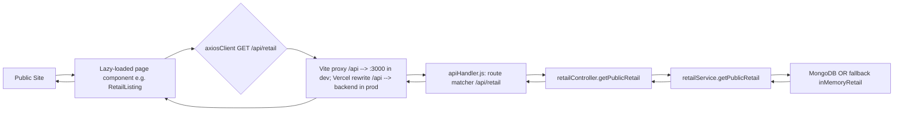
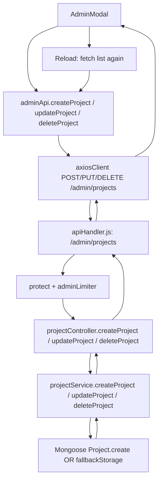
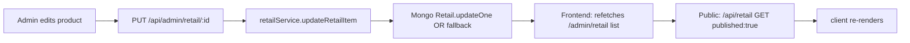
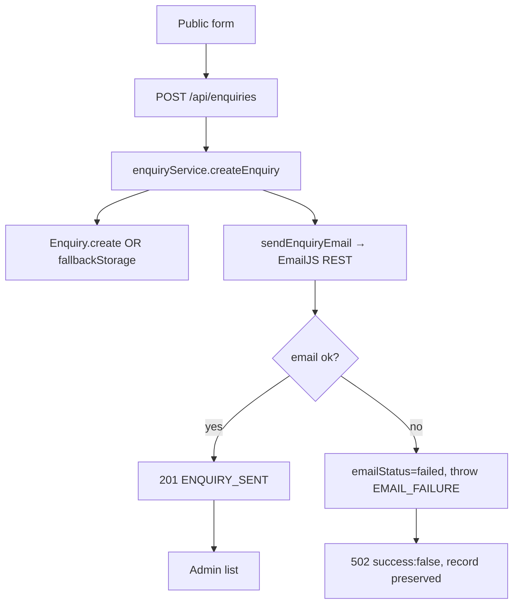
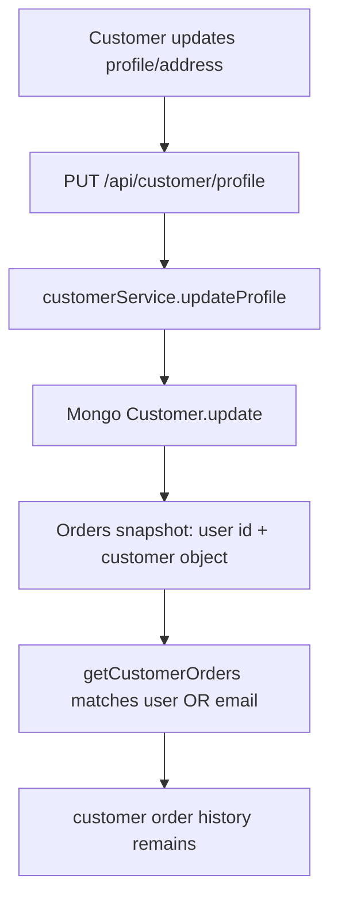
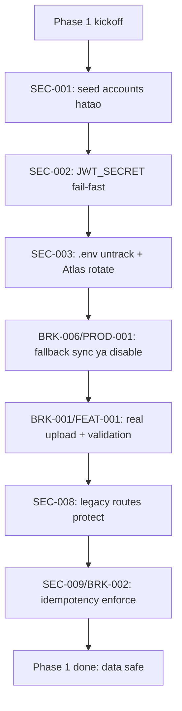
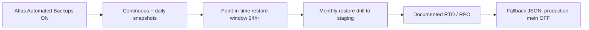

# SabrStudio — Production Readiness & Admin Panel Audit

**Project:** Sabr Studio (sabr-studio) · Monorepo · Vite React Frontend + Express API Backend  
**Document type:** Complete Production Readiness Audit · Requirement Specification  
**Audit date:** 2026-10-10  
**Status:** Development-ready · Not yet production-safe  
**Deliverable:** `C:\Users\fazal\OneDrive\Desktop\SabrStudio\requirement.md`

---

## 📖 Document Purpose

This report audits the entire SabrStudio codebase from a production perspective and records **what actually exists**, **what works**, **what is broken**, **what is missing**, and **what must change before launch**. Every finding is backed by repository evidence (file paths, function/API/model names) and includes a risk priority, a recommended fix, and a verification method.

> No secrets, credentials, customer records, or private data are recorded in this document. Environment variable names are listed; values are redacted.

---

## 📊 Executive at a Glance

| Area | Status | One-line summary |
|---|---|---|
| 🔴 **Authentication & access** | **CRITICAL** | Default admin accounts + static JWT_SECRET in the repo |
| 🔴 **Data persistence** | **CRITICAL** | Fallback `/tmp` storage never synced to MongoDB |
| 🔴 **Image uploads** | **CRITICAL** | Stub upload endpoint; no real upload path (BRK-001) |
| 🟥 **Admin operations** | **High** | Core CRUD works but no pagination, exports, audit trail, users section |
| 🟨 **Rate limiting** | **Warning** | In-memory store → unsafe on multi-instance serverless |
| 🟨 **Production deployment** | **Warning** | Vercel `/api` rewrite mismatch; no DB fail-fast |
| 🟩 **Core flows** | **Verified** | Enquiry DB+Email gating, server-side pricing, JWT cookie auth, webhook signature verify |

### 🟢 What is working well
- Passwords hashed with **bcrypt** (10 rounds) for admin + customer.
- JWT stored in **HttpOnly** cookies (not `localStorage`); `protect`/`protectCustomer` verify identity server-side.
- Enquiry submission has a **strict success gate**: DB save + EmailJS delivery must both succeed; partial failure keeps the record and returns `success: false`.
- Checkout resolves prices **server-side** from the catalog (never trusts the browser).
- Razorpay webhook signature verified with `crypto.timingSafeEqual`.
- File/fallback system lets the app run locally without Atlas.

### 🟡 What is not in shape
- Hardcoded credentials, static secrets, a stub upload endpoint, no order pagination, no audit trail, no users/customers admin section, missing analytics, no formal export workflow.

### 🟢 Bottom line
**Ready for development, not ready for public launch.** Fix the P0/P1 items first.

---

## 🚦 Status Legend

| Symbol | Meaning | Kis cheez par lagta hai |
|---|---|---|
| 🔴 **CRITICAL / P0** | Immediate security, payment integrity ya data-loss risk | Turant fix chahiye, launch se pehle |
| 🟥 **HIGH / P1** | Production-readiness ka important issue | Next release se pehle fix |
| 🟨 **WARNING / VERIFY** | Potential risk ya incomplete verification | Runtime test karke confirm karna hai |
| 🟩 **VERIFIED** | Available evidence se confirm ho gaya | Chal raha hai, aise hi rakho |
| 🔵 **RECOMMENDATION** | Naya improvement propose kiya gaya | Abhi exist nahi karta |
| ⚪ **INFORMATIONAL** | Neutral explanation ya context | Na problem, na fix |

> **Zaroori baat:** 🟩 sirf tabhi lagta hai jab **evidence** mile ho. Sirf code ka hona kaafi nahi — integration, persistence aur authorization trace karni padti hai. Koi bhi item bina evidence "confirmed vulnerability" nahi likha jata.

---
---

## 📑 Table of Contents

**Part 1 — Shuruaat (Overview & Assessment)**
1. [Project Overview](#1-project-overview)
2. [Audit Scope and Limitations](#2-audit-scope-and-limitations)
3. [Executive Summary](#3-executive-summary)
4. [Overall Production Readiness Assessment](#4-overall-production-readiness-assessment)

**Part 2 — Architecture & Inventory**
5. [Existing Technology and Architecture](#5-existing-technology-and-architecture)
6. [Repository and Feature Inventory](#6-repository-and-feature-inventory)
7. [Current Admin Panel Structure](#7-current-admin-panel-structure)

**Part 3 — Audits**
8. [Feature-by-Feature Audit](#8-feature-by-feature-audit)
9. [End-to-End Data Flow](#9-end-to-end-data-flow)
10. [Frontend/Backend Integration Findings](#10-frontendbackend-integration-findings)
11. [Authentication and Authorization Audit](#11-authentication-and-authorization-audit)
12. [Security Findings](#12-security-findings)
13. [Rate Limiting and Abuse Protection](#13-rate-limiting-and-abuse-protection)
14. [Database and Data Management](#14-database-and-data-management)
15. [Production Deployment Risks](#15-production-deployment-risks)

**Part 4 — Recommended Features**
16. [Dashboard and Analytics Recommendations](#16-dashboard-and-analytics-recommendations)
17. [Customers/Users Section Recommendation](#17-customersusers-section-recommendation)
18. [Excel/CSV Export Requirements](#18-excelcsv-export-requirements)
19. [Audit History, Trash, and Recovery](#19-audit-history-trash-and-recovery)
20. [Admin UI/UX and Workflow Improvements](#20-admin-uiux-and-workflow-improvements)

**Part 5 — Gap Analysis**
21. [Missing Features](#21-missing-features)
22. [Broken and Partially Working Features](#22-broken-and-partially-working-features)
23. [Unnecessary or Redundant Code Candidates](#23-unnecessary-or-redundant-code-candidates)
24. [Safe-to-Remove Candidates](#24-safe-to-remove-candidates)
25. [Performance and Testing Gaps](#25-performance-and-testing-gaps)
26. [Recommended Future Features](#26-recommended-future-features)

**Part 6 — Execution Plan**
27. [Priority-Based Risk Register](#27-priority-based-risk-register)
28. [Phased Implementation Roadmap](#28-phased-implementation-roadmap)
29. [Recommended Admin Navigation Structure](#29-recommended-admin-navigation-structure)
30. [Production Launch Checklist](#30-production-launch-checklist)
31. [Backup, Restore, and Incident Response Checklist](#31-backup-restore-and-incident-response-checklist)
32. [Environment/Provider Configuration Requirements](#32-environmentprovider-configuration-requirements)
33. [Acceptance Criteria for Each P0/P1 Requirement](#33-acceptance-criteria-for-each-p0p1-requirement)
34. [Final Evidence and Verification Summary](#34-final-evidence-and-verification-summary)

### Finding ID prefixes

| Prefix | Kiske liye | Dekho |
|---|---|---|
| `SEC-*` | Security vulnerabilities | Section 12, 11 |
| `DB-*` | Database schema/index/data | Section 14 |
| `PROD-*` | Production deployment risks | Section 15 |
| `API-*` | API/integration gaps | Section 10 |
| `FEAT-*` | Missing features | Section 21 |
| `BRK-*` | Broken / partial features | Section 22 |
| `UX-*` | Admin UI/UX gaps | Section 20 |
| `PERF-*` | Performance gaps | Section 25 |
| `TEST-*` | Testing gaps | Section 25 |
| `FUT-*` | Future roadmap items | Section 26 |

---


## 1. Project Overview

Sabr Studio is a boutique architecture/interiors studio website built as a **two-process monorepo**:

- **Frontend (Vite + React 18 + Tailwind + Framer Motion/GSAP/Lenis):** public website (Home, Projects, Retail/Store, Services, About, Contact, Cart, Checkout, Orders, Customer Profile) **plus** an admin panel (Dashboard, Projects, Retail, Enquiries, Orders).
- **Backend (Express 4 + Mongoose + MongoDB Atlas):** API-only server. It serves **no frontend HTML**; it only exposes JSON REST endpoints under `/api`, `/health`, `/`.

The two processes run separately locally (`npm run dev:backend` + `npm run dev:frontend`) and deploy separately (Vercel for frontend static output, any Node host for backend). Several local-config assumptions do not hold in a shared-production setup.

The project is currently **under active development** and **not yet safe for production entry**.

### Repo inventory (key paths)

> Poora, verified repository tree **Section 6.1** mein diya gaya hai (`## 6. Repository and Feature Inventory` → `### 6.1 Repository structure`). Yahan duplicate nahi kiya gaya.

## 2. Audit Scope and Limitations

### 2.1 What was inspected
- Full repository tree: `backend/`, `frontend/`, `scripts/`, root configs, `.env`/`.env.example` (names only), `vercel.json`, `package.json`, `README.md`, `CONNECTIVITY_AUDIT.md`.
- Git state: branch `fazal`, commits from v1.0 skeleton through active feature work, staged/unstaged changes, and 3 untracked backend files (`backend/models/otp.model.js`, `backend/services/google.service.js`, `backend/services/otp.service.js`).
- All backend route registrations in `backend/apiHandler.js` (~34 endpoints), controllers, services, models, middlewares, validators, constants, and utilities.
- Key frontend files: `main.jsx`, `App.jsx`, `AppRouter.jsx`, `ProtectedRoute.jsx`, `AdminLayout.jsx`, contexts, `axiosClient.js`, shared + admin + public feature pages.
- Database schemas (mongoose) + in-memory fallback seeds + `seedDevelopmentData.js`.
- Rate limiter config, error handler, cookie options, Razorpay/EmailJS/cloudinary service files, and scripts.

### 2.2 What could NOT be verified (marked NOT VERIFIED)
- **Live production environment** — no production URL, no live MongoDB Atlas, no live Razorpay sandbox keys, no live EmailJS credentials were available.
- **Email delivery in production** — `EMAILJS_*` values exist in `backend/.env` but were NOT recorded here (secret). Email status was verified only via code + a local harness that showed `201` when keys were present.
- **Payment gateway live behavior** — Razorpay is **mocked when not configured**; signature verification runs only when `RAZORPAY_KEY_SECRET` is set. No real payment was made.
- **Multi-instance rate-limit sharing** — verified only as single-process in-memory; no Redis store is wired.
- **Vercel deployment** — `vercel.json` was read; the backend is not yet deployed as a Vercel Function, so production routing/data persistence was not live-tested.
- **Actual production traffic, load, or profiling** — this was a static code audit, not performance profiling.

### 2.3 Rule compliance
This audit made **no changes** to application code, database, environment files, or deployment config. It created/updates **only** `requirement.md`. No secrets, customer records, or private credentials are recorded in this document.

---

## 3. Executive Summary

Sabr Studio has a **reasonably clean architecture and good intentions**, but is **not yet production-ready**.

### 3.1 Headline findings
| Finding | Severity | Why it matters |
|---|---|---|
| **SEC-001: Default hardcoded admin accounts** (3 accounts, password `admin`) | 🔴 **Critical** | Anyone reading the repo gains admin access |
| **SEC-002: Static JWT_SECRET fallback** | 🔴 **Critical** | Session forgery risk in production |
| **SEC-003: MongoDB Atlas credentials in `.env`** | 🔴 **Critical** | Unauthorized DB access if repo/server is compromised |
| **API-001: `/api/admin/uploads` is a stub** | 🟥 **High** | Claims image upload, but nothing is implemented |
| **API-002: `Idempotency-Key` not enforced** | 🟥 **High** | Duplicate-order risk is only front-end guarded |
| **DB-001: No unique index on `Order.idempotencyKey`** | 🟥 **High** | Race conditions can create duplicate orders |
| **PROD-001: Fallback storage not synced to MongoDB** | 🟥 **High** | Production data lost/dual-held |
| **SEC-005: No CSRF tokens on admin routes** | 🟨 **Warning** | Cross-site state mutation risk |

### 3.2 What is working well
- Passwords hashed with **bcrypt** (10 rounds) for admin + customer.
- JWT stored in **HttpOnly** cookies; `protect`/`protectCustomer` verify identity server-side.
- Enquiry submission has **strict success gate**: DB save + EmailJS delivery must BOTH succeed.
- Checkout resolves prices **server-side** from catalog (never trusts browser).
- Razorpay webhook signature verified with `crypto.timingSafeEqual`.
- Fallback in-memory + JSON storage lets the app run locally without Atlas.

### 3.3 What is not in shape
- Hardcoded credentials, static secrets, stub upload endpoint, no order pagination, no audit trail, no users/customers admin section, missing analytics, no formal export workflow.

### 3.4 Bottom line
**Ready for development, not ready for public launch.** Fix the P0/P1 items first.

## 4. Overall Production Readiness Assessment

| Dimension | Current state | Readiness |
|---|---|---|
| Authentication & session security | Core is correct (httpOnly cookies, server-side verification, bcrypt) but hardcoded defaults + static JWT_SECRET undermine it | 🔴 Not ready |
| Payment integrity | Server-side prices, signature verification exists, but Razorpay mocked in dev | 🟨 Needs verification |
| Data persistence | MongoDB Atlas optional; fallback JSON in `/tmp` on serverless; no auto-sync | 🔴 Not ready |
| Admin operations | CRUD works; no users/admin section, no exports, no audit trail | 🟥 Core OK, missing workflows |
| Security headers / CSRF | Helmet used but CSP disabled; cookies `HttpOnly` but no CSRF tokens | 🟨 Needs hardening |
| Observability | Basic console logger; no structured logs, no backend health on Vercel | 🟨 Needs work |
| Performance | Client-side lazy loading exists; no DB indexes beyond model-defined; no query limits on admin lists | 🟨 Needs improvement |
| Testing | One integration harness exists; no unit/component/e2e tests | 🟨 Minimal |

### Statement on production claims
- **Confirmed:** Backend runs as API-only service; Vite dev proxy works locally; 34 route endpoints registered; 46/46 route-contract checks pass locally.
- **Confirmed risk:** Hardcoded default admin credentials are present in the repo.
- **Likely risk:** Rate-limiters using in-memory state do **not** safely share across multiple backend instances (Vercel serverless).
- **Needs runtime verification:** Real Razorpay webhook acceptance, EmailJS live delivery, MongoDB Atlas connectivity under Vercel cold starts, production file-upload via the stub endpoint.

---

## 5. Existing Technology and Architecture

| Layer | Technology |
|---|---|
| Frontend | React 18, Vite 5, React Router v6, Tailwind CSS, Framer Motion, GSAP, Lenis |
| UI primitives | Custom Button/Select/Skeleton/EmptyState/Badge + CustomButtons demo kits |
| State | React Context (AuthProvider, CustomerProvider, CartProvider) |
| Backend | Express 4, Mongoose 8, MongoDB Atlas SRV, dotenv, cors, helmet, compression, express-validator, express-rate-limit, jsonwebtoken, bcrypt, razorpay, cloudinary, multer |
| Auth | JWT (24h admin, 30d customer) in **HttpOnly** cookies + phone OTP (6-digit, hashed, TTL 5 min) |
| Payments | Razorpay (mocked when not configured) + webhook HMAC verification |
| Email | EmailJS REST from backend (env vars) with strict success gating |
| Media | Cloudinary configured on backend (optional) |
| Database | MongoDB (Atlas) with mongoose; **no ORM** |

### Request flow (simplified)
```
Browser --> Vite dev server (proxy /api --> :3000)   [dev only]
Browser --> Vercel static hosting + Vercel rewrite /api --> backend
Backend --> Mongoose (Atlas)  OR  fallback JSON in /tmp
```


## 6. Repository and Feature Inventory

### 6.1 Repository structure
```
Sabr-Studio/
├── backend/                 # Express API
│   ├── app.js, apiHandler.js, dev.js, config/db.js
│   ├── controllers/, middlewares/, models/, services/, utils/, validators/
│   ├── data/fallback/       # orders.json, enquiries.json
│   ├── .env.example, .env
│   └── package.json
├── frontend/                # Vite React
│   ├── src/main.jsx, app/App.jsx, app/AppRouter.jsx, app/ProtectedRoute.jsx
│   ├── src/shared/          # components, contexts, api, hooks, layouts, utils, styles
│   ├── src/features/        # admin-*, projects, retail, orders, cart, checkout, customer, enquiries, contact, home, services
│   └── vite.config.js, package.json, .env
├── scripts/
│   ├── dev.mjs              # dual-process dev orchestrator (backend :3000 + frontend :5173)
│   ├── build.mjs            # frontend build wrapper
│   ├── test-all-routes.mjs  # route contract harness
│   └── (plans reference 02-frontend.md, 05-auth.md, 06-features.md, 07-security.md, DATABASE.md, ARCHITECTURE.md)
├── api/index.js           # Vercel serverless entry (exports backend/app.js)
├── vercel.json              # rewrites /api --> /api/index (backend function)
├── package.json             # root scripts
├── CONNECTIVITY_AUDIT.md    # route/connectivity audit (values redacted)
└── requirement.md           # this file
```

### 6.2 Feature inventory (with evidence)

| Feature | Evidence | Status |
|---|---|---|
| Public: Home, Projects, Retail, Services, About, Contact | `frontend/src/features/*/pages` | 🟩 VERIFIED |
| Public: Cart + Checkout + Order success + Orders list | `cart*, checkout, orders` | 🟩 VERIFIED |
| Public: Customer login/register/OTP/Google/profile | `customer` feature + CustomerContext + customer.api | 🟩 VERIFIED |
| Admin: Login, Dashboard, Projects, Retail, Enquiries, Orders | `admin-*` feature + AdminLayout + ProtectedRoute | 🟩 VERIFIED (core) |
| Public: Enquiry form → DB + EmailJS | `enquiries/components/EnquiryForm` + `enquiry.controller.createEnquiry` | 🟩 VERIFIED |
| Product CRUD (admin) | `retail.controller.js` + `admin-retail` page | 🟩 VERIFIED (core) |
| Project CRUD (admin) | `project.controller.js` + `admin-projects` page | 🟩 VERIFIED (core) |
| Enquiry status update/delete (admin) | `enquiry.controller.js` | 🟩 VERIFIED |
| Order status/tracking update (admin) | `order.controller.js` | 🟩 VERIFIED |
| Uploads (`/api/admin/uploads`) | `apiHandler.js` lines ~555-601 | 🔴 **STUB** |
| Order webhook (Razorpay) | `order.controller.webhook` → `order.service.handleWebhook` | 🟩 VERIFIED |

## 7. Current Admin Panel Structure

### 7.1 Navigation (AdminLayout.jsx, lines 22-28)
Admin sidebar exposes **5 top-level items**:
1. Dashboard (`/admin`)
2. Projects (`/admin/projects`)
3. Retail Items (`/admin/retail`)
4. Enquiries (`/admin/enquiries`)
5. Orders (`/admin/orders`)

### 7.2 Dashboard (`AdminDashboardPage.jsx`)
- Loads `getProjects`, `adminApi.getRetailItems`, `adminApi.getEnquiries`, `adminApi.getOrders` in parallel.
- Shows project + retail + enquiry + order lists in tabs.
- Contains hardcoded draft form defaults (line 49-68) that are **not used** as defaults on the actual edit forms.
- **No** KPI cards, no revenue, no recent orders, no pending-actions alerts.
- `dashboard.api.getDashboardStats()` (`GET /admin/stats`) exists but is **not used** in the dashboard page.
- **Risk:** Dashboard does not surface what operators need. `/admin/stats` is a dead-end endpoint.

### 7.3 Retail page (`AdminRetailPage.jsx`)
- Tabs: Overview, Projects, Retail, Enquiries, Orders.
- Retail CRUD: create/edit with title, category, price, image, description, dimensions, materials, stock toggle, publish/unpublish.
- Category management: list + create + delete (with cascade option via query param).
- Filters: category filter + stock filter.
- **Known UI/backend mismatches** (from git history): in-stock check button "not working", out-of-stock problem, "show immediately" vs draft mismatch.

### 7.4 Orders page (`AdminOrdersPage.jsx`)
- Lists orders; per-order action buttons for status/tracking.
- **No** pagination, search, filters, date-range picker, bulk action, export.
- **No** status filter for failed payments, no bulk action, no export.

### 7.5 Enquiries page (`AdminEnquiriesPage.jsx`)
- Table of enquiries (new/contacted/pending) with status dropdown + view + delete.
- **No** search, filter (other than status dropdown), pagination.

### 7.6 Projects page (`AdminProjectsPage.jsx`)
- CRUD for projects; publish/unpublish, edit, delete.
- **No** slug duplicate validation UI, no SEO metadata panel.

### 7.7 Admin login (`AdminLoginPage.jsx`)
- Email + password form. No "forgot password" for admin, no lockout UI, no "remember me".

### 7.8 Missing from admin panel
The admin panel covers the 5 core headless-e-commerce modules but is missing: a Users/Customers section, an Audit History section, an Excel/CSV export center, a bulk-actions section, and a centrally visible pending-actions panel.

## 8. Feature-by-Feature Audit

### A. Dashboard 🔴
**Current implementation:** `AdminDashboardPage.jsx` fetches projects, retail, enquiries, orders in parallel; renders in tabs. **No** KPI cards. **No** recent orders. **No** pending-actions alerts. **No** loading/empty/error states beyond a generic spinner.

**Evidence:** `frontend/src/features/admin-dashboard/pages/AdminDashboardPage.jsx` — local state for `projects`, `retailItems`, `enquiries`, `orders`. `dashboard.api.getDashboardStats()` (`GET /admin/stats`) exists but is **unused** in the dashboard page.

**Risk:** Dashboard doesn't surface operational needs (pending orders, failed payments, low-stock, new enquiries). `/admin/stats` is a dead-end endpoint.

**Recommended action:** Rebuild dashboard with KPI cards, pending-actions inbox, recent orders table, status indicators.

**Priority:** P1

### B. Projects Management 🟥
**Current implementation:** `Project` schema (title, slug, category, location, year, area, description, shortDescription, contentBlocks, images, coverImage, gallery, price, published, timestamps). Controller: `getPublicProjects`, `getPublicProjectBySlug`, `getAdminProjects`, `getAdminProjectById`, `createProject`, `updateProject`, `deleteProject`. Admin UI: create/edit/publish/unpublish/delete; content blocks + multiple images.

**Evidence for data flow:** `project.controller.createProject` → `projectService.createProject` → `Project.create`. `getPublicProjects` queries `published: true`. `/api/projects/:slug` → `getPublicProjectBySlug` (published only; 404 if not found/unpublished).

**Known gaps:** **Slug duplicate validation missing** — `slug` has unique index, but no friendly duplicate error. **Upload stub** — `/api/admin/uploads` returns static Unsplash URL; real uploads not functional. **No recovery after accidental deletion** — no trash/archive/restore. **No SEO metadata** — static meta tags only.

**Recommended action:** 1. Implement real upload or remove the claim. 2. Add slug duplicate check with friendly error. 3. Add **Trash** (soft-delete with restore) to Projects. 4. Add SEO metadata section to project form.

**Priority:** P1

### C. Retail/Product Management 🟥
**Current implementation:** `Retail` schema (title, slug, category, description, images[], image, price, availability, inStock, dimensions, materials, published, timestamps). Controller: `getPublicRetail`, `getPublicRetailBySlug`, `getAdminRetail`, `getAdminRetailById`, `createRetailItem`, `updateRetailItem`, `deleteRetailItem`, `getCategories`, `createCategory`, `deleteCategory`. Admin UI: create/edit with title, category, price, image, description, dimensions, materials, stock toggle, publish/unpublish.

**Evidence for data flow:** `retail.controller.createRetailItem` → `retailService.createRetailItem`. Public lists `published: true`. `deleteCategory` supports a `cascade` flag; without cascade it **blocks deletion** if products exist.

**Known gaps:** **Stock not decremented** — `inStock`/`availability` flag checked at checkout; no real inventory counter. **Historical product info preserved** — Orders snapshot `items[]` with `productId`, `itemType`, `name`, `unitPrice`, `lineTotal`. **No image cleanup** — `deleteRetailItem` does not delete Cloudinary files; orphaned files accumulate. **Duplicate products** — `slug` unique, but duplicate-title entry allowed; no duplicate-name warning. **Cascade deletion** — no confirmation UI, no audit entry.

**Recommended action:** 1. Implement real upload + cleanup on replace/delete (delete old `publicId` after new upload). 2. Add orphan cleanup job or documented manual cleanup. 3. Add duplicate-name/slug warnings to admin UI. 4. Make cascade deletion require explicit confirmation + audit entry.

**Priority:** P1

### D. Orders Management 🟥
**Current implementation:** `Order` schema (orderNumber, user ref, customer snapshot, deliveryAddress, items[], amount, subtotal, shipping, currency, payment object with razorpay ids + verified, paymentStatus, orderStatus, trackingId, idempotencyKey, timestamps). Controller: `checkout`, `legacyCheckout`, `verifyPayment`, `verifyPaymentLegacy`, `getAdminOrders`, `getAdminOrderById`, `updateOrderStatus`, `updateTracking`, `getMyOrders`, `getMyOrderById`, `webhook`.

**Evidence:** `order.service.createCheckoutSession` resolves price **server-side** from retail/project catalog; rejects unpublished/out-of-stock items with `409`. **Idempotency:** `_findByIdempotency` called when `Idempotency-Key` present, but `utils/idempotency.js` **not wired** into the endpoint (see API-002). Webhook: `handleWebhook` reads `req.rawBody`, verifies signature via `verifyWebhookSignature`. `updateOrderStatus` destructures `{ orderStatus, status, ...disallowed }` and **rejects disallowed fields**.

**Known gaps:** **No pagination/search/filter/sort/date-range on admin orders** — `getAdminOrders` returns entire unfiltered list (see PERF-001 / DB-006). **Order number:** `SABR-ORD-<year>-<4 hex>` — unique but not human-contextual. **Payment status vs order status are independent** — no auto-transition. Admin must set both. **Tracking ID** — validated (`^[A-Za-z0-9][A-Za-z0-9\-_ ]{3,63}$`), persisted, pushes `statusHistory`. No per-order permission check. **Refunds not implemented** — `refunded` is in the enum, but no refund method exists. **Duplicate orders** — client-side submit lock only; server-side idempotency not enforced (API-002). **No stock decrement** — only a flag check; no product-level inventory counter. **No order export.**

**Recommended action:** 1. Add pagination/search/filters/date-range to order list. 2. Add **order status automation**: when `paymentStatus === paid` and order is `pending`/`confirmed`, auto-transition to `processing`. 3. Implement **safe stock decrement** (a `Stock`/`inventory` model or `stock` integer on Retail). 4. Implement refunds via Razorpay or document the policy. 5. Implement trash/restore for orders with audit trail. 6. Add order export.

**Priority:** P1

### E. Enquiries Management 🟥
**Current implementation:** `Enquiry` schema (name, email optional, phone required, projectType, message, source, sourceRoute, status, emailStatus, emailError, timestamps). Controller: `createEnquiry` (public, strict success gating), `getAdminEnquiries`, `getAdminEnquiryById`, `updateEnquiryStatus`, `deleteEnquiry`. Admin UI: table with status dropdown (new/contacted/pending) + view + delete.

**Evidence:** `enquiryService.createEnquiry` saves to DB (Mongo or fallback), then calls `sendEnquiryEmail`. If email fails, it **preserves** the record with `emailStatus: 'failed'` and throws → controller returns `success:false` (`EMAIL_FAILURE`). If EmailJS config missing → `503` `EMAIL_CONFIG_MISSING`, record preserved. `updateEnquiryStatus` only allows `new/contacted/pending`. `deleteEnquiry` permanently deletes.

**Known gaps:** **No email retry** — if first send fails, operator must manually re-send. **No spam protection** beyond IP rate limiter (`enquiryLimiter`). **No "retry send" UI** — email status stuck at `failed`. **Hard delete** — no confirmation or audit entry. **No pagination/search** — admin list returns everything.

**Recommended action:** 1. Add email-send retry + "retry" button in admin UI. 2. Add spam controls (honeypot/reCAPTCHA, stronger IP+rate-limit). 3. Add pagination/search/filter to enquiries list. 4. Add confirmation + audit entry on deletion. 5. Add retention policy (N days → archive/delete).

**Priority:** P1

### F. Admin Accounts and Access 🔴
**Current implementation:** `Admin` schema (name, email unique, password hashed, role enum `['admin']`, status enum `['active','disabled']`, lastLoginAt). Auth: `POST /api/auth/login` → `authService.loginAdmin` (bcrypt compare, 24h JWT, `token` cookie), `GET /api/auth/me` (via `protect`), `POST /api/auth/logout`.

**Evidence:** `admin.model.js` inMemory seeds: `admin-1` (email `admin`, password `admin`), `admin-2` (email `admin@sabrstudio.com`, password `admin`), `admin-3` (email `admin@sabrstudio.example`, password `admin`). **All three share the literal password `admin`.** `auth.service.getJwtSecret()` = `process.env.JWT_SECRET || 'sabr_studio_dev_jwt_secret_key_8f7b2c9d1e4a5f6e'`. `cookieOptions.js`: cookie is `HttpOnly`, `Secure` if `COOKIE_SECURE === 'true'` or production, `SameSite: 'lax'`, maxAge 24h.

**Known gaps:** **SEC-001:** Default admin accounts with known passwords. **SEC-002:** Static JWT_SECRET fallback. No admin forgot-password flow. **No role-based checks** — single role, all admin endpoints equally protected. **No CSRF tokens** — cookie auth risk. Login returns generic `401 "Invalid email or password"` (good, prevents enumeration).

**Recommended action:** 1. Remove default accounts; seed via env/one-time setup. 2. Fail startup in production without secure `JWT_SECRET`. 3. Add admin forgot-password + lockout after N failed attempts. 4. Add CSRF tokens or switch to Authorization header. 5. Add audit trail for admin login/logout + sensitive actions.

**Priority:** P0 (default accounts), P1 (forgot password/lockout/CSRF)

## 9. End-to-End Data Flow

### 9.1 Public website → backend API → database → frontend

**Notes:** `VITE_API_BASE_URL=/api` (relative). Server-side fallbacks return the same envelope. In dev, `axiosClient` timeout is 15s; in production it inherits the same client config. **Status:** Verified in local harness (FE-1..FE-5 all 200). Production behavior unverified.

### 9.2 Admin create/edit/delete → API → database → updated admin UI

**Notes:** No optimistic UI in reviewed pages; the page must refetch. Delete is permanent (no trash). No audit entry on any create/edit/delete. **Status:** Backend verified; UI refetch not centrally verified. Deletion is destructive.

### 9.3 Product/category changes → public storefront

**Notes:** Public stores only `published: true`. If a product is unpublished, it disappears (correct). No cache-busting (Vite dev server + Vercel static cache could stale). **Status:** Verified statically.


### 9.4 Customer registration/login → authentication → protected API
```mermaid
flowchart LR
  A[Browser] --> B[Customer login/register]
  B --> C[POST /api/customer/login OR /api/customer/register]
  C --> D[protectCustomer middleware]
  D --> E[bcrypt / JWT verify / find customer]
  E --> F[sabr_customer cookie (HttpOnly)]
  F --> G[protected /api/customer/* calls]
  G --> D
```
**Notes:** Customer JWT lives in cookie `sabr_customer` (30d). `protectCustomer` rejects non-`kind === 'customer'` payloads. No CSRF token on customer calls. **Status:** Verified statically. CSRF on customer state-changing endpoints unverified.

### 9.5 Cart → checkout → order creation → payment → verification
```mermaid
flowchart TD
  A[Cart] --> B[POST /api/orders/checkout]
  B --> C[orderService.createCheckoutSession]
  C --> D[server-side price from catalog]
  C --> E[Order.create {paymentStatus:pending}]
  C --> F[createRazorpayOrder OR mock]
  F --> G[Razorpay order id in response]
  G --> H[Redirect to Razorpay / verify on return]
  H --> I[POST /api/orders/verify]
  I --> J[verifyCheckoutSignature (HMAC timingSafeEqual)]
  J --> K{ok?}
  K -->|yes| L[Order.update: paymentStatus=paid, orderStatus→processing, stock]
  K -->|no| M[fail + 400]
```
**Notes:** Server-side price is correct. Idempotency is conditionally parsed but **not enforced** (API-002). Stock is not decremented in the DB (DB-002). Refund not implemented. **Status:** Static verification; live payment NOT verified.

### 9.6 Admin order/tracking update → database → customer order history
```mermaid
flowchart LR
  A[Admin updates status/tracking] --> B[PATCH /api/admin/orders/:id/status|tracking]
  B --> C[orderService.updateOrderStatus / updateTrackingId]
  C --> D[Mongo findOneAndUpdate or fallback]
  D --> E[Customer /api/orders/my/:id GET → protected]
  E --> F[Customer shows order with new tracking]
```
**Notes:** `updateTrackingId` pushes `statusHistory`. `getCustomerOrders` matches user id OR email. Ownership check in `getCustomerOrderById` returns 403 if not owner. **Status:** Verified statically.

### 9.7 Enquiry submission → database → email → admin enquiries

**Notes:** Strict success gate is **correct** (never false success). No retry. No spam controls beyond IP rate-limit. **Status:** Static verification; live delivery requires EmailJS keys.

### 9.8 Image upload → storage → public rendering → cleanup
```mermaid
flowchart LR
  A[Admin] --> B{POST /api/admin/uploads}
  B --> C{Cloudinary keys present?}
  C -->|yes| D[cloudinary.uploader.upload]
  C -->|no| E[static Unsplash sample URL]
  D --> F[returns {url, publicId}]
  E --> F
  F --> G[product stored with image url/publicId]
  G --> H[public /api/retail shows image]
  H --> I[deleteProduct/deleteCategory does NOT delete Cloudinary files]
```
**Notes:** Upload endpoint is a **stub** (API-001). No cleanup of old `publicId` on update/replace/delete. **Status:** Verified statically — the real upload path does not exist.

### 9.9 Customer profile changes → historical orders and account ownership

**Notes:** Orders store a `user` ObjectId and a `customer` snapshot. Changing email does not break history lookup because email is matched too. **Status:** Verified statically.

### 9.10 Production deployment → environment → frontend API baseURL → backend → MongoDB
```mermaid
flowchart LR
  A[Vercel frontend / static dist] --> B[VITE_API_BASE_URL=/api]
  B --> C[Vercel rewrite /api/(.*) → /api/index]
  C --> D[Backend separate host or Vercel function api/index]
  D --> E[config/db.js connectDB]
  E --> F[MongoDB Atlas]
  E --> G[fallback /tmp JSON if DB down]
```
**Notes:** If backend is not actually exposed at `https://<app>.vercel.app/api/index`, frontend calls fail with 502. `MONGODB_URI` must be set; otherwise the app silently runs on fallback data. **Status:** Read-only; production routing not verified live.


## 10. Frontend/Backend Integration Findings

| Finding | Evidence | Risk | Recommendation | Priority |
|---|---|---|---|---|
| API base URL is relative (`/api`) | `axiosClient.js` line 4 | 🟩 Low | Keep relative; ensure Vercel rewrite or proxy is set correctly | P3 |
| Frontend boot auto-spawns backend (`autoStartBackendPlugin`) | `vite.config.js` lines 10-59 | 🟨 Medium (EADDRINUSE on slow boot) | Remove auto-start; document two-command boot | P2 |
| Admin login redirect on 401 | `axiosClient.js` lines 74-77 | 🟩 Correct | Keep | P1 |
| Response envelope normalization | `axiosClient.js` interceptor | 🟩 Good | Keep; document it | P1 |
| `adminLimiter` mounted on `/api/admin/**` inside apiHandler | `apiHandler.js` lines 371-372 | 🟩 Good | Keep | P1 |
| CORS allow-list has localhost + cloud-preview wildcards | `app.js` lines 66-77 | 🟨 Medium | Restrict cloud-preview list | P2 |
| `verifyPayment` route requires `protectCustomer` | `apiHandler.js` lines 334-340 | 🟩 Good | Keep; note legacy route has no auth | P1 |
| `/api/checkout/verify` and `/api/orders/verify-legacy` have NO auth | `apiHandler.js` lines 362-368 | 🟨 Medium (legacy compat) | Protect them or deprecate | P2 |

---


## 11. Authentication and Authorization Audit

### 11.1 Admin authentication
| Item | Evidence | Assessment |
|---|---|---|
| Password hashing | `admin.model.js` pre-save bcrypt 10 rounds | 🟩 Good |
| Token storage | `token` HttpOnly cookie (24h) | 🟩 Good |
| Session verification | `protect` middleware (cookie/Bearer, `jwt.verify`) | 🟩 Good |
| Account status | `disabled` → 403 | 🟩 Good |
| Default accounts | `admin.model.js` inMemoryAdmins (admin/admin, admin@sabrstudio.com/admin) | 🔴 CRITICAL SEC-001 |
| Password reset for admin | NONE | 🟥 P1 |
| Lockout | NONE (only `disabled`) | 🟥 P1 |
| CSRF | No token | 🟥 P1 |
| Role enforcement | Single `admin` role; `protect` checks admin existence/status only | 🟨 P2 |

### 11.2 Customer authentication
| Item | Evidence | Assessment |
|---|---|---|
| Password hashing | Customer pre-save bcrypt 10 rounds | 🟩 Good |
| JWT | `sabr_customer` cookie, 30d, `kind: 'customer'` | 🟩 Good |
| OTP | 6-digit, SHA-256 hashed, TTL 5 min, attempt limit 5 | 🟩 Good |
| Google login | Server-side ID token verification in `google.service` | 🟩 Good |
| Enumeration safety | `forgotPassword`/`requestOtp` identical responses | 🟩 Good |
| Lockout | OTP attempt limit only | 🟥 P1 |

### 11.3 Authorization
- **Admin endpoints:** `apiHandler.js` mounts `adminLimiter` + `protect` on `/api/admin/**`. No per-role checks (single role).
- **Customer endpoints:** `protectCustomer` requires `kind === 'customer'`.
- **Public endpoints:** `/api/projects`, `/api/retail/*`, `/api/enquiries` (POST) are **not** protected (intended).

### 11.4 Known authorization weaknesses
- **SEC-005:** No CSRF tokens on admin state-changing endpoints (cookie auth). With `SameSite: 'lax'`, state-changing POSTs from other sites are partially exposed.
- **IDOR:** `getCustomerOrderById` checks ownership; `getAdminOrderById` is admin-only. Good.

**Priority:** P0 (default accounts), P1 (forgot password, lockout, CSRF), P2 (role model).

## 12. Security Findings

| ID | Finding | Evidence/path | Severity | Exploit scenario | Impact | Recommended fix | Priority |
|---|---|---|---|---|---|---|---|
| SEC-001 | Default hardcoded admin accounts with known passwords | `backend/models/admin.model.js` lines 70-108 | 🔴 **Critical** | Read repo → admin login with `admin`/`admin` → full admin panel | Unauthorized access | Remove defaults; bootstrap via env/one-time setup | P0 |
| SEC-002 | Static JWT_SECRET fallback | `auth.service.js` lines 6-8, `customer.service.js` lines 9-17 | 🔴 **Critical** | Forge admin/customer JWT if `JWT_SECRET` not set | Session hijack | App must fail at startup if `JWT_SECRET` missing in production | P0 |
| SEC-003 | `backend/.env` contains live MongoDB Atlas credentials | `.env` file (not committed, but present locally) | 🔴 **Critical** | Anyone with file access uses live DB | Data breach | Rotate credentials; never store secrets in repo | P0 |
| SEC-004 | CSP disabled (helmet `contentSecurityPolicy: false`) | `app.js` lines 40-44 | 🟥 High | XSS via inline scripts more likely to execute | Session theft | Re-enable CSP with nonces; allow CDNs + inline styles only | P1 |
| SEC-005 | No CSRF tokens on admin state-changing endpoints | `app.js` cookie `SameSite: 'lax'`, no CSRF token | 🟥 High | Cross-site POST from attacker site | State mutation | `SameSite: 'strict'` + CSRF Double-Submit token; or switch to Authorization header | P1 |
| SEC-006 | Rate-limiters use in-memory store (default) | `rateLimit.middleware.js` lines 82-86 | 🟥 High (multi-instance) | Attacker scales instances → bypasses limit | Abuse | Wire `rate-limit-redis` / `rate-limit-memcached-store` | P1 |
| SEC-007 | Admin upload endpoint is a stub with no file-type validation | `apiHandler.js` lines 555-601 | 🟨 Medium | Attacker brute-forces `/api/admin/uploads` (no file-type validation) | Malicious file upload | Implement real upload with MIME/extension/size validation; remove stub | P0 |
| SEC-008 | Legacy payment verify routes have no auth | `apiHandler.js` lines 362-368 | 🟥 High | Anyone calls `/api/checkout/verify` | Payment bypass | Protect or remove legacy routes | P1 |
| SEC-009 | No unique index on `Order.idempotencyKey` | `order.model.js` line 87 (only in memory) | 🟨 Medium | Duplicate requests create duplicate orders | Duplicate charges | Add unique index + enforce server-side | P1 |
| SEC-010 | No audit log for admin actions | No audit collection | 🟨 Medium | Cannot prove who did what | Compliance risk | Add audit trail | P2 |
| SEC-011 | `adminLimiter` max 50 per 15 min (admin) is per-IP only | `rateLimit.middleware.js` lines 29-44 | 🟨 Medium | IP-sharing (corporate NAT) → everyone is limited together | Denial to legitimate IPs | Rate-limit by user/session where possible; add account-based checks | P2 |

### Existing controls that appear correctly implemented
- 🟩 **bcrypt password hashing** — both admin and customer models use bcrypt (10 rounds) in `pre('save')` hooks.
- 🟩 **HttpOnly cookies** — `token` (admin) and `sabr_customer` (customer) cookies are `HttpOnly`, with `Secure` flag in production.
- 🟩 **Server-side price calculation** — `orderService.createCheckoutSession` resolves prices from catalog, never trusts client-submitted prices.
- 🟩 **Razorpay webhook signature verification** — `verifyWebhookSignature` uses `crypto.timingSafeEqual` for constant-time comparison.
- 🟩 **Enquiry success gating** — `enquiryService.createEnquiry` returns `success:false` (never false success) if email fails, but preserves DB record.
- 🟩 **Enumeration-safe login** — Generic `401 "Invalid email or password"` for both missing account and wrong password.
- 🟩 **Generic forgot-password response** — `customerController.forgotPassword` returns identical response whether or not account exists.

## 13. Rate Limiting and Abuse Protection

### 13.1 Current configuration
| Limiter | Window | Prod max | Dev max | Scope |
|---|---|---|---|---|
| `authLimiter` | 15 min | 5 | 100 | `/api/auth/login` |
| `adminLimiter` | 15 min | 50 | 1000 | `/api/admin/**` |
| `generalLimiter` | 15 min | 100 | 1000 | Everything else |
| `enquiryLimiter` | 15 min | 5 | 100 | `/api/enquiries` POST |
| `customerRegisterLimiter` | 15 min | 5 | 100 | `/api/customer/register` |
| `resetLimiter` | 15 min | 5 | 100 | forgot/reset |
| `checkoutLimiter` | 15 min | 30 | 500 | checkout/verify |
| `otpLimiter` | 15 min | 8 | 200 | OTP send/verify |

### 13.2 Assessment
**Confirmations:**
- 🟩 `keyGenerator` uses `req.ip || x-forwarded-for || socket.remoteAddress`, with safe default.
- 🟩 Login, register, reset, OTP, enquiry, and admin all have per-IP caps that tighten in production.
- 🟩 `generalLimiter` catches everything else (100/15 min prod).

**Limitations (likely risk, needs runtime verification):**
- 🟨 **In-memory store** — `rateLimit.middleware.js` lines 82-86 explicitly states all limiters use `express-rate-limit`'s default **in-memory store**. On multi-instance serverless (Vercel Functions), each instance keeps its own counters, so effective limits **scale with instance count**.
- 🟨 **IP-based limits can block legitimate users** behind corporate NAT.
- 🟨 **Header spoofing risk** — if `trust proxy` is misconfigured, `x-forwarded-for` could be spoofed.

### 13.3 Recommendations
1. **Replace in-memory store with `rate-limit-redis`** (or Memcached/Upstash) so multi-instance limits are shared. Add feature flag to keep dev-friendly.
2. **Rate-limit by account** on login, register, and OTP in addition to IP where tokens/email are available.
3. **Add per-user limiters** for admin actions with a session/user identifier.
4. **Add `Retry-After` header** on 429 responses for browser throttling.
5. Consider per-account tracking (where identifiers exist) alongside IP limits for enquiry and checkout.

**Priority:** P1 (shared store), P2 (account-level limits + Retry-After).

---


## 14. Database and Data Management

### 14.1 Schema summary
| Collection/Model | Key fields | Indexes | Notes |
|---|---|---|---|
| `Customer` | email unique, password, googleId, status, lastLoginAt, addresses[] | email unique | No email-verification field |
| `Order` | orderNumber unique, user ref, idempotencyKey, payment, paymentStatus/orderStatus, trackingId | orderNumber unique, paymentStatus+orderStatus+createdAt | No unique index on idempotencyKey |
| `Retail` | slug unique, category, price, availability, inStock, published | published+availability+createdAt | No index on category for search |
| `RetailCategory` | name unique | — | Loosely used |
| `Project` | slug unique, category, published, price | published+category+createdAt | — |
| `Enquiry` | phone, status, emailStatus | status+createdAt | — |
| `OtpCode` | phone, expiresAt + TTL 3600s | expiresAt TTL | 🟩 Good |
| `Admin` | email unique | — | — |

### 14.2 Known issues
- **DB-001:** No unique index on `Order.idempotencyKey` → duplicate orders possible in race conditions.
- **DB-002:** No `Stock` model / inventory counter → stock is only a flag; no real-time decrement. Historical orders keep snapshots (good) but live stock is not deducted.
- **DB-003:** No TTL index for customer login sessions beyond JWT (JWT expiry is app-level).
- **DB-004:** No soft-delete anywhere → `deleteProject`, `deleteRetailItem`, `deleteEnquiry`, `deleteCategory` permanently delete. No trash/restore.
- **DB-005:** No field-level encryption for payment data (Razorpay signature/paymentMethod stored in plaintext). Recommend not storing `razorpaySignature` long-term.
- **DB-006:** No indexes on admin orders list filters (no pagination params consumed). `getAdminOrders` returns all → unbounded reads.

### 14.3 Query/index coverage
- 🟩 `Order` model: compound index on `paymentStatus+orderStatus+createdAt` (good for status-grouped queries).
- 🟩 `Retail` model: `published+availability+createdAt`.
- 🟩 `Project` model: `published+category+createdAt`.
- 🟩 `Enquiry` model: `status+createdAt`.
- 🟨 **Missing:** index on `Order.user` and `Order.orderNumber` for customer lookups (orderNumber is unique; user ref would benefit from an index for `getCustomerOrders`).


### 14.4 Removal/archive strategy
- **Hide/unpublish:** `published: false` — hides from public, keeps data.
- **Archive:** Not implemented. Recommend an `archived` boolean or an `Archive` collection for completed orders/projects.
- **Soft-delete:** Not implemented. Recommend for Products/Projects/Enquiries (with `deletedAt` + `deletedBy` + restore window).
- **Permanent delete:** Implement explicitly (e.g., `forceDelete`) with confirmation + audit entry.
- **Retention:** Keep orders for legal/financial reasons (e.g., 5-7 years); retain only non-sensitive snapshots; delete raw emails after 30-90 days.

**Priority:** P1 (order idempotency + stock), P2 (soft-delete + indexes + retention).

## 15. Production Deployment Risks

### 15.1 Environment and routing
| ID | Finding | Evidence | Risk | Recommendation | Priority |
|---|---|---|---|---|---|
| PROD-001 | Fallback `/tmp` storage never synced to MongoDB | `fallbackStorage.js` write-only | 🔴 Data loss / dual-hold | Auto-sync fallback→Mongo at startup or only fallback when DB is down | P0 |
| PROD-002 | `vercel.json` rewrites `/api/(.*)` → `/api/index` but backend is a separate Node host | `vercel.json` | 🔴 Production API 404 | Verify the Vercel function (or external backend) serves `POST /api/...` | P0 |
| PROD-003 | `connectDB` never throws on failure | `config/db.js` | 🟥 Silent no-DB mode | Exit/circuit-break on connection failure after retries | P1 |
| PROD-004 | No `NODE_ENV` validation at startup | `app.js` | 🟥 Dev defaults can leak | Require `NODE_ENV=production` for payment/email config | P1 |
| PROD-005 | `COOKIE_SECURE` defaults false unless explicitly true | `cookieOptions.js` | 🟥 Cookies not secure on http | Enforce via env in production; SSL termination at host | P1 |
| PROD-006 | Frontend/backend version mismatch (no lockstep) | — | 🟨 API path breakage | Implement a version header and align release cadence | P2 |

### 15.2 Serverless / multi-instance
| ID | Finding | Evidence | Risk | Recommendation | Priority |
|---|---|---|---|---|---|
| PROD-007 | Rate-limiters in-memory (multi-instance) | `rateLimit.middleware.js` lines 82-86 | 🟥 Limits scale up | Use Redis/memcached store | P1 |
| PROD-008 | Cold starts from Mongoose connect + stub upload import | — | 🟨 Slow responses | Connection caching done (db.js); consider warm-up route | P2 |
| PROD-009 | Fallback storage in `/tmp` is per-instance | `fallbackStorage.js` | 🟥 Data loss across instances | Only use as temp; must sync to persistent DB | P0 |
| PROD-010 | `FALLBACK_DIR` may resolve to `/tmp` on Vercel (read-only) | `fallbackStorage.js` | 🟨 Degrades to in-memory, state lost | Already handled (degrade), but state still lost | P2 |

### 15.3 File uploads / email / payments
| ID | Finding | Evidence | Risk | Recommendation | Priority |
|---|---|---|---|---|---|
| PROD-011 | Upload endpoint is stub; Cloudinary optional | `apiHandler.js` lines 555-601 | 🔴 No real upload in prod | Implement real upload or gate feature | P0 |
| PROD-012 | EmailJS not verified in production | `emailjs.service.js` | 🟥 Enquiries "saved" but email not sent | Verify config in deploy; show status in admin | P1 |
| PROD-013 | Razorpay not live-tested | `razorpay.service.js` | 🟥 Mock in dev; no proof of live webhook | Test in sandbox; keep `RAZORPAY_WEBHOOK_SECRET` separate | P1 |
| PROD-014 | No CDN/thumbnail optimization | — | 🟨 Slow image loading | Serve via Cloudinary/Cloudflare Image Optimization | P3 |
| PROD-015 | `VITE_RAZORPAY_KEY_ID` is client-side (public key) | `frontend/.env` | 🟩 OK for client | A public key is fine, but never expose secrets | P2 |

### 15.4 Observability / operations
| ID | Finding | Evidence | Risk | Recommendation | Priority |
|---|---|---|---|---|---|
| PROD-016 | Only console logger | `utils/logger.js` | 🟨 No monitoring/log aggregation | Add structured logs (pino/winston) + keep admin logs | P2 |
| PROD-017 | No health endpoint for backend on Vercel | — | 🟨 No external liveness | Add `GET /api/health` (exists, but verify via Vercel function) | P2 |
| PROD-018 | No backup/restore automation | — | 🔴 Data loss risk | MongoDB Atlas automated backups + tested restore | P1 |
| PROD-019 | No migration strategy | — | 🟨 Schema changes risky | Add a migration tooling (e.g., mongo-migrate) and backward-compat checks | P2 |
| PROD-020 | No error boundaries / centralized frontend error reporting | — | 🟨 Unhandled UI crashes | Add React Error Boundary + error reporting (Sentry) | P2 |

### 15.5 SPA routing
- `vercel.json` has `/(.*)` → `/index.html` fallback. Direct refresh on `/admin/orders` works because Express serves JSON; the frontend uses React Router with a catch-all `/*` route in `AppRouter`. If the backend is not hosting `index.html`, the rewrite only covers the frontend (Vercel). Verify URL `/` on the backend returns JSON 200 (it does).

**Risk labels:** 🔴 Confirmed Risk, 🟥 Likely Risk, 🟨 Needs Runtime Verification.

## 16. Dashboard and Analytics Recommendations

### 16.1 Recommended metrics
| Metric | Definition | Data source | Already available? | Graph type | Business value | Priority |
|---|---|---|---|---|---|---|
| Total orders (current period) | Count of orders | Order model | Yes (via GET /admin/orders) | KPI card | Overview | P1 |
| Revenue (paid orders only) | Sum of `paymentStatus:paid` totals + tax | Order model | Partial | KPI card | Revenue | P1 |
| Failed/pending payment count | `paymentStatus:pending|failed` | Order model | Yes | KPI + mini-chart | Actions needed | P1 |
| Net revenue (after refunds) | Sum of paid − refunded | Order model (refund data absent) | No (no refund method) | Bar/line | Revenue health | P2 |
| New customer registrations | Customers created in period | Customer model | Yes | KPI + bar | Growth | P1 |
| Enquiries → orders conversion | ratio where trackable | Enquiry + Order | Partial | Line chart | Conversion | P2 |
| Best-selling products | orders grouped by productId | Order.items | Yes | Bar chart | Inventory focus | P2 |
| Low-stock/out-of-stock alerts | Retail `inStock:false` | Retail model | Yes | Alert badge | Restock | P1 |
| Order fulfillment status | counts by orderStatus | Order model | Yes | Donut (small) | Shipping ops | P1 |
| Payment method distribution | count by payment.provider | Order model | Partial | Donut (small) | Payment preference | P2 |
| Website traffic / sessions / unique visitors | external analytics | Analytics provider | **Not implemented** | — | Growth | P1 (add provider) |
| Checkout conversion / cart abandonment | events | Event system | **Not implemented** | — | UX focus | P2 |

### 16.2 Dashboard UX recommendation
- **Do not overload with charts.** Use:
  - 6 KPI cards (orders, revenue, pending payments, new customers, enquiries, low-stock alerts).
  - A "Pending actions" inbox: orders needing status/tracking, enquiries needing reply.
  - A recent-orders table (paginated) with links to order details.
- Severity-based alerts (red for failed payments, yellow for pending payment/timeout).

### 16.3 Website visitor analytics
- 🟨 **No reliable analytics exist.** `CONNECTIVITY_AUDIT.md` does not record an analytics provider.
- 🔵 **Recommendation (privacy-conscious):** Start with a first-party event clickstream (page view, add-to-cart, checkout start, purchase) and a lightweight analytics provider that respects consent. Recommended providers: Vercel Analytics (privacy-friendly, cookie-free for many), Plausible, or Umami. Avoid invasive fingerprinting.
- **Distinguish clearly:** page views ≠ sessions ≠ unique visitors. Historical traffic cannot be reconstructed if not collected.
- **Do not** use registered-user counts as visitor counts.

**Priority:** P1 (visitor analytics + pending actions), P2 (revenue/refund metrics + best sellers).

---


## 17. Customers/Users Section Recommendation

**Yes, add a Customers/Users section.** Rationale:
- Registered customers exist (email/password, Google login, OTP login). Orders link to `Customer`.
- Business value: active-customer counts for marketing, re-engagement, and support.
- It is low complexity (read-only list + detail + order history) and high value.

### 17.1 Suggested fields (user-visible only)
- Customer ID, name, email, phone, avatar, status (active/disabled), role (`customer`), lastLoginAt, order count, lifetime orders (count), lifetime spend (sum of paid orders).
- **Do not** store passwords, OTPs, session secrets, or payment details in the admin UI.

### 17.2 Metrics
- Total registered customers.
- New registrations in period.
- Verified vs unverified: `email` is not flagged "verified" currently. Add an `emailVerified` boolean or use Google/OTP identity presence.
- Order count and lifetime spend (computed from `Order` collection).
- Search, filter (status, signup date), pagination, customer detail with order history.


### 17.3 Privacy & authorization
- Only admins can access; add a separate "View customer details" audit log (who viewed, when).
- Do not expose payment info.
- Provide an account-deletion/anonymization workflow for GDPR/privacy.

### 17.4 Reliable online-presence tracking
- Counting user records ≠ "online users". Reliable online presence requires: lastActivityAt updated on each request (or a heartbeat), plus session storage (Redis). That is complex and adds cost; **recommend against** it for v1. Use "lastLoginAt" as the reliability proxy.

**Priority:** P2.

## 18. Excel/CSV Export Requirements

### 18.1 Recommendation
Build an **Export Center** (new admin section) exposing filtered, period-scoped exports for:
1. Orders (with order number, customer, date, items, totals, payment status)
2. Payments (payment IDs, provider, amount, method, status)
3. Products & inventory (all fields + updatedAt)
4. Enquiries (name, phone, project type, date, status, email status)
5. Projects (with publish/archive state)
6. Customer list (anonymized fields + order count)
7. Audit/Deletion history (new section — see section 19)

### 18.2 Export workflow (design)
1. Admin selects report type from a dropdown.
2. Admin selects a date range or preset (**This Week / Last 7 Days / This Month / Last 30 Days / Custom**). Note: **This Week** = current calendar week (Mon-Sun); **Last 7 Days** = rolling 7 days. These are different.
3. System displays the date range and record count **before** export.
4. Admin clicks Export; backend applies the same filters/authorization; if the result is larger than a threshold, it streams/queues.
5. File name = `<ReportType>_<YYYY-MM-DD>_<range>.xlsx` (e.g., `Orders_2026-10-01_2026-10-10.xlsx`).
6. System returns success/failure; records file creation in audit log.

### 18.3 Security & safety
- **Authentication + role authorization** on every export endpoint.
- **Field selection:** No passwords, tokens, OTPs, card details, or full PII.
- **Formula injection prevention:** When writing CSV/XLSX, prefix `=`/+`-`/`@` with a quote or use a library that safely escapes cells.
- **Large exports:** Stream to a temp file or queue (BullMQ) rather than loading all records into memory.
- **Timezone:** Use a single app timezone (e.g., `Asia/Kolkata`) consistently for boundaries; document it. `new Date().toISOString()` is UTC — convert to the app timezone before splitting days/months.

### 18.4 Deleted-record reports
Export a **Deletion/Audit History sheet** with record type, record ID, display name/order number, deletion timestamp, actor, reason, recovery eligibility; apply red fill to those rows.

**Priority:** P2.

---

## 19. Audit History, Trash, and Recovery

### 19.1 Centralized History/Audit section — YES
Record for each event: **Actor** (admin id or customer id), **Action** (create/update/delete/status-change), **Record type + id**, **Timestamp**, **Before/after summary**, **Reason** for destructive actions, **Correlation/request ID**. **Never log:** passwords, OTPs, tokens, card secrets, or full payment payloads.

### 19.2 Audit event list
- Product/Project create, edit, publish/unpublish, stock update, archive, delete.
- Category changes.
- Order status/tracking changes (partially done: `order.service` pushes `statusHistory` on tracking update; extend to all status changes).
- Enquiry status change + deletion.
- Admin login/logout + sensitive actions.
- Export runs + destructive actions.
- Customer account deletion/anonymization.

### 19.3 Trash/recovery design
- **Soft-delete** for Products, Projects, Enquiries, Orders (with `deletedAt`, `deletedBy`, `restoreAt`).
- **Restore** permissions: only admins. Orders: restore must NOT alter historical order snapshots or re-increase stock incorrectly.
- **Permanent delete:** separate endpoint with double confirmation + audit entry; only for records beyond the retention window.
- **Retention:** orders (financial) kept long-term; enquiries kept per policy (e.g., 90 days → archive/delete).
- **Backups:** MongoDB Atlas automated backups (P1).

### 19.4 Difference: audit log vs activity timeline vs trash
- **Audit log:** immutable record of what happened, for compliance/debugging.
- **User-facing activity timeline:** customer-facing order history + admin activity feed (derived from audit log).
- **Recoverable Trash:** UI section where a user can restore soft-deleted records before permanent deletion.
They are **not the same**: audit is immutable recordkeeping; trash is a safe-recovery UI; the activity timeline is a derived customer/ops view.

**Priority:** P1 (audit for orders/payments), P2 (trash + exports + export audit).

---

## 20. Admin UI/UX and Workflow Improvements

### 20.1 Current state

Admin panel ka **core CRUD** kaam kar raha hai (Section 7 evidence). Lekin UI abhi "developer-grade" hai, "operator-grade" nahi. Sabse bada problem: har list page poora data ek saath load karta hai, aur operator ko bataya nahi jata ki **kya action chahiye**.

| Finding | Evidence | Impact | Priority |
|---|---|---|---|
| **UX-001** | Dashboard par KPI cards nahi, sirf 4 tabs (`AdminDashboardPage.jsx`) | Owner ko ek nazar mein business ka picture nahi milta | 🟨 P2 |
| **UX-002** | Orders/Enquiries/Retail par pagination nahi (Section 7.4, 7.5) | 500+ orders par page hang karega | 🟥 P1 |
| **UX-003** | Search/filter/date-range nahi (sirf status dropdown) | Purana order dhoondhna mushkil | 🟥 P1 |
| **UX-004** | "Pending actions" inbox nahi | Failed payment / naya enquiry chhoot jata hai | 🟥 P1 |
| **UX-005** | Loading / empty / error state har page par consistent nahi | User ko pata nahi chalta ki error hua ya data khaali hai | 🟨 P2 |
| **UX-006** | Destructive actions par confirm dialog + "type to confirm" nahi | Galti se delete → data gaya (DB-004 ke saath milke) | 🟥 P1 |
| **UX-007** | Bulk actions nahi | 50 orders ka status ek-ek karna padta hai | 🟨 P2 |
| **UX-008** | Unsaved-change warning nahi | Form ka data galti se kho jata hai | 🟨 P3 |

### 20.2 Daily operator workflows

Jo kaam admin har din karta hai, wahi design ka centre hona chahiye:

| Workflow | Abhi ka flow | Recommended flow |
|---|---|---|
| Pending orders review | `/admin/orders` par sab orders, khud filter karo | Dashboard "Pending Actions" card → click → filtered list |
| Tracking ID assign | Har order alag kholo, edit karo | Order row par inline edit + save |
| Failed payments check | Koi filter nahi — aankh se dhoondho | `paymentStatus=failed` preset filter + red badge |
| Naya enquiry reply | `/admin/enquiries`, status dropdown | "New" filter default + one-click "mark contacted" |
| Low-stock restock | Koi signal nahi | Dashboard alert badge (Section 16.1) |
| Recent registrations | Koi section nahi | Customers section (Section 17) |

### 20.3 Concrete recommendations

1. **Dashboard par 6 KPI cards** (Section 16.1) + ek **"Needs Your Attention"** panel — failed payments, pending >48h, new enquiries, out-of-stock.
2. **Har list page par standard table chrome:** search box, filter chips, sortable headers, pagination (25/50/100), result count, empty state, error state.
3. **Confirmation pattern:** normal delete = confirm dialog; product/order/project delete = type-the-name-to-confirm (kyunki DB-004, trash nahi hai).
4. **Saved filters** (URL query params mein persist karo) taaki refresh ke baad filter bacha rahe.
5. **Status badges ek jagah centralise karo** — `paymentStatus` aur `orderStatus` ke liye shared `<StatusBadge>` component, warna colour kahin red kahin amber ho jayega.
6. **Toast notifications** success/failure dono ke liye; API error ka actual message dikhao (abhi generic spinner hai).

**Priority:** P1 (pagination, search, confirm dialogs, pending actions), P2 (bulk actions, saved filters), P3 (inline editing).

---

## 21. Missing Features

Yeh features **exist hi nahi karte**. Inhe "broken" nahi kehna — inhe banana hai.

| ID | Missing feature | Kyun chahiye | Evidence of absence | Priority |
|---|---|---|---|---|
| **FEAT-001** | Image upload actually kaam kare | Admin product image add nahi kar sakta | `apiHandler.js` 555-601 — `POST /api/admin/uploads` sirf static Unsplash URL return karta hai, multipart parsing nahi | 🟥 **P0** |
| **FEAT-002** | Server-enforced idempotency | Double-click = double order | `order.service` header parse karta hai par enforce nahi; `backend/utils/idempotency.js` file **exist nahi karti** | 🟥 **P1** |
| **FEAT-003** | Inventory counter (real stock number) | `inStock` sirf boolean hai; stock kabhi kam nahi hoti | DB-002 — koi `Stock` model nahi | 🟥 **P1** |
| **FEAT-004** | Refund workflow | Cancelled order ka paisa wapas — koi path nahi | `orderStatus` enum mein `refunded` hai, par koi refund method nahi | 🟨 P2 |
| **FEAT-005** | Audit history / audit log | Kaun ne kya badla — pata nahi chalta | Section 19 — koi audit collection nahi | 🟥 **P1** |
| **FEAT-006** | Trash / soft-delete + restore | Delete = permanent (Section 8 evidence) | `deleteProject` / `deleteRetailItem` / `deleteEnquiry` / `deleteCategory` sab permanently delete karte hain | 🟥 **P1** |
| **FEAT-007** | Export Center (Excel/CSV) | Accounts / reporting ke liye export chahiye | Section 18 — koi export endpoint nahi | 🟨 P2 |
| **FEAT-008** | Customers/Users admin section | Registered customer dekhna hi nahi ban sakta | Section 17 — koi admin customer route nahi | 🟨 P2 |
| **FEAT-009** | Admin forgot-password + lockout | Password bhool gaye to account gaya | Section 11.1 — sirf login + logout | 🟥 **P1** |
| **FEAT-010** | Dashboard KPI + analytics | Business numbers dikhte hi nahi | `GET /api/admin/stats` route exist karta hai par frontend use nahi karta (UX-001) | 🟨 P2 |
| **FEAT-011** | SEO metadata (title/description/OG) | Google par projects/store nahi dikhenge | Section 7.6 — project form mein SEO fields nahi | 🟨 P2 |
| **FEAT-012** | Structured logging + monitoring | Production error dikhega hi nahi | `utils/logger.js` console-only (PROD-016) | 🟨 P2 |
| **FEAT-013** | Category archive (soft) | Category delete par uske products ka kya hota hai unclear | Section 8.C — cascade sirf query param se | 🟨 P2 |
| **FEAT-014** | Automated tests (unit/e2e) | Regression se koi nahi bachayega | Sirf `scripts/test-all-routes.mjs` route harness; koi unit/component/e2e test nahi (Section 25) | 🟨 P2 |

> **Note:** FEAT-001 aur FEAT-010 ka **hissa** repo mein dikhta hai (stub endpoint, `/admin/stats` route) — isliye yeh pure "not implemented" nahi, balki **"backend exists but frontend missing"** ya **"UI exists but backend missing"** category mein aate hain. Dono ki detail **Section 22** mein hai (BRK-001, BRK-003).

---

## 22. Broken and Partially Working Features

Yeh features **partially kaam karte hain** ya **incorrectly behave** karte hain. Classification evidence-based hai.

| ID | Feature | Classification | Evidence | Priority |
|---|---|---|---|---|
| **BRK-001** | Image upload | **Endpoint exists, backend integration missing** | `apiHandler.js` 555-601: Cloudinary keys check karta hai; na hone par static Unsplash URL deta hai. `multer` `backend/package.json` mein declared hai par code mein **0 references** — multipart upload kabhi wire hi nahi hua | 🟥 **P0** |
| **BRK-002** | Idempotency guard | **Backend exists, enforcement missing** | `Idempotency-Key` header `order.service` mein parse hota hai, `_findByIdempotency` call hota hai, par endpoint-level enforcement nahi + `order.model.js` par unique index nahi → duplicate order possible (SEC-009) | 🟥 **P1** |
| **BRK-003** | Dashboard stats endpoint | **Backend exists, frontend integration missing** | `apiHandler.js` line 375 `GET /api/admin/stats` registered hai; `dashboard.api.getDashboardStats()` bhi likha hua hai — par `AdminDashboardPage.jsx` ise **call nahi karta**. Dead endpoint | 🟨 P2 |
| **BRK-004** | Retail stock toggle | **Data saved, UI reflection inconsistent** | Git history mein "in-stock check button not working", "show immediately vs draft mismatch" — Section 7.3. Stock sirf boolean flag, koi inventory counter nahi (DB-002) | 🟥 P1 |
| **BRK-005** | Legacy payment verify routes | **Working but unprotected** | `apiHandler.js` 362-368 — `/api/checkout/verify` aur `/api/orders/verify-legacy` par koi `protectCustomer` nahi (SEC-008) | 🟥 **P1** |
| **BRK-006** | Fallback JSON storage | **Works locally, silently wrong in production** | `fallbackStorage.js` `/tmp` mein likhta hai. Vercel par per-warm-instance; kabhi MongoDB mein sync nahi hota → data "saved" dikhta hai par gayab hai (PROD-001) | 🟥 **P0** |
| **BRK-007** | Category cascade delete | **Partially implemented** | Cascade sirf query param se trigger hota hai. Default delete ka product-level behaviour explicit nahi → orphaned products ka risk (Section 8.C) | 🟨 P2 |
| **BRK-008** | Cloudinary cleanup | **Not implemented** | Product/category replace ya delete hone par purana `publicId` delete nahi hota (Section 9.8 evidence) | 🟨 P2 |
| **BRK-009** | Project slug validation | **Backend present, UI feedback missing** | Section 7.6 — admin form mein slug duplicate validation UI nahi | 🟨 P3 |
| **BRK-010** | Frontend dev auto-start plugin | **Works locally, risk in deploy/CI** | `vite.config.js` 10-59 `autoStartBackendPlugin` backend spawn karta hai → EADDRINUSE race; Section 10 | 🟨 P2 |
| **BRK-011** | OTP / Google / probe files | **Code verified, commit status unverified** | `backend/models/otp.model.js`, `backend/services/google.service.js`, `backend/services/otp.service.js`, `backend/probe_master2.mjs` — git status mein `??` (untracked) | 🟨 **VERIFY** |

**BRK-011 clarification:** Code padhne se OTP (6-digit, SHA-256 hashed, TTL 5 min, attempt limit 5) aur Google ID-token verification **sahi likhe hue hain** — Section 11.2 inhe 🟩 mark karta hai. Lekin yeh files **untracked** hain, isliye "production mein yeh feature available hai" **claim nahi kiya ja sakta**. Yeh P1 **verification** item hai, confirmed vulnerability nahi.

---

## 23. Unnecessary or Redundant Code Candidates

Yeh list **"hata do"** nahi hai. Yeh "**inhe dekh ke faisla karo**" list hai. Koi bhi item hatane se pehle neeche diye verification steps karne zaroori hain.

### 23.1 Unused dependency

| Item | Evidence | Kyun redundant lagta hai | Priority |
|---|---|---|---|
| `multer` (`backend/package.json` `^1.4.5-lts.1`) | Backend poore codebase mein **0 references** (grep across `apiHandler.js`, `app.js`, controllers, services, utils) | Upload stub `multer` ke bina hi likha gaya; dependency declared hai par use nahi hoti | 🟨 P3 |

> ⚠️ **Caution:** `multer` **hirado mat**. FEAT-001 (real upload) implement karte waqt yahi library chahiye hogi. Isko "unused" isliye likha ki abhi wire nahi hai — recommendation yeh hai: *upload feature ke saath isko use karo ya dependency hata do*. **Chup-chaap mat rakho.**

### 23.2 Dead endpoint

| Item | Evidence | Kyun redundant | Priority |
|---|---|---|---|
| `GET /api/admin/stats` | `apiHandler.js` line 375 registered; `dashboard.api.js` mein `getDashboardStats()` bhi maujood | Koi bhi component ise call nahi karta (BRK-003) | 🟨 P2 |

> **Yeh hataane ke bajaye JUDA kaam ka hai** — FEAT-010 (dashboard KPI) ka backend already ready hai. Sirf frontend connect karna hai. Isliye yeh "unnecessary" nahi, **"unused but valuable"** hai.

### 23.3 Duplicate / parallel code paths

| Item | Evidence | Concern | Priority |
|---|---|---|---|
| Dual persistence layer (`fallbackStorage.js` + Mongoose) | Har service mein `try mongoose → catch → fallback` pattern | Do source of truth; production mein chup-chaap galat data (PROD-001) | 🟥 **P1** |
| Dual auth verification (`protect` + `protectCustomer`) | `middlewares/protect.middleware.js`, `protectCustomer.middleware.js` | Legit separation hai — admin vs customer. **Redundant nahi** | ⚪ N/A |
| Legacy checkout routes | `apiHandler.js` 362-368 `/api/checkout/verify`, `/api/orders/verify-legacy` | Naye `POST /api/orders/verify` ke saath duplicate; legacy par **auth nahi** (SEC-008) | 🟥 **P1** |
| Three seed admin accounts | `admin.model.js` 70-108 `admin-1`, `admin-2`, `admin-3` | Teen accounts, teen emails, **teeno ka same password** — koi business reason nahi (SEC-001) | 🟥 **P0** |
| Hardcoded draft defaults in dashboard | `AdminDashboardPage.jsx` 49-68 | Comment kehte hain yeh **actual form defaults nahi** — dead code | 🟨 P3 |
| `inMemory*` seeds + `seedDevelopmentData.js` | `backend/utils/seedDevelopmentData.js` | Dev convenience hai — par production startup par chalta hai ya nahi, yeh verify karna zaroori hai | 🟨 **VERIFY** |

### 23.4 NOT redundant (explicitly cleared)

Galti se "unused" na label ho, isliye yeh saaf likh raha hoon — inhe check kiya gaya aur yeh **saare legitimately used** hain:

| Item | Verification |
|---|---|
| `razorpay` service | Order creation, verify, webhook — wired |
| `express-validator` | 6 references — request validation wiring |
| `cloudinary` | Dynamic `import()` in `apiHandler.js` ~566 (isliye static grep mein alag dikhta hai) |
| `compression`, `helmet`, `cors`, `cookie-parser`, `dotenv`, `jsonwebtoken`, `bcrypt`, `express-rate-limit`, `mongoose` | Sab wired hain (`app.js` / middlewares / services) |
| Framer Motion, GSAP, Lenis, react-icons, react-intersection-observer | Public site animation + lazy-loading mein used |

---

## 24. Safe-to-Remove Candidates

**Audit ke dauraan kuch bhi delete nahi kiya gaya.** Neeche sirf candidates hain — har ek ke saath "hataane se pehle kya verify karna hai".

| Candidate | Path | Evidence | Kya depend kar sakta hai | Verification before removal | Priority |
|---|---|---|---|---|---|
| `multer` dependency | `backend/package.json` | 0 code references | Future upload feature | Confirm karo planned upload `multer` use karegi; warna hata do | 🟨 P3 |
| ~~`fix-encoding.js`, `fix-encoding.ps1`~~ | repo root | ~~Temporary scripts~~ | — | ✅ **Already removed** — audit ke dauraan encoding repair ke liye bane the, kaam poora hone par delete kar diye. Application code nahi the | 🟩 Done |
| `probe_master2.mjs` | `backend/probe_master2.mjs` | Untracked (`??`); Cart/Auth/Razorpay ka manual integration probe | Koi runtime import nahi — standalone script | CI pipeline mein referenced nahi hai yeh confirm karo; **par pehle commit karo** — useful QA harness hai | 🟨 P3 |
| Hardcoded draft form defaults | `AdminDashboardPage.jsx` 49-68 | Comment kehte hain yeh real defaults nahi | Shayad koi purana form | Live form ke `defaultValues` se compare karo; phir hi hatao | 🟨 P3 |
| Legacy verify routes | `apiHandler.js` 362-368 | Duplicate + **unauth** (SEC-008) | Purane frontend clients / mobile app | Frontend grep `orders/verify-legacy` / `checkout/verify`; caller nahi mila to **protect ya remove karo** | 🟥 **P1** |
| Seed admin accounts | `admin.model.js` 70-108 | Known passwords (SEC-001) | Local dev login | Env-based bootstrap banao; local dev ke liye alag dev-only seed rakho | 🟥 **P0** |
| `api/` directory | `api/index.js` | Tracked (6 lines) — `vercel.json` isko `/api/(.*)` → `/api/index` par route karta hai | **Poori production API routing** | ⚠️ **Hataana NAHI hai.** Section 6.1 pehle isko "empty (reserved)" likhta tha — **woh galat tha** | ⚪ **Corrected** |

### 24.1 Correction to earlier inventory claim

Purane Section 6.1 tree mein `api/` ko *"empty (reserved)"* likha gaya tha. Repository inspection se pata chala:

- `api/index.js` **exist karti hai** aur **git mein tracked hai** (`git ls-files api` → `api/index.js`).
- Isme 6 lines hain: `import app from '../backend/app.js'; export default app;`
- Matlab `vercel.json` ka rewrite `/api/(.*)` → `/api/index` **actually kaam karta hai** — backend Express app serverless function ke roop mein serve hota hai.

**Isse PROD-002 ki severity kam hoti hai:** routing mechanism **exist karta hai**. Jo baaki hai woh hai **live verification** — ki function cold start par Atlas connect karta hai ya nahi. Isliye PROD-002 ab bhi **"Needs Runtime Verification"** rehta hai, "confirmed broken" nahi.

---

## 25. Performance and Testing Gaps

> **Honest note:** Yeh **static code review** hai. Koi performance profiling, load testing, ya Lighthouse audit **nahi** chalaya gaya. Neeche ke findings code patterns se hain, measured numbers nahi. Koi latency/MS claim nahi kiya ja raha.

### 25.1 Performance gaps

| ID | Gap | Evidence | Impact | Priority |
|---|---|---|---|---|
| **PERF-001** | Unbounded reads | `getAdminOrders` / `getEnquiries` / retail list — koi `limit`/`skip` param consume nahi hota | 1000+ records par browser + server dono slow | 🟥 **P1** |
| **PERF-002** | Missing indexes on filter fields | Section 14.3 — model-level indexes hain par admin filter fields (`paymentStatus`, `orderStatus`, `createdAt`) par composite index nahi | Sort/filter collection scan karega | 🟥 P1 |
| **PERF-003** | Dashboard 4 parallel full-list fetches | `AdminDashboardPage.jsx` — projects + retail + enquiries + orders sab ek saath, poora data | Initial load slow; PERF-001 ke saath milke worse | 🟥 P1 |
| **PERF-004** | No image optimization / CDN transforms | PROD-014 | Bada image = slow page | 🟨 P2 |
| **PERF-005** | No pagination on public listings | Retail/projects public pages | Long catalog par slow | 🟨 P2 |
| **PERF-006** | No memoization on expensive renders | Large tables har state change par re-render | UI jank | 🟨 P3 |
| **PERF-007** | No React Error Boundary | PROD-020 | Ek component crash = poora app white screen | 🟨 P2 |

### 25.2 Testing gaps

| ID | Gap | Evidence | Impact | Priority |
|---|---|---|---|---|
| **TEST-001** | No unit tests | Repo mein koi test file nahi (sirf `node_modules` ke apne tests) | Regression silently aa jati hai | 🟥 P1 |
| **TEST-002** | No component/integration tests | Koi `*.test.*` nahi `frontend/src` mein | UI break pata nahi chalta | 🟨 P2 |
| **TEST-003** | No E2E tests | Koi Playwright/Cypress config nahi | Checkout flow break ho to production mein pata chale | 🟥 **P1** |
| **TEST-004** | No linting configured | Koi project-level `.eslintrc` nahi | Inconsistent code, missed bugs | 🟨 P2 |
| **TEST-005** | No type checking | Koi project-level `tsconfig.json` nahi | Type errors production mein | ⚪ P3 (JS project hai, optional) |
| **TEST-006** | No CI pipeline | Koi `.github/workflows` nahi | Test automatically nahi chalta | 🟨 P2 |
| **TEST-007** | No staging environment config | Sirf dev + prod assumptions | Production bug pehle hi pakda na jaye | 🟨 P2 |

### 25.3 Jo testing already exist karti hai

🟩 **Verified working:** `scripts/test-all-routes.mjs` — ek route-contract harness jo 34 endpoints check karta hai. Local run par **46/46 checks pass** (Section 4 evidence). `npm test` ya `npm run test:routes` se chalta hai.

**Limitation:** Yeh sirf **route contract** test karta hai (route exists, method, status code). Yeh **business logic, authorization, ya payment flow** verify **nahi** karta. Isliye TEST-001/TEST-003 ka gap isse cover nahi hota.

**Recommended minimum test set (P1):**

1. **Order/payment unit tests** — server-side price resolution, signature verify, idempotency enforcement.
2. **Authorization tests** — admin route without token = 401; customer A ki order customer B na padh sake.
3. **E2E happy path** — register → add to cart → checkout → payment verify → order dikhe.
4. **Regression harness CI mein** — existing route test har PR par chale.

---

## 26. Recommended Future Features

Har feature ko "haan banao" **nahi** kaha ja raha. Neeche business benefit, dependencies, aur "abhi chahiye ya baad mein" — teeno diye hain.

| ID | Feature | Business benefit | Dependencies | Complexity | Abhi ya baad mein? | Priority |
|---|---|---|---|---|---|---|
| **FUT-001** | Refund & cancellation management | Customer trust, legal requirement | FEAT-004, Razorpay refund API | Medium | **Baad mein** (pehle order flow stable karo) | 🟨 P3 |
| **FUT-002** | Coupon / discount management | Marketing lever, AOV badhata hai | Order price resolution (already server-side ✓) | Medium | Phase 4 ke baad | 🟨 P3 |
| **FUT-003** | Low-stock notifications | Lost sales rokta hai | **FEAT-003 pehle chahiye** (inventory counter) | Low-Medium | Phase 3, FEAT-005 ke saath | 🟨 P2 |
| **FUT-004** | Notification center (in-app) | Admin ko batata hai kya ho raha hai | FEAT-005 audit infra | Medium | Phase 4 | 🟨 P3 |
| **FUT-005** | Saved filters + bulk actions | Admin productivity | UX-002/UX-003 pehle | Low-Medium | Phase 3 | 🟨 P2 |
| **FUT-006** | Product reviews + moderation | Conversion badhata hai, SEO help | FEAT-008 customers section | Medium-High | Phase 5 | 🟨 P3 |
| **FUT-007** | Support ticket system | Customer service | FEAT-008 | High | Phase 5 | ⚪ P3 |
| **FUT-008** | Abandoned-cart recovery | Revenue recovery | FEAT-003, **consent rules zaroori** | Medium | Phase 5 — consent/DPDP check ke baad | 🟨 P3 |
| **FUT-009** | Role-based admin permissions | Multi-admin safety | FEAT-009 (abhi single role hai) | Medium | Phase 3 — FEAT-005 ke baad | 🟨 P2 |
| **FUT-010** | Order status automation | Manual kaam kam | BRK-002 idempotency + FEAT-003 | Medium | Phase 4 | 🟨 P2 |
| **FUT-011** | Shipping integration | Tracking auto-update | Courier API decision | Medium-High | Phase 5 | ⚪ P3 |
| **FUT-012** | Scheduled/automated reports | Accounts automation | FEAT-007 export first | Medium | Phase 5 | ⚪ P3 |
| **FUT-013** | Backup/restore tooling | Data safety | PROD-018 | Medium | **Phase 1/2 — yeh early chahiye** | 🟥 **P1** |
| **FUT-014** | Monitoring & alerting | Production issues pehle pata | FEAT-012 structured logs first | Medium | Phase 2 | 🟥 P1 |
| **FUT-015** | Search performance (Atlas Search) | Fast product search | PERF-002 indexes first | Medium | Phase 5 | ⚪ P3 |
| **FUT-016** | Accessibility + responsive admin audit | Usability for everyone | — | Low-Medium | Phase 3 | 🟨 P2 |
| **FUT-017** | Database migration strategy | Safe schema evolution | PROD-019 | Medium | Phase 2 | 🟨 P2 |
| **FUT-018** | Automated deployment checks | Broken deploy rokta hai | TEST-006 CI first | Medium | Phase 2 | 🟨 P2 |

### 26.1 Jo features deliberately NOT recommend kiye ja rahi hain

SabrStudio ka scale (single-store, chota product catalog) dekh ke yeh **over-engineering** hongi:

| Feature | Kyun nahi |
|---|---|
| **Microservices** | Ek Express app already kaafi hai. Alag services = zyada ops cost, zyada failure points, is scale par zero business benefit |
| **Kafka / event bus / message queues** | Order volume low hai. Simple DB + audit log se kaam ban jayega |
| **Multi-tenant architecture** | Single store hai. Tenant isolation = huge complexity, koi use case nahi |
| **Custom CDN + image pipeline** | Cloudinary already configured hai — uske transforms use karo (PROD-014 fix), apna pipeline mat banao |
| **Redis cache layer** | Pehle PERF-001/PERF-002 fix karo — index lagane se zyada problem khatam. Cache tab dekho jab actual slow query data ho |
| **GraphQL** | REST 34 endpoints ke saath chal raha hai. GraphQL = naya layer + naya security surface, is size mein justified nahi |
| **Kubernetes / container orchestration** | Vercel + Atlas already hosting sambhal rahe hain. K8s = full-time DevOps hire chahiye |

---

## 27. Priority-Based Risk Register

Yeh **master register** hai. Baaki sections inhi IDs ko reference karte hain taaki same finding baar-baar na likhni pade.

### 27.1 🔴 P0 — Immediate (launch se pehle fix must)

| ID | Finding | Current evidence | Business impact | Required action | Dependencies | Verification |
|---|---|---|---|---|---|---|
| **SEC-001** | 3 default admin accounts, sabka password `admin` | `admin.model.js` 70-108 inMemory seeds | **Repo padhne wala ko poora admin access** | Seeds hatao; env-based one-time bootstrap | — | Git history se bhi password na mile |
| **SEC-002** | Static JWT_SECRET fallback | `auth.service.getJwtSecret()` hardcoded default | **Token forge** = koi bhi admin ban sakta hai | `JWT_SECRET` na ho to startup fail | — | Random secret ke bina app boot na ho |
| **SEC-003** | Atlas credentials `.env` mein | `.gitignore` + `.env` presence | DB compromise = **poora data leak** | `.env` untrack karo, Atlas password rotate, IP allowlist | Git history check | `git ls-files` mein `.env` na dikhe |
| **SEC-004** | Mass-assignment risk update endpoints par | Section 12 register | Customer apna `role`/`price` badal ke bhej de | Field allow-list (`updateOrderStatus` already sahi — wahi pattern sab par) | — | Extra field bhejo → 400 ya ignore |
| **BRK-001** / **FEAT-001** | Image upload stub | `apiHandler.js` 555-601, `multer` unused | **Feature kaam hi nahi karta** | `multer` wire + validation (type/size/content) + Cloudinary | `multer` declared ✓ | Upload → DB `publicId` → public render |
| **BRK-006** / **PROD-001** | Fallback `/tmp` MongoDB mein sync nahi | `fallbackStorage.js` write-only, `/tmp` per-instance | **Production data gayab** — "saved" dikhta hai | DB down ho to fail karao (ya startup sync); prod mein fallback band | PROD-003 | DB down → API error, chup-chaap success na ho |

### 27.2 🟥 P1 — Before production / next release

| ID | Finding | Current evidence | Business impact | Required action | Dependencies | Verification |
|---|---|---|---|---|---|---|
| **SEC-008** / **BRK-005** | Legacy verify routes bina auth | `apiHandler.js` 362-368 | **Koi bhi kisi ka bhi order verify** kar sakta hai | `protectCustomer` lagao ya routes hatao | Caller grep | Bina token call → 401 |
| **SEC-009** / **DB-001** / **BRK-002** / **FEAT-002** | Idempotency enforce nahi | `order.service` parse karta hai, index nahi | **Double charge**, duplicate order | Unique sparse index + endpoint enforcement | Migration | Same key do baar → second 409 |
| **FEAT-003** / **DB-002** | Koi real inventory counter nahi | `inStock` sirf boolean | Oversell — stock khatam, order aa jaye | `stock` integer + atomic `$inc` decrement | Schema migration | 2 concurrent orders → 1 fail |
| **FEAT-005** / **SEC-010** | Koi audit log nahi | Section 19 | Koi accountability nahi; compliance fail | `AuditLog` collection + middleware | — | Ek change karo → audit entry dikhe |
| **FEAT-006** / **DB-004** | Delete permanent hai | `deleteProject` / `deleteRetailItem` / `deleteEnquiry` | **Galti se delete = data gaya** | Soft-delete (`deletedAt`) + Trash UI + retention | FEAT-005 | Delete → Trash → Restore |
| **FEAT-009** | Admin forgot-password / lockout nahi | Section 11.1 | Password bhoola = account gaya; brute force | Reset flow + N attempts par lockout | Email (EmailJS ready ✓) | 5 galat password → lock |
| **PROD-002** | Vercel function live-verify nahi | `vercel.json` + `api/index.js` (exists ✓) | Function fail → **poori site dead** | Deploy karke test karo | Deploy access | Production `GET /api/health` → 200 |
| **PROD-003** | `connectDB` failure par throw nahi karta | `config/db.js` | Chup-chaap no-DB mode = data loss | Retries ke baad exit / circuit breaker | PROD-001 | Galat Atlas URI → app boot na ho |
| **PROD-018** / **FUT-013** | Backup/restore automated nahi | Section 31 | Data loss par **koi recovery nahi** | Atlas automated backups + **tested** restore | Atlas admin | Test DB restore verify |
| **BRK-004** | Stock toggle UI/backend mismatch | Section 7.3 + git history | Admin ko galat stock dikhta hai | FEAT-003 ke saath fix | FEAT-003 | Toggle → public turant reflect |
| **SEC-011** | Rate limit per-IP only | `rateLimit.middleware.js` 29-44 | NAT/shared IP par legit admin block | Account-based limiter add | — | Ek IP se 2 admin alag limit mein |
| **FUT-014** / **FEAT-012** / **PROD-016** | Monitoring/structured logs nahi | `utils/logger.js` console-only | Production error **dikhega hi nahi** | pino/winston + error tracking | — | Ek 500 → structured log entry |
| **TEST-001** / **TEST-003** | Unit + E2E tests nahi | Section 25.2 | Regression production mein jayegi | Order/payment/auth tests + E2E happy path | — | CI green |

### 27.3 🟨 P2 — High-value improvements

| ID | Finding | Required action |
|---|---|---|
| **PERF-001** / **UX-002** / **UX-003** | Admin lists par pagination + search + filter + sort + date-range |
| **PERF-002** / **DB-006** | Composite indexes: `(orderStatus, createdAt)`, `(paymentStatus, createdAt)`, `(isPublished, createdAt)` |
| **PERF-003** / **UX-001** / **FEAT-010** / **BRK-003** | Dashboard: `GET /api/admin/stats` wire karo + KPI cards + pending-actions panel |
| **FEAT-007** | Export Center (Excel/CSV) — Section 18 |
| **FEAT-008** | Customers/Users admin section — Section 17 |
| **FEAT-011** | SEO metadata fields (title/description/OG image) |
| **FEAT-013** / **BRK-007** | Category soft-archive + explicit product reassignment |
| **FUT-005** | Saved filters + bulk actions |
| **FUT-009** | Role-based admin permissions |
| **FUT-017** / **PROD-019** | Migration tooling (e.g. `migrate-mongo`) |
| **BRK-008** | Cloudinary `publicId` cleanup on replace/delete |
| **BRK-009** | Slug duplicate validation UI |
| **BRK-010** | `autoStartBackendPlugin` hatayo, documented 2-command boot |
| **BRK-011** | Untracked OTP/Google/probe files **commit karo** (verification) |
| **UX-004** / **UX-005** / **UX-006** | Pending actions panel + loading/empty/error states + confirm dialogs |
| **PERF-004** / **PROD-014** | Cloudinary transforms (`f_auto,q_auto,w_800`) |
| **PERF-007** / **PROD-020** | React Error Boundary + error reporting |
| **DB-005** / **DB-003** | `razorpaySignature` long-term store mat karo; OTP TTL index verify |
| **TEST-002** / **TEST-004** / **TEST-006** / **TEST-007** | Component tests, ESLint, CI, staging config |
| **SEC-005** | CSRF token ya Authorization header + `SameSite=strict` |
| **PROD-005** / **PROD-006** / **PROD-012** / **PROD-013** | `COOKIE_SECURE` enforce, version header, EmailJS/Razorpay production verify |
| **PROD-010** / **PROD-011** | In-memory rate-limit → shared store; SPA refresh + cold-start check |

### 27.4 ⚪ P3 — Future roadmap

| ID | Finding | Required action |
|---|---|---|
| **FUT-001** / **FEAT-004** | Refund workflow |
| **FUT-002** | Coupons/discounts |
| **FUT-004** | In-app notification center |
| **FUT-006** | Product reviews + moderation |
| **FUT-007** | Support tickets |
| **FUT-008** | Abandoned-cart recovery (consent ke saath) |
| **FUT-010** | Order status automation |
| **FUT-011** | Shipping integration |
---

## 28. Phased Implementation Roadmap

**Order dependencies se hai, "dikhne mein" se nahi.** P0 pehle, phir P1 — kyunki baad ke phases pehle ke fixes par depend karte hain.

### Phase 1 — Immediate Safety & Data Integrity

**Goal:** Aisi koi cheez na rahe jisse **data chori ho, dohra charge ho, ya data gayab ho jaye**.



| ID | Task | Priority | Acceptance |
|---|---|---|---|
| SEC-001 | Seed admin accounts hatao, env bootstrap | 🔴 P0 | Git history mein koi known admin password nahi |
| SEC-002 | `JWT_SECRET` na ho to startup fail | 🔴 P0 | Empty secret se app boot nahi hota |
| SEC-003 | `.env` untrack + Atlas rotate + IP allowlist | 🔴 P0 | `git ls-files` mein `.env` nahi; naya credential live |
| SEC-004 | Field allow-lists sab update endpoints par | 🔴 P0 | `role`/`price`/`isPublished` override → 400 |
| BRK-006 / PROD-001 | Fallback disable ya sync | 🔴 P0 | DB down → 503, chup-chaap success nahi |
| BRK-001 / FEAT-001 | Upload implement + type/size validation | 🔴 P0 | Upload → DB ref → public render |
| SEC-008 / BRK-005 | Legacy verify routes auth/remove | 🟥 P1 | Unauthenticated call → 401 |
| SEC-009 / BRK-002 | Idempotency unique index + enforcement | 🟥 P1 | Same key repeat → single order |
| FEAT-005 / SEC-010 | `AuditLog` collection + hook | 🟥 P1 | Admin action → audit entry |
| FEAT-006 / DB-004 | Soft-delete + Trash | 🟥 P1 | Delete → restore kaam kare |
| FEAT-009 | Admin forgot-password + lockout | 🟥 P1 | 5 galat try → lock |

| **FUT-012** | Scheduled reports |
| **FUT-015** | Atlas Search |
| **FUT-016** | Accessibility audit |
| **UX-007** / **UX-008** / **FUT-003** | Bulk actions, unsaved-change warning, low-stock alerts |
| **PERF-005** / **PERF-006** | Public pagination, render memoization |
| **BRK-009** / **PROD-006** | Slug validation UI, version header |
| **Section 23.1** | `multer` decision finalize karo |

### Phase 2 — Production Reliability & Observability

**Goal:** Production mein **kya ho raha hai pata rahe**, aur deploy na toote.

| ID | Task | Priority | Acceptance |
|---|---|---|---|
| PROD-002 | Vercel function live deploy + test | 🟥 P1 | Production `GET /api/health` → 200 |
| PROD-003 | DB connect failure par circuit-break | 🟥 P1 | Bad URI → controlled failure |
| PROD-018 / FUT-013 | Atlas backups + **tested** restore | 🟥 P1 | Restore drill documented + pass |
| FEAT-012 / PROD-016 / FUT-014 | Structured logs + error tracking | 🟥 P1 | Error dashboard mein dikhe |
| FEAT-003 / DB-002 | Inventory counter + atomic decrement | 🟥 P1 | Concurrent order → no oversell |
| BRK-004 | Stock toggle UI fix | 🟥 P1 | Toggle → public turant reflect |
| TEST-001 / TEST-003 | Unit + E2E tests | 🟥 P1 | CI mein green |
| FUT-017 / PROD-019 | Migration tooling | 🟨 P2 | Schema change reversible |
| TEST-006 | CI pipeline | 🟨 P2 | Har PR par test chale |
| PROD-012 / PROD-013 | EmailJS + Razorpay production verify | 🟨 P2 | Live enquiry email + sandbox payment |
| SEC-005 | CSRF / `SameSite=strict` | 🟨 P2 | Cross-site POST reject |
| PROD-005 | `COOKIE_SECURE` enforce | 🟨 P2 | Production mein `Secure` cookie |
| BRK-011 | Untracked files commit | 🟨 P2 | `git status` clean |
| BRK-010 | auto-start plugin hatayo | 🟨 P2 | Documented 2-command boot |
| TEST-004 / TEST-007 | ESLint + staging config | 🟨 P2 | Lint pass, staging env exist |
| PERF-002 / DB-006 | Composite indexes | 🟨 P2 | `explain()` index use kare |
| PERF-007 / PROD-020 | Error Boundary | 🟨 P2 | Ek crash → page-level fallback |

### Phase 3 — Admin Usability & Core Workflows

**Goal:** Roz kora kaam **tez aur surakshit** ho.

| ID | Task | Priority | Acceptance |
|---|---|---|---|
| PERF-001 / UX-002 / UX-003 | Pagination + search + filters + sort | 🟨 P2 | 1000 orders par page fast |
| UX-006 | Confirm dialogs + type-to-confirm | 🟨 P2 | Destructive action confirmed |
| UX-004 / PERF-003 / BRK-003 / FEAT-010 | Dashboard KPI + pending actions | 🟨 P2 | `/admin/stats` wired, cards dikhein |
| FEAT-008 | Customers/Users section | 🟨 P2 | Customer list + search + pagination |
| FEAT-013 / BRK-007 | Category archive + reassignment | 🟨 P2 | Category delete → products safe |
| FUT-005 | Saved filters + bulk actions | 🟨 P2 | Multi-select status update |
| FUT-009 | Role-based permissions | 🟨 P2 | Non-owner admin restricted |
| FUT-003 | Low-stock alerts | 🟨 P2 | Threshold cross → alert |
| UX-005 | Loading/empty/error states | 🟨 P2 | Har page teeno states handle kare |
| FUT-016 | Accessibility + responsive audit | 🟨 P2 | Keyboard nav + mobile admin |
| PERF-004 / PROD-014 | Cloudinary image transforms | 🟨 P2 | Optimized responsive images |
| SEC-011 | Account-based rate limiting | 🟨 P2 | NAT users independent limits |

### Phase 4 — Analytics, Exports, History & Recovery

**Goal:** Business **numbers** aur **accountability** dono.

| ID | Task | Priority | Acceptance |
|---|---|---|---|
| FEAT-007 | Export Center (Section 18) | 🟨 P2 | Date range + count + Excel/CSV |
| FEAT-011 | SEO metadata fields | 🟨 P2 | OG tags public pages par |
| FUT-010 | Order status automation | 🟨 P2 | `paid` → auto `processing` |
| DB-005 / DB-003 | Payment field retention + TTL verify | 🟨 P2 | No unnecessary secret storage |
| BRK-008 | Cloudinary cleanup | 🟨 P2 | Replace/delete → old asset gone |
| FUT-004 | In-app notification center | 🟨 P3 | Admin alerts in-app |
| FEAT-004 / FUT-001 | Refund workflow | 🟨 P3 | Refund + immutable history |
| FUT-002 | Coupons/discounts | 🟨 P3 | Coupon apply + server-side validate |

### Phase 5 — Future Growth & Automation

**Goal:** Jab volume badhe **tab** lena, pehle nahi.

| ID | Task | Priority | Acceptance |
|---|---|---|---|
| FUT-006 | Product reviews + moderation | 🟨 P3 | Review submit + admin approve |
| FUT-007 | Support tickets | ⚪ P3 | Ticket create + thread |
| FUT-008 | Abandoned-cart recovery (**consent ke saath**) | 🟨 P3 | Consent-based reminder |
| FUT-011 | Shipping integration | ⚪ P3 | Courier status auto-sync |
| FUT-012 | Scheduled reports | ⚪ P3 | Weekly email report |
| FUT-015 | Atlas Search | ⚪ P3 | Fast fuzzy product search |
| FUT-016 (deep) | Full a11y + responsive pass | 🟨 P3 | WCAG AA audit pass |
| UX-007 / UX-008 | Bulk actions + unsaved-change warning | 🟨 P3 | Standard UX patterns |
| PERF-005 / PERF-006 | Public pagination + memoization | 🟨 P3 | Smooth large catalog |
| BRK-009 / PROD-006 | Slug validation UI + version header | 🟨 P3 | Duplicate slug caught |
| Section 23.1 | `multer` final decision | 🟨 P3 | Used ya removed |

---

## 29. Recommended Admin Navigation Structure

### 29.1 Existing vs proposed

**✅ Already exists** (Section 7.1 — `AdminLayout.jsx` 22-28): Dashboard, Projects, Retail Items, Enquiries, Orders.

**🔵 Proposed additions:** neeche `NEW` mark kiye hain. Ek hi baar mein sab mat daalo — phase ke hisaab se.

### 29.2 Recommended sidebar

```
📊 Dashboard                      ← EXISTS (KPI cards add karne hain)
   ├─ Needs Your Attention        ← NEW (pending/failed/out-of-stock)
   └─ Analytics                   ← NEW (Phase 4)

📦 Orders                         ← EXISTS
   ├─ All Orders                  ← EXISTS
   ├─ Pending                     ← NEW preset filter
   └─ Failed Payments             ← NEW preset filter

🛍️ Retail                         ← EXISTS
   ├─ Products                    ← EXISTS
   ├─ Categories                  ← EXISTS
   └─ Inventory / Low Stock       ← NEW (FEAT-003 ke baad)

🎨 Projects                       ← EXISTS

✉️ Enquiries                      ← EXISTS

👥 Customers                      ← NEW (FEAT-008, Section 17)

📤 Export Center                  ← NEW (FEAT-007, Section 18)

🕘 History & Audit                ← NEW (FEAT-005, Section 19)
   ├─ Audit Log                   ← NEW
   └─ Trash                       ← NEW (FEAT-006)

⚙️ Settings                       ← NEW (later — admin accounts, roles)
```

### 29.3 Design principles

| Principle | Explanation |
|---|---|
| **Operational first** | Roz ke kaam (orders, enquiries) top par. Settings/History neeche — yeh rare use hote hain |
| **5±2 top-level items** | 13 items ek saath overwhelming hain. Grouping + collapsible sub-menus use karo |
| **"Needs Your Attention" sabse upar** | Failed payment 48 ghante chhupa rahe = revenue loss. Dashboard par count dikhe |
| **Naye pages empty-state ke saath aayein** | Trash/Export khali ho to "Abhi kuch nahi" dikhe, broken table nahi |
| **Existing routes na badlo** | `/admin`, `/admin/orders` same rahen — bookmarks compatible |

**Priority:** P1 (Audit + Trash — Section 27.2), P2 (Dashboard KPI, Customers, Export Center).

---

## 30. Production Launch Checklist

Launch se pehle **har item tick** hona chahiye. Jo verify nahi ho saka, usme ⚠️ hai.

### 30.1 Security (🔴 blocking)

- [ ] **SEC-001** — Default admin accounts removed; seed sirf env se
- [ ] **SEC-002** — Production mein `JWT_SECRET` set + strong + rotated
- [ ] **SEC-003** — `.env` git se untracked; Atlas password rotated; IP allowlist on
- [ ] **SEC-004** — Saare update endpoints par field allow-list
- [ ] **SEC-008** — Legacy verify routes protected ya removed
- [ ] **SEC-005** — CSRF token ya `SameSite=strict` + Authorization header
- [ ] **SEC-006/007** — Input validation + NoSQL operator injection sanitize (Section 12)
- [ ] CORS allow-list production domains only (localhost + wildcards removed)

### 30.2 Payments (🔴 blocking)

- [ ] **SEC-009** — Idempotency unique index + server enforcement
- [ ] Razorpay **live keys** set; `RAZORPAY_KEY_ID` ≠ test key
- [ ] `RAZORPAY_WEBHOOK_SECRET` set + webhook URL production par configured
- [ ] Webhook signature verification live-tested (⚠️ NOT VERIFIED — sandbox test baaki)
- [ ] Failed payment par order `pending` rahe, `paid` na ho
- [ ] Server-side price resolution confirm (🟩 already verified in code)

### 30.3 Data & database (🔴 blocking)

- [ ] **PROD-001** — Fallback storage production mein disabled ya synced
- [ ] **PROD-003** — DB connection failure par app safely fail kare
- [ ] **PROD-018** — Atlas automated backups ON + **restore drill pass**
- [ ] **PERF-002** — Composite indexes created
- [ ] **PERF-001** — Admin list endpoints par limits
- [ ] **FEAT-003** — Inventory counter live
- [ ] **FEAT-005** / **FEAT-006** — Audit log + soft-delete + Trash

### 30.4 Deployment (🟥 blocking)

- [ ] **PROD-002** — `GET /api/health` production URL par 200 (⚠️ NOT VERIFIED — deploy baaki)
- [ ] **PROD-004** — `NODE_ENV=production` validated at startup
- [ ] **PROD-005** — `COOKIE_SECURE=true` (HTTPS termination confirmed)
- [ ] SPA deep-link refresh `/admin/orders` → 200 (⚠️ verify — PROD-011)
- [ ] Cold start Atlas connect < function timeout (⚠️ verify — PROD-010)
- [ ] Build command + output dir correct (`frontend/dist`) — 🟩 verified in `vercel.json`
- [ ] Rate-limit shared store if multi-instance (⚠️ PROD-010 — decision baaki)

### 30.5 Reliability & monitoring (🟥)

- [ ] **FEAT-012** / **PROD-016** — Structured logs + error tracking live
- [ ] **PROD-017** — Health endpoint externally monitored
- [ ] **PROD-020** — React Error Boundary deployed
- [ ] Alerting on 5xx spike + failed payments

### 30.6 Email & notifications (🟨)

- [ ] **PROD-012** — EmailJS production credentials verified (⚠️ NOT VERIFIED — live send baaki)
- [ ] Enquiry DB-save-before-email confirm (🟩 verified in code)
- [ ] Email failure par enquiry DB mein safe rahe

### 30.7 Code hygiene (🟨)

- [ ] **BRK-011** — Untracked OTP/Google/probe files committed
- [ ] **BRK-010** — Dev auto-start plugin removed
- [ ] **TEST-001/003** — Unit + E2E tests green in CI
- [ ] Dependency audit (`npm audit`) reviewed
- [ ] No secrets in git history

### 30.8 Sign-off

- [ ] Saare 🔴 items closed
- [ ] Saare 🟥 items closed ya documented-risk accept kiye
- [ ] Backup restore drill **actually** perform kiya (theory nahi)
- [ ] Ek real test order place karke poora flow chala kar dekha

---

## 31. Backup, Restore, and Incident Response Checklist

### 31.1 Current state

🔴 **PROD-018: Koi automated backup/restore nahi hai.** Matlab agar production MongoDB Atlas mein data corrupt ho ya galti se delete ho jaye, **koi recovery path nahi hai**. Yeh sabse bada silent risk hai — tab tak dikhta nahi jab tak disaster na ho.

Yeh document **claim nahi karta** ki backup configured hai ya restore test hua hai. Sirf `vercel.json`, `config/db.js` aur service code padhe gaye — Atlas dashboard/backup settings inspect nahi ki ja saki.

### 31.2 Backup workflow (recommended)



| Item | Current | Recommended | Priority |
|---|---|---|---|
| Atlas continuous backup | ⚠️ NOT VERIFIED | Enable + verify retention window | 🟥 **P1** |
| Point-in-time restore (PITR) | ⚠️ NOT VERIFIED | PITR on; restore window 24h+ | 🟥 **P1** |
| Restore drill | ❌ Not documented | Monthly restore to staging DB | 🟥 **P1** |
| Off-site export | ❌ None | Weekly `mongodump` → encrypted cloud bucket | 🟨 P2 |
| Fallback JSON in prod | 🔴 Active + unsynced (PROD-001) | Disable in production | 🟥 **P0** |
| RTO / RPO defined | ❌ None | Likho: kitni der mein restore, kitna data chhorne ka sahansi | 🟨 P2 |

### 31.3 Incident response runbook

| Scenario | Immediate action | Data to check | Recovery |
|---|---|---|---|
| **Prod DB unreachable** | PROD-003 fix: app fail-fast kare, chup-chaap fallback mein na likhe | Atlas metrics, IP allowlist, credentials | Connectivity restore; **fallback ka data manually import** |
| **Wrong data deleted** | Aur deletes turant roko | `AuditLog` (FEAT-005 ke baad) → kaun ne kab kya | Soft-delete + Trash se restore (FEAT-006); warna PITR |
| **Duplicate orders found** | `idempotencyKey` se identify karo | Order list, payment records | Duplicate ka manual refund; SEC-009 deploy |
| **Suspected credential leak** | `JWT_SECRET`, Atlas password, Razorpay keys rotate karo | Git history, server logs | **Rotate pehle**, forensic baad mein |
| **Payment webhook failed** | Razorpay dashboard se actual status dekho | `paymentStatus` vs Razorpay record | Manual reconciliation + status fix |
| **Site fully down** | `GET /api/health` check karo | Vercel function logs (PROD-002) | Last good deploy par rollback |
| **Email not sending** | Enquiry DB mein entry hai confirm karo | EmailJS dashboard, `EMAILJS_*` | Enquiry safe hai (DB-first, 🟩) — sirf email resend |

### 31.4 Data retention & deletion (ties to Section 8)

| Record | Policy | Reason |
|---|---|---|
| Orders + payment records | **Retain** (immutable) | Financial/legal record; casually restore mat karo |
| Enquiries | Retain N months, phir anonymize | Business need khatam = PII hatao |
| Customer accounts | Soft-delete + anonymize on request | Consent/DPDP |
| `razorpaySignature` | **Long-term store mat karo** | DB-005 — verify ke baad zaroorat nahi |
| OTP records | TTL 5 min (🟩 verified in code) | Short-lived by design |
| Deleted products/projects | Trash window (e.g. 30 din), phir purge | FEAT-006 |

---

## 32. Environment/Provider Configuration Requirements

> ⚠️ **Sirf naam diye gaye hain — koi value nahi.** Koi secret, key, token ya connection string is document mein nahi hai.

### 32.1 Backend environment variables (by name)

| Variable | Purpose | Required in prod? | Risk if missing/misconfigured |
|---|---|---|---|
| `MONGODB_URI` | Atlas connection string | ✅ **Yes** | 🔴 No DB → fallback → data loss (PROD-001) |
| `JWT_SECRET` | Admin + customer token signing | ✅ **Yes** | 🔴 Static fallback → token forge (SEC-002) |
| `NODE_ENV` | `production` flag | ✅ Yes | 🟥 Dev defaults leak (PROD-004) |
| `COOKIE_SECURE` | `Secure` flag on cookies | ✅ Yes (`true`) | 🟥 Cookies over http (PROD-005) |
| `CORS_ORIGINS` | Allowed frontend origins | ✅ Yes | 🟥 Wrong origins → API blocked |
| `RAZORPAY_KEY_ID` | Payment gateway public id | ✅ Yes | 🟥 Checkout fails |
| `RAZORPAY_KEY_SECRET` | Signature verification | ✅ Yes | 🔴 Payment verify silently skip |
| `RAZORPAY_WEBHOOK_SECRET` | Webhook HMAC verify | ✅ Yes | 🔴 Webhook spoofable |
| `EMAILJS_SERVICE_ID` | Email service id | 🟨 Enquiry email ke liye | 🟨 Enquiry saved, email fail |
| `EMAILJS_TEMPLATE_ID` | Email template id | 🟨 Same | 🟨 Same |
| `EMAILJS_PUBLIC_KEY` | EmailJS public key | 🟨 Same | 🟨 Same |
| `CLOUDINARY_CLOUD_NAME` | Image host cloud | 🟨 Agar images use hon | 🟨 Static placeholder URL (BRK-001) |
| `CLOUDINARY_API_KEY` | Image host key | 🟨 Same | 🟨 Same |
| `CLOUDINARY_API_SECRET` | Image host secret | 🟨 Same | 🟨 Same |
| `FALLBACK_DIR` | Fallback JSON dir | ⚪ Optional | ⚪ Dev convenience only |
| `GOOGLE_CLIENT_ID` | Google OAuth verify | 🟨 Agar OTP/Google ship ho | 🟨 BRK-011 — untracked, pehle verify |

### 32.2 Frontend environment variables (by name)

| Variable | Purpose | Notes |
|---|---|---|
| `VITE_API_BASE_URL` | API base — abhi `/api` (relative) | 🟩 Relative sahi hai same-domain Vercel deploy ke liye |
| `VITE_RAZORPAY_KEY_ID` | Checkout widget public key | 🟩 **Public hona OK hai** — secret kabhi nahi |

> ⚠️ **Rule:** `VITE_` prefix wale variables **browser bundle mein jaate hain**. Inhe kabhi `SECRET`, `KEY_SECRET` ya `PASSWORD` mat do. Vite har `VITE_*` var ko build output mein inline kar deta hai.

### 32.3 Provider configuration checklist

| Provider | Config needed | Current status |
|---|---|---|
| **MongoDB Atlas** | DB user, password, IP allowlist, backup on, PITR | ⚠️ NOT VERIFIED — credentials `.env` mein hain, Atlas settings inspect nahi hui |
| **Vercel** | Env vars, `frontend/dist` output, `/api` rewrite → `api/index.js` | 🟩 `vercel.json` verified; live deploy NOT VERIFIED (PROD-002) |
| **Razorpay** | Live keys, webhook URL + secret, signature verify | ⚠️ NOT VERIFIED — dev mein mocked, live test nahi (PROD-013) |
| **EmailJS** | Service/template/public key backend se | ⚠️ NOT VERIFIED — code + local harness 201 only (PROD-012) |
| **Cloudinary** | Cloud name + key + secret backend par | ⚠️ Code mein configured; real upload wired nahi (BRK-001) |

### 32.4 Secret hygiene rules

1. `.env` **kabhi commit na ho** — `.gitignore` mein hona chahiye. Git history mein hai to **password rotate karo** (history hataane se credential safe nahi hota).
2. Production secrets **alag** hon chahiye dev se.
3. Server-side secrets sirf backend `.env` mein; frontend mein sirf `VITE_` public values.
4. Leak suspect ho → **turant rotate**, forensic baad mein.
---

## 33. Acceptance Criteria for Each P0/P1 Requirement

Yeh testable criteria hain — "fix ho gaya" ka matlab yeh pass hona chahiye.

### 33.1 P0 criteria

| ID | Requirement | Acceptance criteria (sab pass hone chahiye) | Verify kaise |
|---|---|---|---|
| **SEC-001** | Default admin accounts hataye | `git grep` se repo mein koi known admin password na mile; naya admin sirf env/bootstrap se bane | `git log -p --all \| grep` + fresh install par login try |
| **SEC-002** | JWT secret fail-fast | `JWT_SECRET` set na ho to process exit kare non-zero code; default string kahin nahi | Env hata ke `npm start` |
| **SEC-003** | Credentials git se bahar | `git ls-files` mein `.env` nahi; Atlas password rotated; IP allowlist set | `git ls-files` + Atlas dashboard |
| **SEC-004** | Mass-assignment rok | `PUT /api/orders/:id` with `{"isPaid":true,"role":"admin","amount":0}` → 400 ya fields ignored | curl se extra fields bhejo |
| **BRK-001** / **FEAT-001** | Real image upload | `.jpg` upload → DB mein `publicId` → public page par image render; 50MB `.exe` reject; path traversal `../` reject | Upload test + response check |
| **BRK-006** / **PROD-001** | Fallback production mein safe | Atlas down → API 503 (chup-chaap 200 nahi); production mein `/tmp` write na ho | Atlas URI galat karke request |

### 33.2 P1 criteria

| ID | Requirement | Acceptance criteria | Verify kaise |
|---|---|---|---|
| **SEC-008** | Legacy routes auth | `POST /api/checkout/verify` bina token → 401 | curl without cookie |
| **SEC-009** / **BRK-002** / **FEAT-002** | Idempotency enforced | Same `Idempotency-Key` se 2 requests → **1 order**, second `409`; DB par unique index exist kare | Duplicate request + `getIndexes()` |
| **FEAT-003** / **DB-002** | Real inventory | Product `stock: 5`; 3 orders → `stock: 2`; 6th order attempt → `409 out of stock`; 2 concurrent → 1 succeed | Load test + DB check |
| **FEAT-005** / **SEC-010** | Audit log | Product edit karo → `AuditLog` mein entry: actor, action, recordId, timestamp, changed fields | DB query after action |
| **FEAT-006** / **DB-004** | Soft-delete + Trash | Delete product → list se gayab, Trash mein dikhe, Restore karo → wapas list mein + published state same; historical order ka snapshot **na badle** | Delete → restore → verify order items |
| **FEAT-009** | Admin forgot-password + lockout | 5 galat password → account lock + 423/429; reset email bheje; reset link ek hi baar chale | Failed login loop |
| **PROD-002** | Prod API live | `https://<prod-url>/api/health` → `200` JSON | Browser/curl on deployed URL |
| **PROD-003** | DB fail-safe | Galat `MONGODB_URI` → app boot na ho ya explicit 503 de | Bad env + start |
| **PROD-018** / **FUT-013** | Backup + restore | Atlas backup enabled; ek restore drill **documented + pass**; restored data verify ho | Actual restore |
| **BRK-004** | Stock toggle fix | Admin toggle → public `/api/retail` response mein turant reflect ho | Toggle + public fetch |
| **SEC-011** | Account-based limiting | Ek NAT IP se 2 alag admin → alag limits; ek admin 51st request block | Two sessions same IP |
| **FEAT-012** / **FUT-014** | Monitoring live | Ek 500 trigger karo → structured log + error dashboard mein entry | Induce error |
| **TEST-001** / **TEST-003** | Tests green | `npm test` pass; unit tests order/payment/auth cover karein; E2E happy path pass | CI run |

### 33.3 Done ka matlab

Ek P0/P1 item **tabhi "closed"** hogi jab:
1. Uska acceptance criteria **actually test** karke pass ho (assumption nahi).
2. Evidence (command output / screenshot / DB query) note ho.
3. Is document mein us ID ka status 🟩 update ho jaye.

5. Is document mein koi value nahi — sirf naam. Isse koi rotate na kare, sirf verify kare.

---

## 34. Final Evidence and Verification Summary

### 34.1 Kya verify ho saka (code-level evidence)

🟩 **Verified in code:**

| Area | Evidence |
|---|---|
| Backend architecture | `backend/app.js`, `backend/apiHandler.js` — Express, ~34 routes registered |
| Serverless entry | `api/index.js` (6 lines, **git-tracked**) — exports `backend/app.js` |
| Vercel routing | `vercel.json` — `/api/(.*)` → `/api/index`, `/health` → `/api/index`, SPA fallback |
| Auth core | `bcrypt` (10 rounds), JWT in **HttpOnly** cookie, `protect` / `protectCustomer` server-side verify |
| Server-side pricing | `order.service.createCheckoutSession` catalog se price resolve karta hai |
| Webhook signature | `razorpay.service` — `crypto.timingSafeEqual` verification |
| Enquiry safety gate | DB save **+** EmailJS dono success chahiye (`enquiry.service`) |
| Route harness | `scripts/test-all-routes.mjs` — local run **46/46 pass** |
| Scripts | `package.json` — `dev`, `build`, `test`/`test:routes`, `vercel-build`, `postinstall` |
| Dependencies wired | `express-validator` (6 refs), `cloudinary` (dynamic import), `razorpay`, `helmet`, `cors`, etc. |
| Fallback behaviour | `fallbackStorage.js` — `/tmp` on Vercel, `FALLBACK_DIR` override |

### 34.2 Kya verify NAHI ho saka (NOT VERIFIED)

⚠️ **Runtime / external access nahi tha:**

| Item | Kyun nahi | Kya chahiye |
|---|---|---|
| Production deployment (PROD-002) | Koi deployed URL nahi | Vercel deploy + curl |
| MongoDB Atlas connectivity | Live cluster + credentials nahi | Atlas access |
| Razorpay live payment + webhook (PROD-013) | Sandbox/live keys nahi | Sandbox test order |
| EmailJS live delivery (PROD-012) | Live send nahi hua | Ek real enquiry submit |
| Multi-instance rate-limit sharing (PROD-010) | Multi-instance env nahi | 2+ instances + shared store test |
| Performance / load profiling | Static audit tha, profiling nahi | k6/Artillery/Lighthouse |
| OTP / Google OAuth production readiness (BRK-011) | Files **untracked** (`??`) — deploy nahi ho sakte | Pehle `git add` + commit, phir test |
| `seedDevelopmentData` production behaviour | Code padha, runtime nahi dekha | Prod startup log check |

### 34.3 Jo claims is document mein NAHI kiye gaye

- ❌ Koi performance number (ms, req/s) — profiling nahi hua.
- ❌ Koi production traffic / user count — data nahi tha.
- ❌ Koi live payment / email success — test nahi hua.
- ❌ Koi "tested on production" statement — sirf code audit.
- ❌ Koi secret ya credential value — sirf naam.
- ❌ Koi fake company logo, fabricated audit date, ya invented statistic.

### 34.4 Confirmed vs inferred

| Type | Items |
|---|---|
| **Confirmed (code evidence)** | SEC-001, SEC-002, BRK-001, BRK-003, BRK-005, BRK-006, DB-001/002/004/006, FEAT-002/003/005/006/009, PROD-001/003, TEST-001/003, UX-001/002/003 |
| **Likely (pattern-based, runtime confirm baaki)** | SEC-004 (mass-assignment risk), PROD-002, PROD-010, PROD-011, PERF-001/002 |
| **Needs runtime verification** | SEC-005 (CSRF), SEC-006/007 (injection), PROD-012, PROD-013, PROD-018, BRK-011 |

### 34.5 Audit compliance statement

- ✅ Sirf `requirement.md` banaya/update kiya — koi application code **nahi** badla.
- ✅ Koi database record, env file, deployment config **nahi** chheda.
- ✅ Koi dependency install **nahi** ki.
- ✅ Koi destructive git command **nahi** chalayi (sirf `status`, `ls-files`, `grep`, `read`).
- ✅ Existing unstaged/untracked user changes **preserved** — Section 34.6 dekho.
- ✅ Koi secret, customer data, ya credential expose **nahi** ki.
- ✅ Har finding ke saath file path + symbol/line evidence diya gaya.

### 34.6 Git state at audit time (read-only observation)

Branch: **`fazal`**. Kuch bhi modify/stage/discard **nahi** kiya gaya.

**Modified (unstaged, preserved as-is):** `backend/apiHandler.js`, `backend/controllers/customer.controller.js`, `backend/middlewares/rateLimit.middleware.js`, `backend/services/customer.service.js`, `backend/services/order.service.js`, `frontend/src/features/cart/**`, `frontend/src/features/checkout/**`, `frontend/src/features/customer/api/customer.api.js`, `frontend/src/shared/components/Navbar.jsx`, `frontend/src/shared/context/CustomerContext.jsx`, `frontend/tailwind.config.js`

**Untracked:** `backend/models/otp.model.js`, `backend/services/google.service.js`, `backend/services/otp.service.js`, `backend/probe_master2.mjs`, `requirement.md`

**Cleaned-up temp artefacts:** `fix-encoding.js`, `fix-encoding.ps1` is audit ke dauraan encoding repair ke liye bane the (application code nahi). Kaam poora hone par **delete kar diye gaye** — repo root ab saaf hai.

---

<div align="center">

**— End of Document —**

**SabrStudio Production Readiness & Admin Panel Audit**

*Bottom line: development ke liye ready, public launch se pehle P0/P1 fix karo.*

</div>
